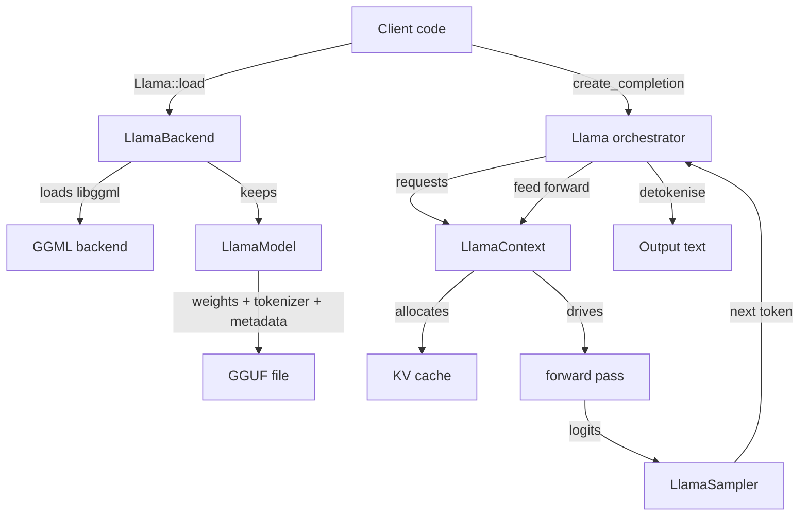
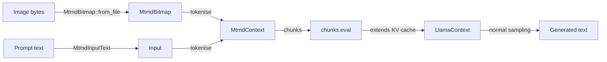

# Architecture

This page walks through the data flow of a single completion request
in `llama-crab`, from the moment you call `Llama::load` until the
last generated token lands in a `String`. It's the mental model you
need before you can read the lower-level API or hit a wall that the
high-level helpers don't paper over.

## Big picture



The high-level [`Llama`] orchestrator owns the model, the context and
the default sampler. It exposes a handful of methods that hide the
loop illustrated above behind a single function call:

```rust
let mut llama = Llama::load(LlamaParams::new("model.gguf"))?;
let resp = llama.create_completion("Hello", 32)?;
println!("{}", resp.text);
```

When you need finer-grained control, every step of the loop is
exposed through a typed API. The remainder of this page describes
each step.

## Step 1: Initialise the backend

Before any llama.cpp call, the native library has to be initialised.
This sets up the global GGML state, registers the backends compiled
into the binary, and configures the thread pools.

```rust
use llama_crab::LlamaBackend;

// Implicit, called by Llama::load:
let _backend = LlamaBackend::init()?;

// Explicit, if you drive the lower-level API directly:
let _backend = LlamaBackend::init_numa(NumaStrategy::Distribute)?;
```

- `LlamaBackend::init()` — initialises the default backend.
- `LlamaBackend::init_numa(strategy)` — same, but with an explicit
  NUMA placement strategy (`Distribute`, `Isolate`, `Numactl`).
- The returned guard owns the backend; dropping it tears the
  underlying state down. As long as a `LlamaModel` or `LlamaContext`
  is alive, the backend must be alive too.

The guard is `Send + Sync` so it can sit in a `OnceLock` or an
`Arc<LlamaBackend>` in a multi-threaded binary.

## Step 2: Load the model

The model holds the weights, the tokenizer and the metadata stored
in the GGUF container. Loading is the single most expensive step
in any `llama-crab` program: expect anywhere from 0.5 s (for a 0.5 B
Q4 quant) to 30 s (for a 70 B Q4 quant on a cold disk).

```rust
use llama_crab::{Llama, LlamaParams};

let mut llama = Llama::load(
    LlamaParams::new("model.gguf")
        .with_n_ctx(2048)
        .with_n_gpu_layers(99),
)?;
```

Behind the scenes the orchestrator:

1. Calls `LlamaBackend::init()` (or reuses an existing guard).
2. Memory-maps the GGUF file (when supported) and parses the
   metadata.
3. Creates a `LlamaModel`, which allocates the weight tensors and
   loads them onto the active backend (CPU, GPU, or a mix).
4. Creates a default `LlamaContext` with the requested context size.

The `Llama` struct is essentially `LlamaModel + LlamaContext +
default state`, so you rarely have to touch the model and context
directly when you stay on the high-level path.

## Step 3: Tokenise the prompt

Tokenisation converts a UTF-8 string into the integer ids the model
operates on. The tokeniser is part of the GGUF file (or, with the
`hf-tokenizer` feature, can be loaded from a separate `tokenizer.json`).

```rust
let prompt = "The capital of France is";
let tokens = llama.model().tokenize(prompt, /*add_bos*/ true, /*special*/ true)?;
```

The high-level helpers tokenise for you:

```rust
let resp = llama.create_completion(prompt, 32)?;
// → internally: tokenize → decode → sample loop → detokenize
```

## Step 4: Forward pass (decode)

The tokenised prompt is wrapped in a `LlamaBatch` and submitted to
the context with `decode`. This runs the model over the batch and
returns the logits of the last token.

```rust
use llama_crab::batch::LlamaBatch;

let mut batch = LlamaBatch::new(tokens.len(), 1);
batch.add_sequence(&tokens, 0, /*logits_all*/ false);
batch.prepare();
llama.context().decode(&batch)?;
```

The KV cache stored in the context is updated in place, so the next
call only needs to feed the newly generated token.

## Step 5: Sample the next token

The logits are passed to a `LlamaSampler`, which implements a
particular decoding strategy. The default sampler chain is
`greedy`, but you can compose a custom chain with `SamplerChain`:

```rust
use llama_crab::sampling::{LlamaSampler, SamplerChain};

let mut sampler = SamplerChain::new()
    .temp(0.8)
    .top_p(0.95, 1)
    .min_p(0.05, 1)
    .penalties(64, 1.1, 0.0, 0.0)
    .build();

let next_token = unsafe { sampler.sample(llama.context().raw_handle(), -1) };
sampler.accept(next_token);
```

See the [Sampling strategies](../guides/sampling.md) guide for the
full menu of samplers and recommended chains.

## Step 6: Append and continue

The selected token is fed back into the context as a new batch of
size 1. The KV cache is reused, so this forward pass is the
cheapest one in the loop.

```rust
use llama_crab::batch::LlamaBatch;

let single = LlamaBatch::one(next_token, n_past, 0, true);
llama.context().decode(&single)?;
n_past += 1;
```

Steps 5 and 6 repeat until the sampler emits the EOS token, a stop
sequence is matched, or the maximum token count is reached.

## Step 7: Detokenise

The selected token ids are mapped back to text with the model's
tokeniser:

```rust
let text = llama.model().detokenize(&generated_tokens, /*special*/ false)?;
```

The high-level `Completion` struct combines the generated tokens, the
text, the per-token log probabilities and the timings:

```rust
pub struct Completion {
    pub text: String,
    pub tokens: Vec<LlamaToken>,
    pub logprobs: Option<CompletionLogprobs>,
    pub timings: CompletionTimings,
    pub stop_reason: StopReason,
}
```

## Where the multimodal stack fits in

The `mtmd` feature adds a parallel pipeline for vision and audio
inputs. The text model stays the same; the `MtmdContext` and
`MtmdBitmap` types encode images (or audio) into the same token
stream used by the rest of the API.



See the [Multimodal guide](../features/multimodal.md) for the
end-to-end flow.

## Where to next?

- [Lifecycle](lifecycle.md) — when the model and context come up
  and tear down, and how to share them across threads.
- [Sampling strategies](../guides/sampling.md) — every available
  sampler and how to chain them.
- [Backends & GPU offload](../guides/backends.md) — what the active
  backend does to the data flow above.

[`Llama`]: https://docs.rs/llama-crab/latest/llama_crab/struct.Llama.html
