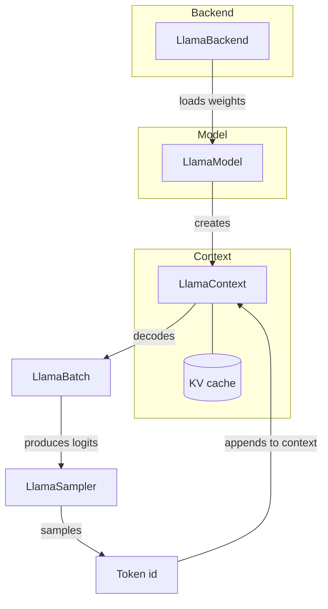

# Core concepts

This section explains the *why* behind the `llama-crab` API. Read it
once before diving into a specific feature, and refer back to it
when a method signature doesn't do what you expected.

-   :material-sitemap-outline: __[Architecture](architecture.md)__

    The big picture: the relationship between `LlamaBackend`,
    `LlamaModel`, `LlamaContext`, `LlamaBatch`, `LlamaSampler` and
    `Llama`. A diagram of the data flow inside a single forward pass.

-   :material-recycle: __[Lifecycle](lifecycle.md)__

    When does the backend come up and tear down? Who owns the model?
    What is the safe way to share a model across threads? How do you
    free a context when you no longer need it?

-   :material-alert-circle-outline: __[Error handling](errors.md)__

    The `LlamaError` enum, how to map it to user-facing errors, and
    the patterns the safe API uses to surface "model not found",
    "context too large", "backend not initialised" and friends.

## Mental model

A request to "complete a prompt" walks this loop once per generated
token:

1. The model weights are loaded from a GGUF file into a `LlamaModel`.
2. A `LlamaContext` is created on top of the model, allocating the
   KV cache that will hold attention keys and values.
3. The prompt is tokenised into a `Vec<LlamaToken>`, wrapped in a
   `LlamaBatch` and submitted to the context with `decode`.
4. The logits produced by the forward pass are handed to a
   `LlamaSampler`, which selects the next token.
5. The selected token is appended to the context (re-using the KV
   cache) and the loop continues until the sampler emits EOS or a
   stop condition is met.
6. The selected tokens are detokenised back into text.

The high-level [`Llama`] orchestrator hides steps 3–5 behind a single
method call. The lower-level types in [`llama_crab::context`],
[`llama_crab::batch`] and [`llama_crab::sampling`] give you full
control over each step when you need it.

## The three layers of the API

`llama-crab` is intentionally a three-layer crate:

| Layer | Crate / module | When to use it |
| --- | --- | --- |
| **High-level orchestrator** | [`Llama`] | 95 % of applications. The ergonomic, safe facade. |
| **Mid-level building blocks** | [`LlamaModel`], [`LlamaContext`], [`LlamaBatch`], [`LlamaSampler`], [`MtmdContext`] | When you need manual control over batching, sessions, multimodal evaluation, sampling chains, etc. |
| **Raw FFI** | [`llama_crab_sys`] | Only when you need a llama.cpp symbol that the safe layer does not expose. The high-level crate re-exports the safe wrappers you need. |

Most of this guide works at the **mid-level** — the building blocks —
because they explain *what's happening* under the hood of the
high-level helpers. Production code can stay at the high level unless
you hit a wall.

## A note on safety

`llama-crab` is built on top of C++ that allocates, frees and shares
memory through raw pointers. The `unsafe` boundary is intentionally
narrow:

- `llama_crab_sys` contains all the `unsafe` FFI declarations and
  the few `unsafe` functions needed to wrap them.
- The safe crate on top is annotated with `#![deny(unsafe_op_in_unsafe_fn)]`
  and a strict clippy configuration, so the public API is `unsafe`-free
  in 100 % of the documented call sites.
- A few low-level escape hatches (raw context handles, raw
  `*mut llama_context`, `chunks.eval`, the FFI re-exports) are
  exposed behind `unsafe fn` so the compiler can verify that you
  accept responsibility for the invariants.

The rule of thumb: **if you don't see an `unsafe` block in your code,
the safe layer has your back.**

## Where to next?

- [Architecture](architecture.md) — the data flow, the responsibilities
  of each type, and how to read the safe API as a thin layer on top
  of the FFI.
- [Lifecycle](lifecycle.md) — when the backend lives, when the model
  lives, and how to share a model between threads.
- [Error handling](errors.md) — the `LlamaError` enum and the
  patterns for converting library errors into application errors.

[`Llama`]: https://docs.rs/llama-crab/latest/llama_crab/struct.Llama.html
[`LlamaModel`]: https://docs.rs/llama-crab/latest/llama_crab/model/struct.LlamaModel.html
[`LlamaContext`]: https://docs.rs/llama-crab/latest/llama_crab/context/struct.LlamaContext.html
[`LlamaBatch`]: https://docs.rs/llama-crab/latest/llama_crab/batch/struct.LlamaBatch.html
[`LlamaSampler`]: https://docs.rs/llama-crab/latest/llama_crab/sampling/struct.LlamaSampler.html
[`MtmdContext`]: https://docs.rs/llama-crab/latest/llama_crab/multimodal/struct.MtmdContext.html
[`llama_crab_sys`]: https://docs.rs/llama-crab-sys
