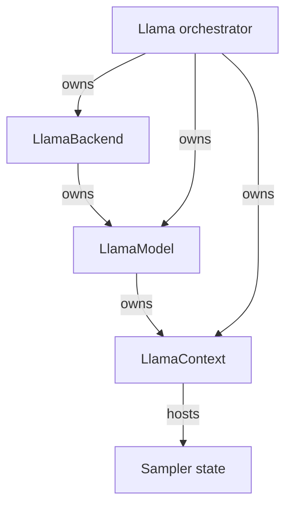
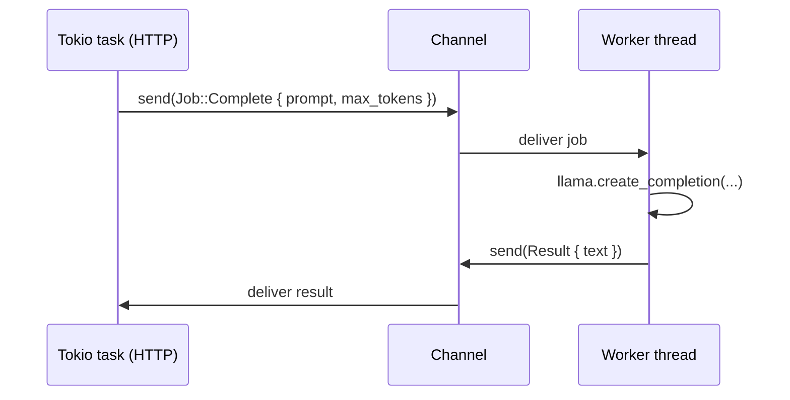
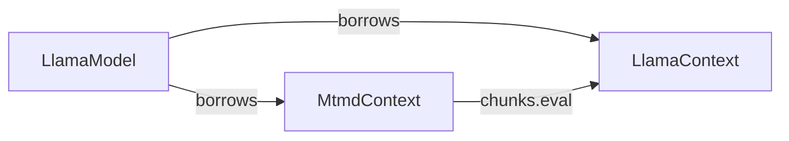

# Lifecycle

This page documents the *lifetimes* of the major types in
`llama-crab`. It's the answer to questions like "when does the
backend tear down?", "can I share a model across threads?" and
"how do I free a context?".

## Ownership graph



The high-level `Llama` struct owns the backend, the model and the
context all at once. Drop the `Llama` and the entire stack tears
down in reverse order: context → model → backend.

When you drive the lower-level API directly, the rule is the same
but stated explicitly:

> A `LlamaContext` is borrowed from a `LlamaModel`, which is borrowed
> from a `LlamaBackend`. Drop them in that order: context first,
> then model, then backend.

## When does the backend initialise?

`LlamaBackend::init()` is called automatically by `Llama::load`. If
you build a `LlamaModel` and a `LlamaContext` by hand, you must hold
a `LlamaBackend` guard for the entire lifetime of the model and
context. The safest pattern is:

```rust
use llama_crab::LlamaBackend;

let backend = LlamaBackend::init()?;          // 1
let model = llama_crab::model::LlamaModel::load(
    "model.gguf",
    &Default::default(),
    backend.handle(),                        // 2
)?;
let context = model.new_context(
    llama_crab::context::params::LlamaContextParams::default(),
    backend.handle(),                        // 3
)?;
drop(context);                                // 4
drop(model);
drop(backend);
```

1. The guard owns the global GGML state.
2. The model holds a `BackendHandle` (a borrowed reference to the
   backend).
3. The context does the same.
4. Reverse order on drop.

## Sharing a model across threads

`LlamaModel` and `LlamaContext` are **not** `Sync`. They wrap C++
objects that hold raw pointers and mutable state, and the safe
layer enforces single-threaded access at compile time.

The recommended pattern is to put the inference state behind a
dedicated worker thread and send jobs to it:



This is exactly how [`llama-crab-server`](../server/index.md) is
built. If you need parallel inference, run several worker threads,
each with its own `Llama`.

### When is a model `Send`?

`LlamaModel` and `LlamaContext` are `Send`, just not `Sync`. The
`Send` bound means you can move them between threads, as long as only
one thread touches them at a time. The simplest "move and back"
pattern is to keep them inside a `Mutex<Llama>` on a dedicated
thread.

### When is a model `Sync`?

It isn't. If you really need parallel access from multiple threads,
clone the GGUF-loaded state by **loading the model twice** (once per
worker). This is what the server's "one worker, one model" design
encourages.

## Freeing a context early

If you have a long-lived `Llama` orchestrator but you want to free
the KV cache between requests, drop the context and re-create it:

```rust
{
    let mut llama = Llama::load(LlamaParams::new("model.gguf"))?;
    // Use llama for a batch of requests…
    drop(llama.context().take());   // not exposed yet — illustration
}
// Memory released.
```

In the current API, the cleanest way to free the context is to drop
the entire `Llama` and re-load. If you need finer-grained control,
use the lower-level `LlamaModel` + `LlamaContext` types and manage
them yourself.

## Cleanup on panic

The `Llama` struct and its components are `Drop`-implementing RAII
guards over C++ resources. If your `main` panics inside an
`Llama::load` call, the partially-constructed `Llama` (if any) is
dropped, which in turn drops the C++ objects it owns. There is no
explicit `teardown` call.

For a server, prefer to wrap each worker in a [`scopeguard`] or a
custom RAII type so a panic in one request does not corrupt the next
one's state.

[`scopeguard`]: https://crates.io/crates/scopeguard

## Lifecycle of the multimodal stack

When the `mtmd` feature is enabled, an `MtmdContext` is a separate
top-level resource that **borrows** the `LlamaModel`:



Drop the `MtmdContext` before the `LlamaContext`, and the
`LlamaContext` before the `LlamaModel`. The high-level `Llama`
struct does not own an `MtmdContext`; you create it on the side:

```rust
let mut llama = Llama::load(LlamaParams::new("gemma-4-it.gguf"))?;
let mtmd = MtmdContext::init_from_file("gemma-4-it-mmproj.gguf", llama.model())?;
// … use mtmd together with llama.context() …
drop(mtmd);   // before llama
```

## Where to next?

- [Architecture](architecture.md) — the data flow of a single
  forward pass.
- [Error handling](errors.md) — what happens when an FFI call
  fails and how to map it to a user-facing error.
- [Server](../server/index.md) — the reference implementation of
  the worker-thread pattern.
