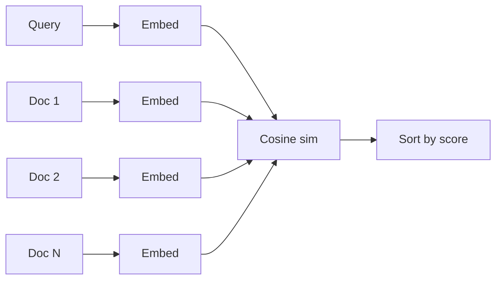

# `embedding_search` — Semantic search

Embeds a query and a tiny fixed corpus with a BGE model, then ranks
the corpus by cosine similarity. The classic "given a query, find
the closest documents" workflow in ~50 lines.

## Run

=== "One-command"

    ```bash
    ./examples/run.sh embedding_search
    ```

=== "Manual"

    ```bash
    ./scripts/download_models.sh bge
    cargo run --release --bin run_embeddings
    ```

Downloads `bge-small-en-v1.5-q4_k_m.gguf` (~30 MB).

## What it does

```rust
use llama_crab::context::params::PoolingType;
use llama_crab::{Llama, LlamaParams};

let mut llama = Llama::load(
    LlamaParams::new("models/bge-small-en-v1.5-q4_k_m.gguf")
        .with_n_ctx(512)
        .with_embeddings(true)
        .with_pooling_type(PoolingType::Cls),
)?;

let corpus = &[
    "Rust is a memory-safe systems language without a garbage collector.",
    "Python is a high-level dynamic language with duck typing.",
    "The Eiffel Tower is one of the most visited monuments in the world.",
    "Borrow checking enforces lifetimes at compile time in Rust.",
];

let q = llama.embed("What programming language is safest?", true)?;
let mut scored: Vec<(usize, f32)> = corpus.iter().enumerate()
    .map(|(i, doc)| {
        let v = llama.embed(doc, true).unwrap();
        let sim: f32 = q.iter().zip(v.iter()).map(|(a, b)| a * b).sum();
        (i, sim)
    })
    .collect();
scored.sort_by(|a, b| b.1.partial_cmp(&a.1).unwrap());
```

Because the embeddings are L2-normalised, the dot product equals
the cosine similarity.

## Expected output

```
📊 results (cosine similarity, higher = more similar):
   0.823  doc-1  Rust is a memory-safe systems language without a garbage collector.
   0.741  doc-4  Borrow checking enforces lifetimes at compile time in Rust.
   0.312  doc-2  Python is a high-level dynamic language with duck typing.
   0.088  doc-3  The Eiffel Tower is one of the most visited monuments in the world.

Query: What programming language is safest?
Top match: doc-1 (cosine = 0.823)
```

## How the scoring works



Each document is embedded independently. With L2-normalised
vectors, the dot product equals cosine similarity. The example uses
a single-threaded loop; for thousands of documents, batch the
embeddings through `embed_texts`.

## Scaling up

For a real corpus, replace the in-memory list with a vector index:

- [HNSW in pure Rust](https://crates.io/crates/hnsw) — no
  external service.
- [Qdrant](https://crates.io/crates/qdrant-client) — production
  vector DB.
- [pgvector](https://github.com/pgvector/pgvector) — Postgres
  with vector support.

The key invariant: the index stores L2-normalised vectors, and
queries are also normalised. Then dot product = cosine similarity
and you can use the same index type for both.

## Common variations

=== "Different corpus"

    ```rust
    let corpus = &[
        "How to make sourdough bread at home",
        "The capital of France is Paris",
        "Tips for a good night's sleep",
    ];
    let q = llama.embed("bread baking tips", true)?;
    ```

=== "Top-K instead of full ranking"

    ```rust
    scored.sort_by(|a, b| b.1.partial_cmp(&a.1).unwrap());
    let top_3: Vec<_> = scored.iter().take(3).collect();
    ```

## Full source

[`examples/embedding_search/src/main.rs`](https://github.com/DominguesM/llama-crab/tree/main/examples/embedding_search/src/main.rs).

## Where to next?

- [Reranker](reranker.md) — when you need higher-quality rankings
  on the top K.
- [Embeddings & reranking guide](../features/embeddings.md) — the
  full reference.
- [RAG recipe](../recipes/rag.md) — embeddings in a retrieval
  pipeline.
