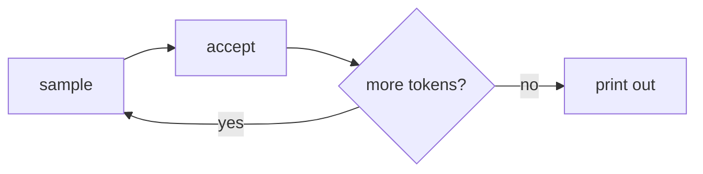

# `mtmd` — Raw `mtmd.h` API

A lower-level counterpart to the [`vision`](vision.md) example:
loads a text model and an `mmproj` projector, embeds an image and a
prompt into a chunk list, then drives the decode loop by hand. Use
this when you need direct access to `MtmdBitmap` / `MtmdInputText` /
`chunks.eval`.

The higher-level [`vision`](vision.md) example does the same thing
in fewer lines through the `MtmdContext` helper.

## Run

=== "One-command"

    ```bash
    ./examples/run.sh mtmd gemma4
    ```

=== "Manual"

    ```bash
    ./scripts/download_models.sh gemma4
    cargo run --release --bin mtmd -- \
      models/gemma-4-E4B-it-Q4_K_M.gguf \
      models/mmproj-gemma-4-E4B-it-BF16.gguf \
      tests/fixtures/test_image.png \
      "Describe this image in one short sentence."
    ```

Downloads the Gemma 4 text GGUF + its mmproj projector (~5 GB total).

## What it does

```rust
use llama_crab::batch::LlamaBatch;
use llama_crab::multimodal::{default_media_marker, MtmdBitmap, MtmdContext, MtmdInputText};
use llama_crab::sampling::LlamaSampler;
use llama_crab::token::LlamaToken;
use llama_crab::{Llama, LlamaParams};

let mut llama = Llama::load(LlamaParams::new("model.gguf").with_n_ctx(4096))?;
let mtmd = MtmdContext::init_from_file("mmproj.gguf", llama.model())?;

let bitmap = MtmdBitmap::from_file("image.png")?;
let marker = default_media_marker();
let prompt = format!("{marker}\nDescribe this image in one short sentence.");

let chunks = mtmd.tokenize(MtmdInputText::new(&prompt), &[&bitmap])?;

let ctx_ptr = llama.context().raw_handle();
let mut n_past = unsafe {
    chunks.eval(&mtmd, ctx_ptr, 0, 0, llama.context().n_batch() as i32, true)?
};

// Standard decode loop with a greedy sampler.
let mut sampler = LlamaSampler::greedy()?;
let eos = llama.model().token_eos();
let mut out = String::new();
for i in 0..96 {
    let idx = if i == 0 { -1 } else { 0 };
    let tok: LlamaToken = unsafe { sampler.sample(ctx_ptr, idx) };
    sampler.accept(tok);
    if tok == eos { break; }
    out.push_str(&llama.model().detokenize(&[tok], false)?);
    let single = LlamaBatch::one(tok, n_past + i as i32, 0, true);
    llama.context().decode(&single)?;
}
println!("{out}");
```

## Walk-through

### `default_media_marker()`

The marker is the special string the projector expects at the
position of each image. The marker is model-specific:

- Gemma 4 uses `<start_of_image>`.
- LFM2.5-VL uses `<|image|>`.

`default_media_marker()` returns whatever the loaded `MtmdContext`
expects, so you don't need to hard-code it.

### `MtmdInputText`

The text part of the prompt. It can include the marker inline (as
above) or rely on the projector to insert the marker automatically.

### `chunks.eval`

Evaluates the multimodal chunks into the KV cache:

```rust
let new_n_past = unsafe {
    chunks.eval(&mtmd, ctx_ptr, 0, 0, llama.context().n_batch() as i32, true)?
};
```

- `&mtmd` — the active context.
- `ctx_ptr` — the raw `*mut llama_context` from `llama.context().raw_handle()`.
- `seq_id` — usually `0`.
- `n_past` — usually `0` (start a fresh position) or the current
  position if you want to extend an existing context.
- `n_batch` — the logical batch size; use
  `llama.context().n_batch()`.
- `logits_last` — `true` so the next sample reads the right
  position.

The function returns the new `n_past`, which is where the sampler
should start.

### The decode loop

The rest of the example is a standard sampler loop:



`LlamaSampler::greedy()` is the fastest and the most reproducible
sampler. For higher-quality output, build a `SamplerChain`.

## Tested models

| Model | Status |
| --- | --- |
| `lmstudio-community/gemma-4-E4B-it-GGUF` | ✅ |
| `unsloth/LFM2.5-VL-1.6B-GGUF` | ✅ |
| `Qwen2.5-VL` | Compatible via mtmd. |
| `Llama-3.2-Vision` | Compatible via mtmd. |

The same flow is exercised by the integration tests in
`llama-crab/tests/gemma4_vision.rs` and
`llama-crab/tests/lfm_vl_vision.rs`.

## Full source

[`examples/mtmd/src/main.rs`](https://github.com/DominguesM/llama-crab/tree/main/examples/mtmd/src/main.rs).

## Where to next?

- [Multimodal guide](../features/multimodal.md) — the data flow
  and the chunk-evaluation API.
- [Vision (high level)](vision.md) — if you don't need the raw
  loop.
- [Server with vision](../server/api.md#multimodal-chat) — the
  HTTP path.
