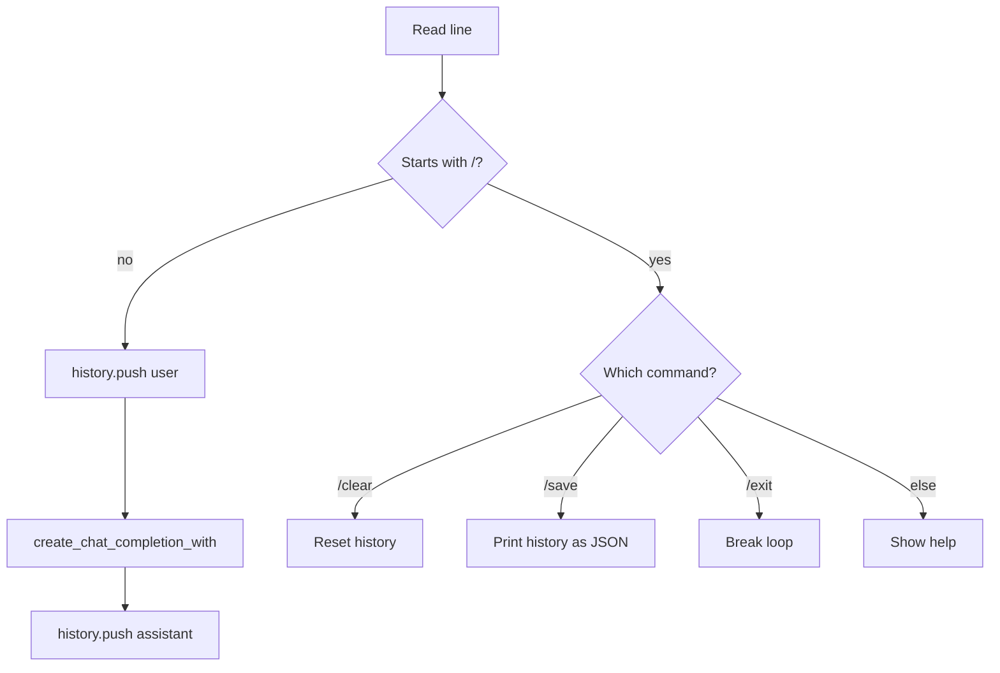

# `stateful_chat` — Interactive REPL

A multi-turn chat REPL that grows the conversation history on every
turn. Supports `/clear`, `/save`, and EOF to quit. The model is
loaded once and reused; only the message list grows.

## Run

=== "One-command"

    ```bash
    ./examples/run.sh stateful_chat
    ```

=== "Manual"

    ```bash
    ./scripts/download_models.sh smol
    cargo run --release --bin run_chat
    ```

Downloads `Qwen2.5-0.5B-Instruct-GGUF` (~400 MB).

## Commands

| Command | Action |
| --- | --- |
| `/exit` | Quit (also `/quit`, `/q`, or Ctrl+D). |
| `/clear` | Reset history (keeps the system message). |
| `/save` | Print the conversation as JSON. |
| anything else | Sent as a user message. |

## What it does

```rust
use llama_crab::chat::BuiltinTemplate;
use llama_crab::high_level::chat_completion::{create_chat_completion_with, ChatMessage};
use llama_crab::{Llama, LlamaParams, Role};

let mut llama = Llama::load(LlamaParams::new("model.gguf").with_n_ctx(4096))?;

let mut history: Vec<ChatMessage> = vec![
    ChatMessage::new(Role::System,
        "You are a helpful, concise assistant. Always reply in English, in under 2 sentences."),
];

// On every user turn:
history.push(ChatMessage::new(Role::User, "What is Rust?"));
let resp = create_chat_completion_with(
    &mut llama, &history, BuiltinTemplate::ChatMl, &[], 128,
)?;
history.push(ChatMessage::new(Role::Assistant, resp.content));
```

The history is the entire context. Each high-level call re-sends
and re-evaluates the rendered history. Prompt-cache/session APIs
are manual tools for lower-level loops; they are not used
automatically by `create_chat_completion_with`.

## Expected output

```
🦀 llama-crab interactive chat
   model : models/qwen2.5-0.5b-instruct-q4_k_m.gguf
   commands: /exit  /clear  /save

> What is Rust?
  (0.81s)
assistant> Rust is a memory-safe systems programming language.

> /save
[
  { "role": "system", ... },
  { "role": "user", "content": "What is Rust?" },
  { "role": "assistant", "content": "Rust is a ..." }
]
```

## Command parsing

The REPL parses the input line and dispatches:



## Trimming history

The context size caps the number of tokens the model can see. When
the history grows past `n_ctx`, the REPL trims the oldest turns
(keeping the system message):

```rust
const MAX_HISTORY_TURNS: usize = 40;

if history.len() > MAX_HISTORY_TURNS {
    let system = history[0].clone();
    history = std::iter::once(system)
        .chain(history.into_iter().skip(1).rev().take(MAX_HISTORY_TURNS).rev())
        .collect();
}
```

For a smarter strategy, see the
[stateful chat guide](../features/stateful-chat.md).

## Persisting the session

The `/save` command serialises the history to JSON. The REPL does
not auto-load it on the next start, but you can add a `--load <file>`
flag and call:

```rust
let raw = std::fs::read_to_string(path)?;
let history: Vec<ChatMessage> = serde_json::from_str(&raw)?;
```

## Full source

[`examples/stateful_chat/src/main.rs`](https://github.com/DominguesM/llama-crab/tree/main/examples/stateful_chat/src/main.rs).

## Where to next?

- [Chatbot recipe](../recipes/chatbot.md) — turn this REPL into a
  deployable agent.
- [Caching & session state](../guides/caching.md) — skip
  re-evaluating previous turns.
- [Tool calling](tools.md) — add function calls to the loop.
