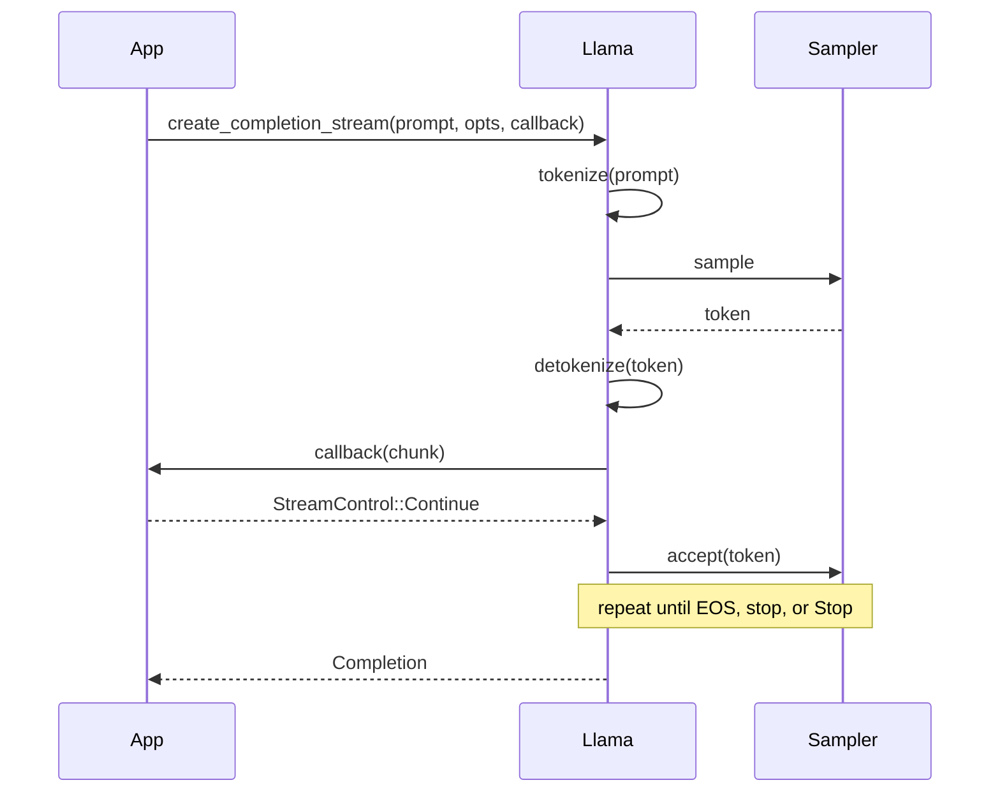

# `streaming` — High-level token streaming

Use `Llama::create_completion_stream` when you want synchronous
token-by-token output while still receiving the final `Completion`.
The callback receives text chunks as they become available and
returns `StreamControl::Continue` or `StreamControl::Stop`.

## Run

```bash
./examples/run.sh streaming
```

Downloads the same ~400 MB Qwen2.5 0.5B model as the `quickstart`
example.

## What it does

```rust
use std::io::{self, Write};

use llama_crab::{CompletionOptions, Llama, LlamaParams, StreamControl};

fn main() -> Result<(), Box<dyn std::error::Error>> {
    let mut llama = Llama::load(LlamaParams::new("model.gguf").with_n_ctx(512))?;
    let prompt = "Write one short sentence about Rust.";
    let mut stdout = io::stdout().lock();

    let mut write_error: Option<io::Error> = None;
    let completion = llama.create_completion_stream(
        prompt,
        CompletionOptions::new(64).with_stop_sequence("\n\n"),
        |chunk| {
            if let Err(err) = write!(stdout, "{}", chunk.text).and_then(|_| stdout.flush()) {
                write_error = Some(err);
                return StreamControl::Stop;
            }
            StreamControl::Continue
        },
    )?;

    if let Some(err) = write_error {
        return Err(err.into());
    }
    writeln!(stdout)?;
    Ok(())
}
```

## Capturing I/O errors

The callback cannot return a `Result`, so capture I/O errors and
return `StreamControl::Stop`; after the stream returns, propagate
the captured error:

```rust
let mut write_error: Option<io::Error> = None;

let completion = llama.create_completion_stream(
    "Write one short sentence about Rust.",
    CompletionOptions::new(64),
    |chunk| {
        if let Err(err) = write!(stdout, "{}", chunk.text).and_then(|_| stdout.flush()) {
            write_error = Some(err);
            return StreamControl::Stop;
        }
        StreamControl::Continue
    },
)?;

if let Some(err) = write_error {
    return Err(err.into());
}
```

For quick demos where stdout errors are not important, the callback
can ignore them:

```rust
llama.create_completion_stream(
    "Write one short sentence about Rust.",
    CompletionOptions::new(64),
    |chunk| {
        let _ = write!(stdout, "{}", chunk.text);
        let _ = stdout.flush();
        StreamControl::Continue
    },
)?;
```

## Stopping the stream early

Returning `StreamControl::Stop` from the callback halts the
generation loop. The `Completion` returned by the call is still
populated with whatever was generated so far:

```rust
let mut stopped = false;
let completion = llama.create_completion_stream(
    "List 10 colors, one per line:",
    CompletionOptions::new(256),
    |chunk| {
        print!("{}", chunk.text);
        if chunk.text.contains("done") {
            stopped = true;
            return StreamControl::Stop;
        }
        StreamControl::Continue
    },
)?;
println!("\nstopped: {stopped}");
```

## How it works internally



The streaming helper uses the same high-level completion path as
`create_completion`: it clears sequence 0 before each call and does
not enable automatic prompt-cache reuse between calls. For custom
sampling, batching, or manual KV/session reuse, use the lower-level
context, batch and sampler APIs directly.

## Streaming + log probabilities

If you set `logprobs = true` on the options, each chunk carries the
per-token log probabilities:

```rust
CompletionOptions::new(64)
    .with_logprobs(true, 5)
```

The `chunk.logprobs` field is `Some(...)` on every chunk, including
the partial one. Use the field to display alternatives in a UI or
to compute a confidence score.

## Streaming + tools

Streaming works with the chat pipeline and tool calling. The chunk
schema matches the OpenAI SSE format. See the
[server streaming guide](../server/streaming.md) for the exact
chunk order.

## Full source

[`examples/streaming/src/main.rs`](https://github.com/DominguesM/llama-crab/tree/main/examples/streaming/src/main.rs).

## Where to next?

- [Stateful chat](stateful-chat.md) — multi-turn REPL.
- [Sampling strategies guide](../guides/sampling.md) — custom
  sampler chains.
- [Server streaming](../server/streaming.md) — the same flow over
  HTTP.
