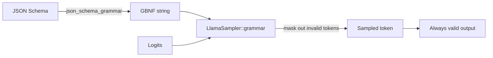

# `structured` — Constrained JSON output

The example uses a JSON Schema → GBNF grammar to force the model to
emit only valid JSON of a specific shape. The output is guaranteed
to be parseable, regardless of model size or prompt phrasing.

## Run

```bash
cargo run -p structured --release -- model.gguf
```

The first positional argument is the path to any text GGUF.

## What it does

```rust
use llama_crab::high_level::completion::json_schema_grammar;
use llama_crab::high_level::completion::CompletionOptions;
use llama_crab::sampling::{LlamaSampler, SamplerChain};
use llama_crab::{Llama, LlamaParams};
use serde_json::json;

fn main() -> Result<(), Box<dyn std::error::Error>> {
    let schema = json!({
        "type": "object",
        "properties": {
            "name": { "type": "string" },
            "age":  { "type": "integer" }
        },
        "required": ["name", "age"]
    });
    let grammar_text = json_schema_grammar(&schema).unwrap();
    let mut llama = Llama::load(LlamaParams::new("model.gguf").with_n_ctx(1024))?;
    let grammar = unsafe { LlamaSampler::grammar(llama.model(), &grammar_text, "root")? };
    let greedy = LlamaSampler::greedy()?;
    let mut sampler = SamplerChain::new()
        .add_sampler(grammar)
        .add_sampler(greedy)
        .build();
    let resp = llama.create_completion_with_sampler(
        "Generate a fictional person as JSON: ",
        CompletionOptions::new(32),
        &mut sampler,
    )?;
    println!("{}", resp.text);
    Ok(())
}
```

## Expected output

```
{"name": "Alice", "age": 30}
```

The model can emit any name or age; the shape is fixed.

## How it works



The grammar sampler runs **after** every other sampler in the
chain. It looks at the current context, computes the set of tokens
that would keep the output valid against the grammar, and masks
all other tokens' logits to `-inf`. The next sampler in the chain
then picks from the masked distribution.

The result: the model literally cannot emit a token that would
break the grammar.

## Supported JSON-Schema features

The converter understands a useful subset of JSON Schema 2020-12:

| Feature | Status |
| --- | --- |
| `type: object` with `properties`, `required`, `additionalProperties` | ✅ |
| `type: array` with `items`, `prefixItems`, `minItems`, `maxItems` | ✅ |
| `type: string` with `minLength`, `maxLength`, `pattern` | ✅ |
| `type: integer` / `number` with `minimum`, `maximum`, … | ✅ |
| `type: boolean`, `null` | ✅ |
| `enum`, `const` | ✅ |
| `format: date-time`, `email`, `uri`, `uuid` | ✅ |
| `oneOf`, `anyOf`, `allOf` | ✅ |
| `$ref` (local `#/definitions/...`) | ✅ |
| `definitions`, `$defs` | ✅ |

See the [grammars guide](../features/grammars.md) for the full
table.

## A more complex schema

Suppose you want a list of people, each with a name, age, and
optional email:

```rust
let schema = json!({
    "type": "array",
    "items": {
        "type": "object",
        "properties": {
            "name":  { "type": "string" },
            "age":   { "type": "integer", "minimum": 0 },
            "email": { "type": "string", "format": "email" }
        },
        "required": ["name", "age"]
    },
    "minItems": 1,
    "maxItems": 5
});
```

The grammar is generated, the sampler chain is built, and the
output is always a 1-to-5-element array of valid person objects.

## Combining with sampling

The grammar sampler is *added* to the chain, not a replacement for
it. A typical chain is:

```rust
let mut sampler = SamplerChain::new()
    .temp(0.7)                    // temperature
    .top_p(0.9, 1)                // nucleus
    .add_sampler(grammar)         // grammar (must be last)
    .add_sampler(greedy)
    .build();
```

Putting the grammar last ensures every token the chain emits keeps
the output valid.

## Common pitfalls

| Pitfall | What goes wrong | Fix |
| --- | --- | --- |
| `common` feature not enabled | `LlamaSampler::grammar` is not in scope. | Add `features = ["common"]` to the dependency. |
| Schema with no `type` keyword | Grammar is unconstrained. | Add `type: object` (or whatever the root is). |
| Grammar sampler runs **before** another sampler | The second sampler picks an invalid token. | Always put the grammar sampler **last** in the chain. |
| Model is too small | Output is valid but semantically off. | Increase model size or improve the prompt. |

## Full source

[`examples/structured/src/main.rs`](https://github.com/DominguesM/llama-crab/tree/main/examples/structured/src/main.rs).

## Where to next?

- [Grammars guide](../features/grammars.md) — the underlying safe
  API.
- [Server structured output](../server/structured.md) — the HTTP
  `response_format` field.
- [Tool calling](tools.md) — when the structured output is a
  *function call*, use the chat pipeline instead.
