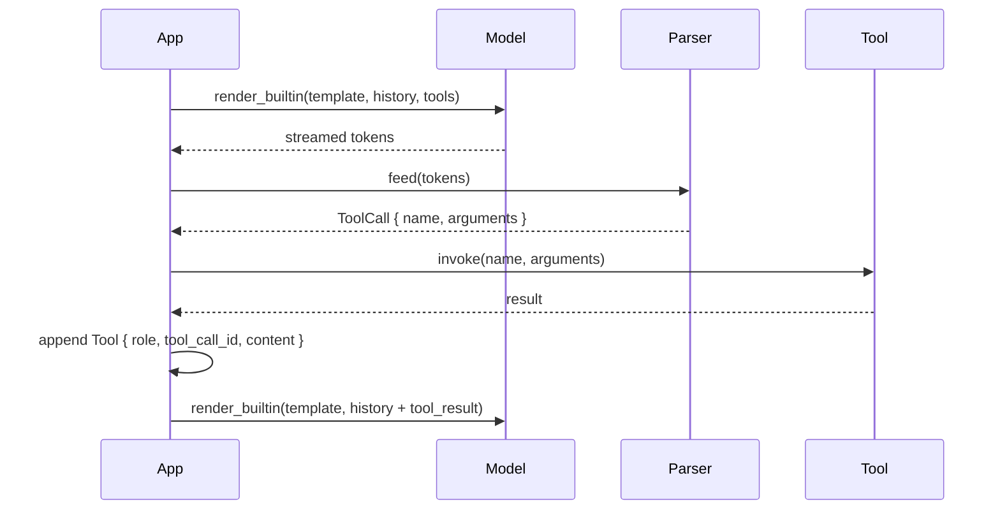

# `tools` — Tool / function calling

The example asks the model to invoke a tool; the response is parsed
back into a `ToolCall` struct. Use it as a starting point for any
function-calling workflow.

## Run

```bash
cargo run --bin tools --release -- model.gguf
```

The first positional argument is the path to a tool-aware
instruct-tuned GGUF (Qwen 2.5, Hermes, Llama 3, Mistral, …).

## What it does

```rust
use llama_crab::chat::tool_call::{ToolDefinition, ToolFormat, ToolParser};
use llama_crab::chat::{BuiltinTemplate, render_builtin};
use llama_crab::high_level::chat_completion::ChatMessage;
use llama_crab::{Llama, LlamaParams, Role};

fn main() -> Result<(), Box<dyn std::error::Error>> {
    let tool = ToolDefinition::new("get_weather", "Get the weather for a city")
        .with_parameters(serde_json::json!({
            "type": "object",
            "properties": { "city": { "type": "string" } },
            "required": ["city"]
        }));
    let prompt = render_builtin(
        BuiltinTemplate::Qwen2_5,
        &[ChatMessage::new(Role::User, "Weather in Tokyo?")],
        &[tool.clone()],
        true,
    );
    let mut llama = Llama::load(LlamaParams::new("model.gguf").with_n_ctx(2048))?;
    let resp = llama.create_completion(&prompt, 64)?;
    let mut parser = ToolParser::new(ToolFormat::ChatMl);
    let calls: Vec<_> = parser
        .feed(&resp.text)
        .into_iter()
        .filter_map(|r| r.ok())
        .collect();
    for call in calls {
        println!("name: {}", call.name);
        println!("args: {}", call.arguments);
    }
    Ok(())
}
```

## Expected output

```
name: get_weather
args: {"city": "Tokyo"}
```

The actual tool call depends on the model. The example asserts the
shape of the call, not the specific value.

## Supported formats

The `ToolFormat` enum picks the right parser for the chat template:

| Format | Trigger syntax | Notes |
| --- | --- | --- |
| `ChatMl` | `<tool_call>{...}</tool_call>` | Qwen, Hermes, and other ChatML-based models. |
| `Mistral` | `[TOOL_CALLS][{...}]` | Mistral and Mixtral instruct models. |
| `Llama3` | `<\|python_tag\|>{...}` | Llama 3.1/3.2 instruct with built-in tools. |
| `Plain` | `{...}` (any JSON object) | Fallback for models without a defined format. |
| `Functionary` | `<\|start\|>function<\|message\|>...<\|call\|>` | Functionary v2 (multi-turn tool protocol). |

Pick the format that matches the chat template you used in
`render_builtin`:

```rust
use llama_crab::chat::tool_call::{ToolParser, ToolFormat};

let mut parser = ToolParser::new(ToolFormat::ChatMl);
```

## The full loop

The example does only one turn. A real agent needs three more
steps:



### 1. Run the tool

```rust
let result = match call.name.as_str() {
    "get_weather" => {
        let city: String = serde_json::from_value(
            call.arguments.get("city").cloned().unwrap_or_default()
        )?;
        fake_weather_api(city)
    }
    _ => return Ok(()),
};
```

### 2. Append the result to the history

```rust
history.push(ChatMessage::new_tool(
    &call.id,        // tool_call_id
    &result,         // content
));
```

### 3. Re-prompt

```rust
let next_resp = create_chat_completion_with(
    &mut llama,
    &history,
    BuiltinTemplate::Qwen2_5,
    &tools,
    128,
)?;
```

The model now sees the tool result and produces the user-facing
answer.

## Common pitfalls

| Pitfall | What goes wrong | Fix |
| --- | --- | --- |
| Template and parser don't match | The model emits a tool call but the parser doesn't see it. | Use the same template family for both. |
| `tool_choice` names an unknown function | The server returns `400 Bad Request` before generation. | Validate the function name before sending. |
| Tool returns invalid JSON | The next turn fails to parse. | Always return valid JSON from a tool. |
| Model emits a tool call AND text | The parser picks up both. | Use `parser.feed()` and ignore text after the closing tag. |

## Full source

[`examples/tools/src/main.rs`](https://github.com/DominguesM/llama-crab/tree/main/examples/tools/src/main.rs).

## Where to next?

- [Chat & tool calling guide](../features/chat.md) — the
  template / parser matrix.
- [Chatbot recipe](../recipes/chatbot.md) — turn the loop above
  into a deployable agent.
- [Server API](../server/api.md#chat-with-tools) — the HTTP path.
