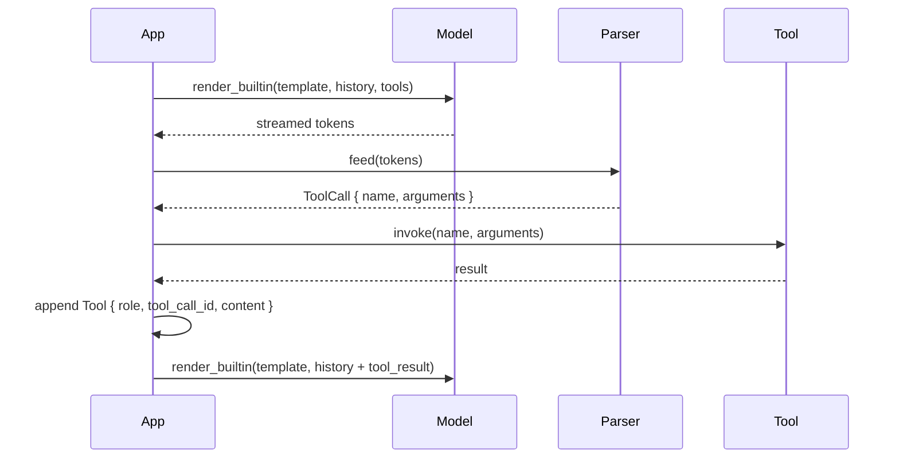
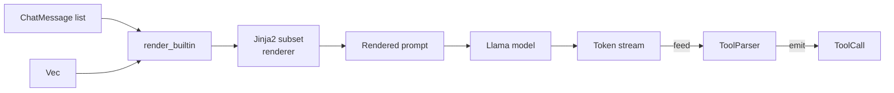

# Chat & tool calling

`llama-crab` provides a full chat pipeline: role-based messages,
Jinja2 template rendering (with a built-in subset engine and 14
named templates), a streaming tool-call parser, and a high-level
helper that wires the whole thing together.

## Messages

A conversation is a `Vec<ChatMessage>`, where each message has a
[`Role`] and a string body:

```rust
use llama_crab::chat::{ChatMessage, Role};

let messages = vec![
    ChatMessage::new(Role::System, "You are a helpful assistant."),
    ChatMessage::new(Role::User, "Hi!"),
];
```

The supported roles are:

| Role | Typical use |
| --- | --- |
| `Role::System` | Sets the persona, instructions, and constraints. Goes first. |
| `Role::User` | The end-user's turns. |
| `Role::Assistant` | The model's prior responses. Used for multi-turn history. |
| `Role::Tool` | The result of a tool call. Carries the `tool_call_id` and the output. |

A `ChatMessage` can also carry `tool_calls` (a `Vec<ToolCall>`) on
the assistant role, and the corresponding `tool_call_id` on the
tool role. See the [Tool calling](#tool-calling) section.

## Chat templates

Chat models expect their inputs in a specific format — typically a
Jinja2 template that wraps the conversation in `<|im_start|>` /
`<|im_end|>` markers, formats the tools as a JSON Schema, and so on.
`llama-crab` ships with:

- A **Jinja2 subset** renderer that supports the primitives used by
  95 % of real chat models: `if`, `for`, `set`, attribute and
  subscript access, filters, list and dict literals, `and`, `or`,
  `not`, `in`.
- **14 built-in templates** that cover the most popular open-weights
  models: `Plain`, `ChatMl`, `Llama2`, `Llama3`, `Mistral`, `Qwen2`,
  `Qwen2_5`, `Phi3`, `Gemma`, `CommandR`, `DeepSeek2`, `CodeFim`,
  `FunctionaryV2`, and `OpenChat`.

The full list lives in the [`BuiltinTemplate` enum] reference.

### Rendering manually

When you need the rendered prompt without running inference, use
[`render_builtin`]:

```rust
use llama_crab::chat::{BuiltinTemplate, render_builtin, ChatMessage, Role};

let prompt = render_builtin(
    BuiltinTemplate::Llama3,
    &[ChatMessage::new(Role::User, "Hi")],
    &[],      // no tools
    true,     // add the assistant turn-prefix
);
```

The last argument controls whether to append the assistant
"turn prefix" (e.g. `<|start|>assistant\n` for Llama 3). Set it to
`true` when the model is supposed to continue, `false` when you're
inspecting the rendered prompt.

### Auto-detecting from GGUF metadata

Most modern GGUF files declare their chat template in the metadata.
Use [`detect_chat_format`] to read it and pick a matching
`BuiltinTemplate`:

```rust
use llama_crab::chat::detect_chat_format;
use llama_crab::model::ModelMetadata;

let metadata = llama.model().metadata();
let template = detect_chat_format(&metadata);
```

If the architecture in the metadata is not recognised,
`detect_chat_format` returns `BuiltinTemplate::Plain` (a fallback
that just concatenates the messages with `### ` separators).

### The high-level helper

The fastest path to a chat completion is
`Llama::create_chat_completion_with`:

```rust
use llama_crab::chat::BuiltinTemplate;
use llama_crab::high_level::chat_completion::{create_chat_completion_with, ChatMessage};
use llama_crab::{Llama, LlamaParams, Role};

let mut llama = Llama::load(LlamaParams::new("model.gguf").with_n_ctx(4096))?;

let messages = vec![
    ChatMessage::new(Role::System, "You are a concise assistant."),
    ChatMessage::new(Role::User, "Explain Rust ownership in one paragraph."),
];

let response = create_chat_completion_with(
    &mut llama,
    &messages,
    BuiltinTemplate::ChatMl,
    &[],      // tools
    128,      // max tokens
)?;

println!("{}", response.content);
```

The returned [`ChatCompletionResponse`] carries the assistant
content, the per-token timings and the stop reason.

## Tool calling

Many modern instruct models are trained to *call functions* in
response to user messages. `llama-crab` exposes:

- A [`ToolDefinition`] type that mirrors the OpenAI function-calling
  schema.
- A [`ToolParser`] type that scans the model's output for tool calls
  and emits typed [`ToolCall`] values.
- Five built-in [`ToolFormat`] parsers, one per chat template:
  `ChatMl`, `Mistral`, `Llama3`, `Plain`, `FunctionaryV2`.

### Defining a tool

A tool is a function name, a description, and a JSON Schema for the
parameters:

```rust
use llama_crab::chat::ToolDefinition;
use serde_json::json;

let tool = ToolDefinition::new("get_weather", "Get the weather for a city")
    .with_parameters(json!({
        "type": "object",
        "properties": { "city": { "type": "string" } },
        "required": ["city"]
    }));
```

Pass a slice of tools to `render_builtin` (or
`create_chat_completion_with`) and the template renders them in the
expected format. The model then either:

- Calls one of the tools (emitting a structured `<tool_call>` block,
  or a `[TOOL_CALLS] [...]` list, or a `<|python_tag|>`-prefixed
  JSON object, depending on the format).
- Replies normally without calling any tool.

### Parsing the response

The model output is fed into a stateful `ToolParser` that emits
completed calls as they appear. This is the right shape for
streaming, because tool calls usually materialise one at a time
across multiple tokens:

```rust
use llama_crab::chat::tool_call::{ToolFormat, ToolParser};

let mut parser = ToolParser::new(ToolFormat::ChatMl);

let response = r#"<tool_call>{"name": "get_weather", "arguments": {"city": "Tokyo"}}</tool_call>"#;
let calls: Vec<_> = parser.feed(response).into_iter().filter_map(|r| r.ok()).collect();
assert_eq!(calls.len(), 1);
```

The parser is **stateful**: feed it token-by-token as the model
generates, and it will emit completed calls as they appear.

### Supported formats

| Format | Trigger syntax | Notes |
| --- | --- | --- |
| `ChatMl` | `<tool_call>{...}</tool_call>` | Qwen, Hermes, and other ChatML-based models. |
| `Mistral` | `[TOOL_CALLS][{...}]` | Mistral and Mixtral instruct models. |
| `Llama3` | `<|python_tag\|>{...}` | Llama 3.1/3.2 instruct with built-in tools. |
| `Plain` | `{...}` (any JSON object) | Fallback for models without a defined format. |
| `FunctionaryV2` | `<\|start\|>function<\|message\|>...<\|call\|>` | Functionary v2 (multi-turn tool protocol). |

### The full loop



### Multi-turn tool calling

After the tool runs, append the result to the history as a
`Role::Tool` message and call the model again:

```rust
use llama_crab::chat::{ChatMessage, Role};

history.push(ChatMessage::new(
    Role::Tool,
    /* tool_call_id */ "call_weather",
    /* content      */ r#"{"temperature": 22}"#,
));

let response = create_chat_completion_with(
    &mut llama, &history, BuiltinTemplate::ChatMl, &[tool], 128,
)?;
```

The model now has the tool result in its context and can answer
the user's original question.

## How rendering works



The Jinja2 renderer is pure Rust and does not shell out to Python.
The subset it supports covers 95 % of real-world templates; if you
hit a model that needs an unsupported primitive, open an issue.

## Where to next?

- [Built-in chat templates reference](../reference/chat-templates.md)
  — the full list, with a snippet of each template.
- [Tool calling example](../examples/tools.md) — a runnable
  program that defines a tool, sends a request, parses the
  response, and re-prompts with the tool result.
- [Stateful chat](stateful-chat.md) — multi-turn chat with
  growing history and session persistence.

[`Role`]: https://docs.rs/llama-crab/latest/llama_crab/enum.Role.html
[`ChatMessage`]: https://docs.rs/llama-crab/latest/llama_crab/chat/struct.ChatMessage.html
[`BuiltinTemplate` enum]: https://docs.rs/llama-crab/latest/llama_crab/chat/enum.BuiltinTemplate.html
[`render_builtin`]: https://docs.rs/llama-crab/latest/llama_crab/chat/fn.render_builtin.html
[`detect_chat_format`]: https://docs.rs/llama-crab/latest/llama_crab/chat/fn.detect_chat_format.html
[`ChatCompletionResponse`]: https://docs.rs/llama-crab/latest/llama_crab/chat/struct.ChatCompletionResponse.html
[`ToolDefinition`]: https://docs.rs/llama-crab/latest/llama_crab/chat/struct.ToolDefinition.html
[`ToolParser`]: https://docs.rs/llama-crab/latest/llama_crab/chat/tool_call/struct.ToolParser.html
[`ToolFormat`]: https://docs.rs/llama-crab/latest/llama_crab/chat/tool_call/enum.ToolFormat.html
[`ToolCall`]: https://docs.rs/llama-crab/latest/llama_crab/chat/tool_call/struct.ToolCall.html
