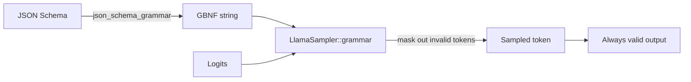

# JSON-Schema & GBNF grammars

Constrained decoding is the most reliable way to get a model to emit
structured output. `llama-crab` ships with a pure-Rust JSON-Schema →
GBNF converter that supports a useful subset of [JSON Schema
2020-12](https://json-schema.org/draft/2020-12/json-schema-core.html),
and a GBNF grammar sampler that constrains the model's logits to
match the grammar at every step.

## How it works



The grammar sampler runs **after** every other sampler in the chain.
It looks at the current context (the tokens generated so far) and
the GBNF grammar, computes the set of tokens that would keep the
output valid, and masks all other tokens' logits to `-inf`. The
next sampler in the chain then picks from the masked distribution.

The result: the model literally cannot emit a token that would
break the grammar. The output is guaranteed to be valid against
the schema, regardless of the model size or the prompt.

## Quickstart

```rust
use llama_crab::high_level::completion::json_schema_grammar;
use serde_json::json;

let schema = json!({
    "type": "object",
    "properties": {
        "name": { "type": "string" },
        "age":  { "type": "integer" }
    },
    "required": ["name", "age"]
});
let grammar = json_schema_grammar(&schema).unwrap();
```

The function returns a `String` containing a valid GBNF grammar.
Pass it to the grammar sampler:

```rust
use llama_crab::sampling::LlamaSampler;
use llama_crab::high_level::completion::CompletionOptions;
use llama_crab::{Llama, LlamaParams};

let mut llama = Llama::load(LlamaParams::new("model.gguf"))?;
let grammar = unsafe { LlamaSampler::grammar(llama.model(), &grammar_text, "root")? };
let greedy = LlamaSampler::greedy();
let mut sampler = LlamaSampler::chain(vec![grammar, greedy], false)?;

let completion = llama.create_completion_with_sampler(
    "Return one object: ",
    CompletionOptions::new(64),
    &mut sampler,
)?;
```

`LlamaSampler::grammar` is gated by the `common` Cargo feature.
The full example is in
[`examples/structured/`](../examples/structured.md).

## Supported JSON-Schema features

The converter understands a useful subset of JSON Schema 2020-12:

| Feature | Status |
| --- | --- |
| `type: object` with `properties`, `required`, `additionalProperties` | ✅ |
| `type: array` with `items`, `prefixItems`, `minItems`, `maxItems` | ✅ |
| `type: string` with `minLength`, `maxLength`, `pattern` | ✅ |
| `type: integer` / `number` with `minimum`, `maximum`, `exclusiveMinimum`, `exclusiveMaximum` | ✅ |
| `type: boolean`, `null` | ✅ |
| `enum` (string, integer, boolean, null) | ✅ |
| `const` | ✅ |
| `format: date-time`, `email`, `uri`, `uuid` | ✅ |
| `oneOf`, `anyOf`, `allOf` | ✅ |
| `$ref` (local, `#/definitions/...`) | ✅ |
| `definitions`, `$defs` | ✅ |
| Conditional keywords (`if`, `then`, `else`) | Partial |
| Recursive schemas | Partial (single-level `$ref` only) |

If a feature you need is missing, open an issue with the schema
snippet. The converter is designed to grow with the use cases the
community hits.

## A worked example

Suppose you want the model to emit a list of "people", each with a
name, age and email. The schema is:

```json
{
  "type": "array",
  "items": {
    "type": "object",
    "properties": {
      "name":  { "type": "string" },
      "age":   { "type": "integer", "minimum": 0 },
      "email": { "type": "string", "format": "email" }
    },
    "required": ["name", "age"]
  },
  "minItems": 1,
  "maxItems": 5
}
```

The GBNF grammar the converter produces is roughly:

```
root   ::= arr
arr    ::= "[" item (", " item)* "]"
item   ::= "{" pair (", " pair)* "}"
pair   ::= string ":" (number|string)
string ::= "\"" char+ "\""
number ::= [0-9]+
char   ::= [^"\\] | "\\" ["\\nrt]
```

When the model generates, the grammar sampler only allows tokens
that keep the partial output on a path to a valid `root` rule. The
output is always parseable JSON that matches the schema.

### Performance

Grammars have a small per-token overhead — the grammar sampler
evaluates the grammar against the partial output every step. In
practice the cost is dominated by the model forward pass, not the
sampler, so total time-to-completion is usually comparable to
unconstrained generation. The grammar is also tighter than what a
hand-written GBNF would be, because the converter optimises for
the schema structure.

## Custom grammars

For full control, build a GBNF string by hand and pass it directly
to the `grammar` sampler (gated by the `common` feature):

```rust
let grammar_text = r#"
root   ::= "answer=" answer
answer ::= "yes" | "no"
"#;
let grammar = unsafe { LlamaSampler::grammar(llama.model(), grammar_text, "root")? };
```

GBNF is a small, BNF-like grammar language. The
[llama.cpp GBNF spec](https://github.com/ggml-org/llama.cpp/blob/master/grammars/README.md)
covers the full syntax.

## When to use grammars vs few-shot

| Approach | Reliability | Flexibility | Cost |
| --- | --- | --- | --- |
| **Grammar-constrained decoding** | 100 % valid output. | Output is locked to the grammar. | Small per-token overhead. |
| **Few-shot prompting** | 80–95 % valid output (model-dependent). | Anything the model can express. | None. |
| **JSON-mode + parser** | High (most models emit valid JSON when asked). | The schema has to be hinted in the prompt. | None, plus a post-hoc parser. |

The grammar sampler is the right choice when:

- The schema is fixed and known in advance.
- Downstream code expects well-typed output (no fallback parser).
- The cost of an invalid output is high (e.g. a database insert).

## Common pitfalls

| Pitfall | What goes wrong | Fix |
| --- | --- | --- |
| Schema with no `type` keyword | Converter falls back to "any value", which is unconstrained. | Add `type: object` (or whatever the root is). |
| Recursive schema with deep nesting | Converter truncates recursion at one level. | Flatten the schema or use `anyOf` with a fixed depth. |
| Grammar sampler runs **before** another sampler | The second sampler picks an invalid token. | Always put the grammar sampler **last** in the chain. |
| `LlamaSampler::grammar` returns `None` | The `common` feature is not enabled. | Add `features = ["common"]` to the dependency. |
| Model ignores the grammar | The model is too small or the prompt is bad. | Increase model size; verify the prompt mentions the expected output. |

## Where to next?

- [Structured output example](../examples/structured.md) — a
  runnable program that emits a JSON object.
- [Server structured output](../server/structured.md) — the
  `response_format` field on the HTTP API.
- [Tools](chat.md) — when the structured output is a *function
  call*, use the chat pipeline instead.
