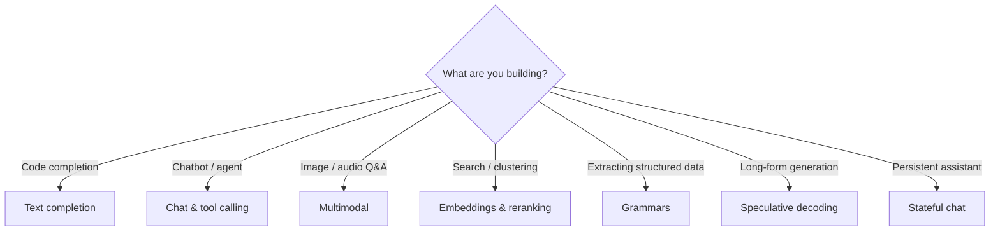

# Features

This section documents every public feature of the `llama-crab` API.
Each page goes end-to-end: the why, the how, the pitfalls, and a
complete runnable example.

-   :material-text-box-outline: __[Text completion](text-completion.md)__

    Plain prompt → text. Stop sequences, log probabilities, streaming,
    best-of-N, and FIM (fill-in-the-middle) for code.

-   :material-message-text-outline: __[Chat & tool calling](chat.md)__

    Role-based messages, 14 built-in Jinja2 templates, a Jinja2 subset
    renderer, the tool-call parser for ChatML / Mistral / Llama 3 /
    Functionary, and incremental parsing.

-   :material-image-multiple-outline: __[Multimodal (vision + audio)](multimodal.md)__

    Pair a text GGUF with an `mmproj` projector, decode local images
    into `MtmdBitmap`, evaluate multimodal chunks, and continue
    generation with the normal sampler chain.

-   :material-vector-circle: __[Embeddings & reranking](embeddings.md)__

    Mean / CLS / Last pooling, L2-normalised vectors, semantic
    search, and the cross-encoder `Llama::rerank` helper.

-   :material-code-braces: __[JSON-Schema & GBNF grammars](grammars.md)__

    Convert a JSON Schema 2020-12 document into a GBNF grammar and
    use the grammar sampler to force the model to emit only valid
    output. The most reliable way to get structured data out of a
    model.

-   :material-fast-forward: __[Speculative decoding](speculative.md)__

    The `PromptLookupDecoding` draft model (no extra weights) and
    the `DraftModel` trait for plugging in your own draft. The
    `speculative_decode` free function drives the verify step.

-   :material-history: __[Stateful chat](stateful-chat.md)__

    Multi-turn chat with a growing history. Template auto-detection,
    history trimming strategies, and session persistence.

## Picking the right feature for the job

If you're not sure where to start, the [`quickstart` example](../examples/quickstart.md)
walks through plain completion, chat, FIM and embeddings in a single
~80-line program.
