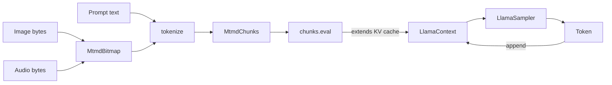

# Multimodal (vision + audio)

With the `mtmd` Cargo feature, `llama-crab` exposes `llama.cpp`'s
multimodal stack. This page explains how to pair a text GGUF with an
`mmproj` projector, decode local images (and audio) into `MtmdBitmap`,
evaluate multimodal chunks and continue generation with the normal
sampler chain.

## The `mtmd` feature

```toml title="Cargo.toml"
[dependencies]
llama-crab = { version = "0.1", features = ["mtmd"] }
```

The feature gates the `llama_crab::multimodal` module: `MtmdContext`,
`MtmdBitmap`, `MtmdInputText`, and the `chunks.eval` method. Without
it, the types simply do not exist (so your code fails to compile, not
at runtime — a deliberate design choice to keep the default binary
small).

## The data flow



The text prompt and the bitmaps are tokenised **together** into a
list of chunks. The chunks are then evaluated with `chunks.eval`,
which extends the KV cache the same way a normal `decode` call would.
After evaluation, the model has the multimodal prefix in its context
and you can sample text as usual.

## Loading a multimodal model

A multimodal workflow needs two GGUF files:

- The **text model** (e.g. Gemma 4 E4B, LFM2.5-VL, Qwen2.5-VL).
- The **mmproj projector** that bridges the modality encoder to the
  text model. The file is usually named `mmproj-<model>.gguf`.

```rust,no_run
use llama_crab::multimodal::MtmdContext;
use llama_crab::{Llama, LlamaParams};

let mut llama = Llama::load(
    LlamaParams::new("gemma-4-E4B-it-Q4_K_M.gguf").with_n_ctx(4096),
)?;
let mtmd = MtmdContext::init_from_file("gemma-4-E4B-it-mmproj.gguf", llama.model())?;
```

`MtmdContext` borrows the `LlamaModel`, so the model must outlive
the multimodal context.

## Building a multimodal prompt

`MtmdInputText` carries the text part, and a list of bitmaps carries
the media. The text usually contains a marker that tells the
tokeniser where to insert the image embeddings; use
`default_media_marker()` to get the marker the current `mmproj`
expects:

```rust,no_run
use llama_crab::multimodal::{default_media_marker, MtmdBitmap, MtmdInputText};

let marker = default_media_marker();
let prompt = format!("{marker}\nDescribe this image in one short sentence.");

let bitmap = MtmdBitmap::from_file("image.png")?;
let chunks = mtmd.tokenize(
    MtmdInputText::new(&prompt),
    &[&bitmap],
)?;
```

`MtmdBitmap::from_file` accepts PNG, JPEG, and BMP. For raw RGB
data, use `MtmdBitmap::from_image_data(width, height, &rgb_bytes)`.

### Bitmap configuration

`MtmdContext::bitmap_config()` returns a builder with knobs for
image resizing and aspect ratio:

```rust,no_run
let bitmap = MtmdBitmap::from_file("image.png")?
    .resize_to(896, 896)?;   // downscale large images
```

Most VLMs have an optimal input resolution around 336×336 to
896×896. Larger images waste memory without improving the model's
answers.

## Evaluating the chunks

`chunks.eval` is `unsafe` because it writes into a raw context
pointer. The pointer must point to a live, unaliased context owned
by the caller:

```rust,no_run
let ctx_ptr = llama.context().raw_handle();
let new_n_past = unsafe {
    chunks.eval(&mtmd, ctx_ptr, 0, 0, llama.context().n_batch() as i32, true)?
};
```

The arguments are:

| Argument | Meaning |
| --- | --- |
| `&mtmd` | The active `MtmdContext`. |
| `ctx_ptr` | A `*mut llama_context` from a live `LlamaContext`. |
| `seq_id` | The sequence id to extend (usually `0`). |
| `n_past` | The starting position in the KV cache (usually `0` or the current position). |
| `n_batch` | The logical batch size (use `llama.context().n_batch()`). |
| `logits_last` | Whether to read the logits of the last token (set to `true` to sample after the call). |

The function returns the new `n_past`, which is the position the
sampler should start from.

## Sampling text after the multimodal prefix

Once the chunks are evaluated, sample with a normal `LlamaSampler`
chain:

```rust,no_run
use llama_crab::batch::LlamaBatch;
use llama_crab::sampling::LlamaSampler;
use llama_crab::token::LlamaToken;

let mut sampler = LlamaSampler::greedy()?;
let eos = llama.model().token_eos();
let mut out = String::new();
let mut next_pos = new_n_past;

for _ in 0..128 {
    let tok: LlamaToken = unsafe { sampler.sample(ctx_ptr, -1) };
    sampler.accept(tok);
    if tok == eos { break; }
    if let Ok(piece) = llama.model().detokenize(&[tok], false) {
        out.push_str(&piece);
    }
    let single = LlamaBatch::one(tok, next_pos, 0, true);
    llama.context().decode(&single)?;
    next_pos += 1;
}
println!("{out}");
```

The full example lives in [`examples/mtmd/`](../examples/mtmd.md).

## Audio

`MtmdBitmap` also carries audio. The exact audio formats supported
depend on the model and the projector. As of writing:

- **LFM2.5-VL** accepts 16 kHz mono PCM.
- **Gemma 4** is text + image only.

```rust,no_run
use llama_crab::multimodal::MtmdBitmap;

let audio = MtmdBitmap::from_audio_file("clip.wav")?;
let chunks = mtmd.tokenize(
    MtmdInputText::new("Transcribe the audio."),
    &[&audio],
)?;
```

If the projector is audio-capable, the same `chunks.eval` call works
without changes.

## Tested models

| Model | Modality | Status |
| --- | --- | --- |
| `lmstudio-community/gemma-4-E4B-it-GGUF` | Vision | Tested in CI. |
| `unsloth/LFM2.5-VL-1.6B-GGUF` | Vision | Tested in CI. |
| `Qwen2.5-VL` | Vision | Compatible via `mtmd`. |
| `Llama-3.2-Vision` | Vision | Compatible via `mtmd`. |
| `LLaVA-1.5/1.6` | Vision | Compatible via `mtmd`. |

The integration tests under [`llama-crab/tests/`](https://github.com/DominguesM/llama-crab/tree/main/llama-crab/tests)
exercise both Gemma 4 and LFM2.5-VL on a fixed set of test images
and skip cleanly when the model is not on disk.

## Pitfalls

| Pitfall | What goes wrong | Fix |
| --- | --- | --- |
| Wrong `mmproj` for the text model | `MtmdContext::init_from_file` fails or `chunks.eval` produces nonsense. | Use the projector that ships with the model family (e.g. `mmproj-gemma-4-...` for Gemma 4). |
| Audio model loaded against an image projector | `chunks.eval` returns "no audio token in the chunk". | Use a projector that supports the modality you want. |
| Image too large | Out-of-memory or extremely slow evaluation. | Use `MtmdBitmap::resize_to` to downscale to the VLM's optimal resolution. |
| Multiple bitmaps in one prompt | The VLM may attend to the wrong image. | Verify the marker placement in the text prompt. |

## Where to next?

- [Vision example](../examples/vision.md) — high-level `MtmdContext`
  API.
- [mtmd example](../examples/mtmd.md) — raw `mtmd.h` API, for
  advanced users.
- [Recipes: chatbot](../recipes/chatbot.md) — combining vision +
  tool calling + chat in a single agent.
