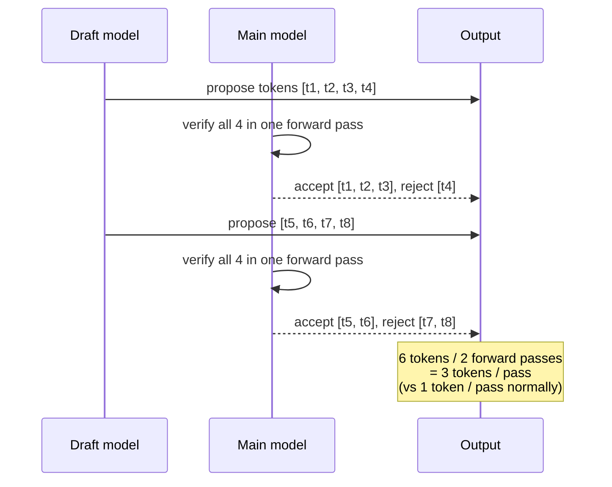

# Speculative decoding

Speculative decoding trades a small amount of extra compute for a
large speedup on agreement-heavy workloads. A cheap **draft** step
proposes `n` candidate tokens; the main model verifies them in a
single forward pass. Accepted tokens cost one decode step each, just
like greedy sampling — but you also got them "for free" if the draft
was right.



The accepted count depends on how well the draft agrees with the
main model. For repetitive prompts (code, lists, RAG that quotes
the context) acceptance can hit 80–90 %; for open-ended creative
generation it drops below 50 %, and the overhead can exceed the
savings.

## The two flavours in `llama-crab`

| Flavour | What you provide | When to use it |
| --- | --- | --- |
| [`PromptLookupDecoding`] | Nothing — drafts from n-grams in the prompt. | The cheapest possible draft. Works on code, lists, RAG, FIM. |
| Your own `DraftModel` | A smaller model, a trie, a regex automaton, … | When the prompt-lookup acceptance is too low, or you have a small draft model available. |

## Prompt-lookup n-gram

`PromptLookupDecoding` is a zero-config draft model. It looks for
the last `k` tokens of the current sequence earlier in the prompt
and emits whatever followed them as the draft. Works extremely well
on:

- Code with repeated patterns.
- Lists (1, 2, 3, …; a, b, c, …).
- RAG answers that quote the prompt.
- FIM infill, where the body of the function appears earlier in the
  file.

```rust
use llama_crab::speculative::{DraftModel, PromptLookupDecoding};
use llama_crab::{Llama, LlamaParams};

let llama = Llama::load(LlamaParams::new("model.gguf").with_n_ctx(2048))?;
let prompt = "Rust is fast and memory safe. Rust is fast";
let tokens = llama.model().tokenize(prompt, true, true)?;

let draft = PromptLookupDecoding::new(3, 8);
let drafted = draft.draft(&tokens, 8);
```

### Tuning knobs

| Knob | Description | Typical range |
| --- | --- | --- |
| `max_ngram_size` | How many trailing tokens form the lookup key. | 2–4 |
| `num_pred_tokens` | How many tokens to emit when a match is found. | 4–16 |

Larger `max_ngram_size` finds more matches but is more sensitive to
small edits. Larger `num_pred_tokens` reduces the verification
overhead per accepted token, but a wrong draft is more expensive to
recover from.

## Custom draft models

Implement the [`DraftModel`] trait for anything that can propose
tokens — a smaller quantized GGUF loaded into a second `Llama`, a
regex automaton, a finite-state machine, a trie of common phrases,
…

```rust
use llama_crab::speculative::DraftModel;
use llama_crab::token::LlamaToken;

struct AlwaysHello;
impl DraftModel for AlwaysHello {
    fn draft(&self, _input: &[LlamaToken], n: usize) -> Vec<LlamaToken> {
        // Replace with: sample n tokens from your smaller model.
        Vec::new()
    }
}
```

A common pattern is to load a 0.5 B draft model and a 70 B target
model, both on the same GPU, and let the draft propose 8–16 tokens
at a time. Acceptance rates of 60–80 % are typical for chat workloads.

## Driving a speculative step

The free function [`speculative_decode`] feeds the draft through the
main context, samples at every position, accepts the longest
matching prefix and returns the accepted tokens:

```rust
use llama_crab::speculative::{DraftModel, PromptLookupDecoding, speculative_decode};
use llama_crab::sampling::LlamaSampler;

let main_ctx: *mut llama_crab_sys::llama_context = llama.context().raw_handle();
let mut sampler = LlamaSampler::greedy()?;
let draft = PromptLookupDecoding::new(2, 4);
let history: Vec<LlamaToken> = Vec::new();

let accepted: Vec<LlamaToken> = unsafe {
    speculative_decode(main_ctx, &mut sampler, &draft, &history, 4)
};
```

The function is `unsafe` because `main_ctx` must point at a live,
unaliased context owned by the caller. The high-level `Llama`
orchestrator exposes the raw handle through
`llama.context().raw_handle()` when you need it.

## When speculative decoding helps

- **High draft acceptance** — repetitive inputs, FIM, structured
  output, RAG answers that quote the prompt.
- **Cheap draft step** — n-gram lookups are nanoseconds; a small
  draft model should be 5–10× smaller than the main model.
- **Single-user latency** — throughput gains disappear under
  batching because the main model is already busy.

## When it doesn't help

- **Open-ended creative generation** — acceptance drops below
  ~50 %.
- **Tiny models** — the overhead eats the savings.
- **Heavily batched servers** — the main model is already saturated.
- **The draft model is large enough to be slow on its own** — the
  draft should be small enough that one draft forward pass is
  cheaper than one main forward pass.

## Pitfalls

| Pitfall | What goes wrong | Fix |
| --- | --- | --- |
| `n` larger than `n_batch` | The draft overflows the batch. | Keep `n ≤ n_batch / 2`. |
| Draft uses a different tokenizer | Mismatched token ids crash the verify step. | Make sure both models use compatible tokenizers. |
| Draft proposes from a stale context | Acceptance is lower than it should be. | The draft sees the same prompt as the main model. |
| Speculative step inside a long batched sequence | Verification skips some KV-cache positions. | Reset the cache between requests. |

## Where to next?

- [Speculative decoding example](../examples/speculative.md) — a
  runnable program that demonstrates `PromptLookupDecoding`.
- [Sampling strategies](../guides/sampling.md) — pair speculative
  decoding with a custom sampler chain.
- [Performance tuning recipe](../recipes/performance.md) — measure
  throughput with and without speculative decoding.

[`speculative`]: https://docs.rs/llama-crab/latest/llama_crab/speculative/index.html
[`DraftModel`]: https://docs.rs/llama-crab/latest/llama_crab/speculative/trait.DraftModel.html
[`PromptLookupDecoding`]: https://docs.rs/llama-crab/latest/llama_crab/speculative/struct.PromptLookupDecoding.html
[`speculative_decode`]: https://docs.rs/llama-crab/latest/llama_crab/speculative/fn.speculative_decode.html
[`Llama`]: https://docs.rs/llama-crab/latest/llama_crab/struct.Llama.html
