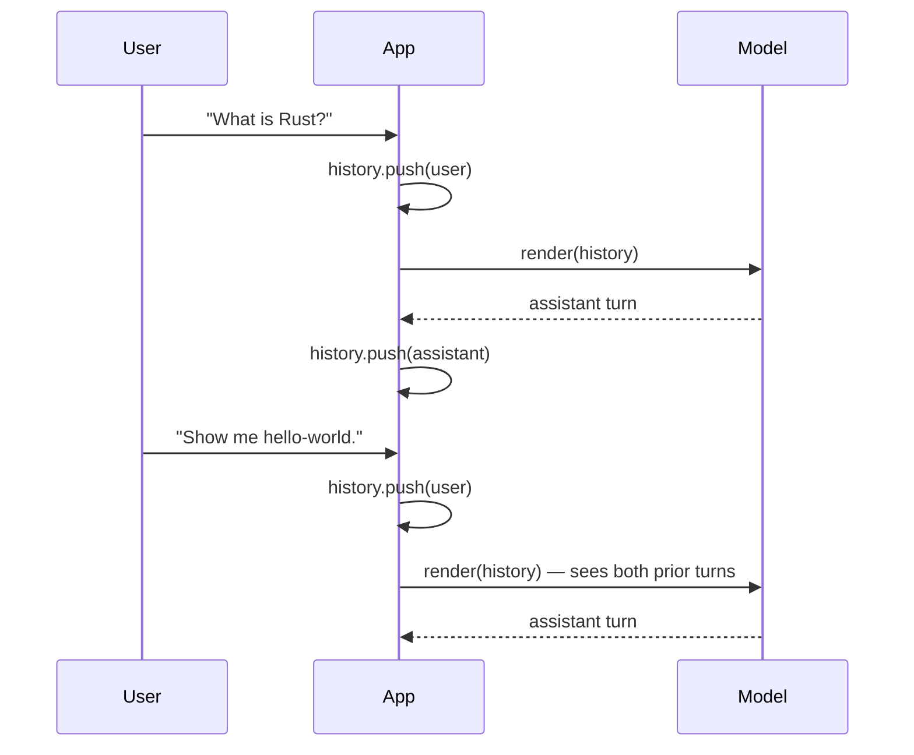
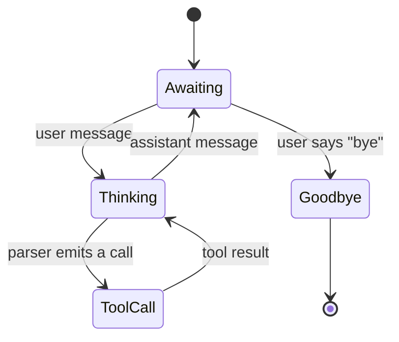

# Stateful chat

A stateful chat keeps the conversation history alive across turns so
the model sees the full context every time. At the API level this
is just a growing `Vec<ChatMessage>` that you re-send on each turn;
the high-level chat completion helper handles the rest.



In v0.1.x, the high-level completion helpers do not automatically
restore prompt-cache entries. `create_completion` clears KV sequence
0 before each call, and `create_chat_completion_with` uses that path.
Use the lower-level context/session APIs if you need manual KV reuse
— see the [Caching & session state guide](../guides/caching.md).

## Minimal loop

```rust
use llama_crab::chat::{BuiltinTemplate, ChatMessage};
use llama_crab::high_level::chat_completion::create_chat_completion_with;
use llama_crab::{Llama, LlamaParams, Role};

let mut llama = Llama::load(LlamaParams::new("model.gguf").with_n_ctx(4096))?;

let mut history: Vec<ChatMessage> = vec![
    ChatMessage::new(Role::System, "You are a concise assistant."),
];

// First user turn.
history.push(ChatMessage::new(Role::User, "What is Rust?"));
let resp = create_chat_completion_with(
    &mut llama, &history, BuiltinTemplate::ChatMl, &[], 128,
)?;
history.push(ChatMessage::new(Role::Assistant, resp.content));

// Second user turn — the model sees the previous exchange.
history.push(ChatMessage::new(Role::User, "Show me hello-world."));
let resp = create_chat_completion_with(
    &mut llama, &history, BuiltinTemplate::ChatMl, &[], 128,
)?;
```

The full interactive REPL (with `/clear`, `/save`, EOF handling) is
in the [`stateful_chat` example](../examples/stateful-chat.md).

## Picking a template

The model's GGUF metadata usually declares its chat template. Use
`detect_chat_format` on the metadata to read it, or force a known
one with `BuiltinTemplate::ChatMl`, `Llama3`, `Qwen2`, and friends.

```rust
use llama_crab::chat::detect_chat_format;

let metadata = llama.model().metadata();
let template = detect_chat_format(&metadata);
```

If the architecture in the metadata is not recognised, the fallback
is `BuiltinTemplate::Plain` (a simple `### ` separator). That is
almost never what you want for a chat model — prefer an explicit
template.

## Trimming history

`LlamaParams::with_n_ctx(N)` caps the number of tokens the context
can hold. When the history grows past it, you have three options:

1. **Truncate head** — drop the oldest user/assistant turns, keep
   the system message. Simplest and what most chat UIs do.
2. **Summarise** — periodically replace the oldest turns with a
   single `Role::System` summary.
3. **Bigger `n_ctx`** — pay more memory and per-step latency.

### Truncate head

```rust
// Keep the system message + the last N turns.
let keep_tail = 20;
if history.len() > keep_tail {
    let system = history[0].clone();
    history = std::iter::once(system)
        .chain(history.into_iter().skip(1).rev().take(keep_tail).rev())
        .collect();
}
```

### Periodic summarisation

```rust
// Run every 10 turns — call the model itself to summarise the
// old turns, replace them with a single System message.
let summary = llama.create_chat_completion(
    &vec![/* summarisation prompt */],
    256,
)?;
history.insert(1, ChatMessage::new(Role::System, summary.content));
```

## Session persistence

To resume a conversation after the process exits, serialise the
history with `serde_json` and reload it on the next start. If you
also need KV reuse, persist and restore session state manually
through the lower-level APIs described in
[Caching & session state](../guides/caching.md).

```rust
let json = serde_json::to_string_pretty(&history)?;
std::fs::write("conversation.json", json)?;

// On the next start:
let raw = std::fs::read_to_string("conversation.json")?;
let history: Vec<ChatMessage> = serde_json::from_str(&raw)?;
```

## State machines for chatbots

A real chatbot often needs more than a flat history:



Implement this with an enum:

```rust
enum ChatState {
    Awaiting,
    Thinking,
    ToolCall { name: String, arguments: serde_json::Value },
    Goodbye,
}
```

The [Chatbot recipe](../recipes/chatbot.md) walks through a full
implementation.

## Where to next?

- [`stateful_chat` example](../examples/stateful-chat.md) — a
  runnable REPL with `/clear`, `/save`, and EOF handling.
- [Chat & tool calling](chat.md) — when the state machine includes
  tool calls.
- [Caching & session state](../guides/caching.md) — manual KV
  cache reuse to skip re-evaluating previous turns.
