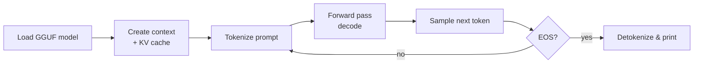

# Your first program

This page walks you through a complete, runnable `main.rs` that
exercises the most common paths in the `llama-crab` API: load a model,
run a plain text completion, run a multi-turn chat completion, and
print both. By the end you'll have a self-contained binary that you
can copy into your own project.

## What we'll build



Behind the scenes `Llama::create_completion` does steps **C → G** for
you in a single call; we keep them explicit in the example below so
you can see the data flow.

## 1. The full program

Drop this into a new Cargo project and adjust the model path:

```rust title="src/main.rs"
use llama_crab::chat::ChatMessage;
use llama_crab::{Llama, LlamaParams, Role};

fn main() -> Result<(), Box<dyn std::error::Error>> {
    // 1. Load the model from a GGUF file. Adjust the path to a real
    //    model on your machine.
    let mut llama = Llama::load(
        LlamaParams::new("models/qwen2.5-0.5b-instruct-q4_k_m.gguf")
            .with_n_ctx(2048)
            .with_n_threads(4),
    )?;

    // 2. Plain text completion.
    let resp = llama.create_completion("The capital of France is", 24)?;
    println!("completion> {}", resp.text);

    // 3. Multi-turn chat completion. `create_chat_completion` uses
    //    a sensible default template; pick a specific one with
    //    `create_chat_completion_with` for full control.
    let history = vec![
        ChatMessage::new(Role::System, "You are a concise assistant."),
        ChatMessage::new(Role::User, "What is Rust?"),
    ];
    let resp = llama.create_chat_completion(&history, 128)?;
    println!("assistant> {}", resp.content);

    Ok(())
}
```

A matching `Cargo.toml`:

```toml title="Cargo.toml"
[package]
name = "hello-crab"
version = "0.1.0"
edition = "2021"

[dependencies]
llama-crab = "0.1"
```

## 2. Run it

```bash
cargo run --release
```

The first build takes a few minutes (CMake + `llama.cpp` + the
safe-API crate). Subsequent builds are cached. Expected output:

```
completion>  Paris. The City of Light, famous for the Eiffel Tower...
assistant> Rust is a memory-safe systems programming language that...
```

The exact text depends on the model and the sampling defaults; the
important part is that both calls return without an error.

## 3. Walk-through

### Loading a model

```rust
let mut llama = Llama::load(
    LlamaParams::new("path/to/model.gguf")
        .with_n_ctx(2048)
        .with_n_threads(4),
)?;
```

- `LlamaParams::new(path)` — accepts a path to a `.gguf` file.
- `.with_n_ctx(2048)` — size of the KV cache (prompt + generation
  tokens). 2048 is enough for short chat sessions; bump to 4096–8192
  for longer contexts.
- `.with_n_threads(4)` — CPU threads used for prompt ingestion and
  decode. Defaults to the number of physical cores; tune down on
  laptops to avoid thermal throttling.

The `?` propagates [`LlamaError`](../core-concepts/errors.md); see the
[error handling page](../core-concepts/errors.md) for the full list of
variants.

### Plain text completion

```rust
let resp = llama.create_completion("The capital of France is", 24)?;
```

- The first argument is the **prompt** (any `&str` or `String`).
- The second argument is the **maximum number of tokens** to
  generate. Generation also stops on EOS or on a stop sequence
  configured through [`CompletionOptions`](../features/text-completion.md).
- The returned [`Completion`] carries `.text`, the per-token log
  probabilities, the model timings, and the list of generated token
  ids.

### Multi-turn chat completion

```rust
let history = vec![
    ChatMessage::new(Role::System, "You are a concise assistant."),
    ChatMessage::new(Role::User, "What is Rust?"),
];
let resp = llama.create_chat_completion(&history, 128)?;
```

- The history is a list of [`ChatMessage`]s with one of the roles in
  [`Role`]: `System`, `User`, `Assistant` or `Tool`.
- `create_chat_completion` picks a default template; for production
  use [`create_chat_completion_with`] and pass the
  [`BuiltinTemplate`] that matches your model.
- The result is a [`ChatCompletionResponse`] with `.content` (the
  assistant turn) and the per-token timings.

## 4. Where to go from here

| Goal | Next page |
| --- | --- |
| Add tools / function calling | [Chat & tool calling](../features/chat.md) |
| Switch to a different sampler | [Sampling strategies](../guides/sampling.md) |
| Stream tokens as they are generated | [Streaming example](../examples/streaming.md) |
| Compute embeddings | [Embeddings & reranking](../features/embeddings.md) |
| Run on a GPU | [Backends & GPU offload](../guides/backends.md) |
| Ship to mobile | [Mobile distribution](../guides/mobile.md) |
| Build a chatbot with history | [Stateful chat](../features/stateful-chat.md) |
| Expose the model over HTTP | [Server](../server/index.md) |

[`Completion`]: https://docs.rs/llama-crab/latest/llama_crab/struct.Completion.html
[`ChatMessage`]: https://docs.rs/llama-crab/latest/llama_crab/chat/struct.ChatMessage.html
[`ChatCompletionResponse`]: https://docs.rs/llama-crab/latest/llama_crab/chat/struct.ChatCompletionResponse.html
[`Role`]: https://docs.rs/llama-crab/latest/llama_crab/enum.Role.html
[`BuiltinTemplate`]: https://docs.rs/llama-crab/latest/llama_crab/chat/enum.BuiltinTemplate.html
[`create_chat_completion_with`]: https://docs.rs/llama-crab/latest/llama_crab/high_level/chat_completion/fn.create_chat_completion_with.html
