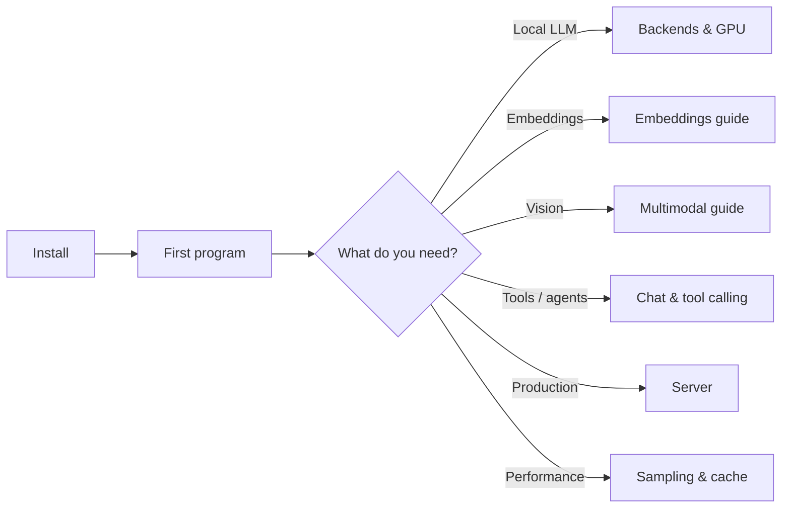

# Getting Started

Welcome to `llama-crab`! This section walks you from "I have Rust
installed" to "I have a model generating text on my machine" in three
short steps. The pages below assume you already have a recent Rust
toolchain and a working C/C++ build environment.

-   :material-download: __[Installation](installation.md)__

    Add `llama-crab` to your `Cargo.toml`, install the required system
    tools (CMake, a C/C++ compiler, the platform SDK for your GPU), and
    pick the right set of Cargo features for your target.

-   :material-play: __[Your first program](first-program.md)__

    A complete, runnable program that loads a model, runs a text
    completion and a chat completion, and prints the results. We also
    cover the smallest possible model you can use to verify the
    toolchain works end-to-end.

-   :material-tune: __[Cargo features](cargo-features.md)__

    A deep dive into the feature flags that pick the backend (`openmp`,
    `metal`, `cuda`, `vulkan`, `rocm`, `opencl`, `kleidiai`), opt into
    multimodal (`mtmd`), the grammar sampler (`common`, `llguidance`),
    the disk-backed KV cache (`disk-cache`) and a few integration
    features.

-   :material-folder-outline: __[Project layout](project-layout.md)__

    Where to put your `Cargo.toml`, how to wire your binaries, how to
    download a model, and how to wire the helpers in `examples/run.sh`
    into your own workflow.

## What you'll need

| Tool | Version | Why |
| --- | --- | --- |
| Rust | **1.88** or newer (pinned via `rust-toolchain.toml`) | The crate uses the 2024 edition's features and a recent `std::sync` API. |
| CMake | **3.18** or newer | `llama-crab-sys` builds `llama.cpp` from source through CMake. |
| C/C++ compiler | Anything `llama.cpp` accepts (clang 14+, GCC 11+, MSVC 2022, Apple clang) | Compiles the bundled C/C++ source. |
| Platform SDK | Xcode CLT (macOS), build-essential (Debian/Ubuntu), or the equivalent | Required by the GPU backend you pick (Metal, CUDA, Vulkan, …). |
| Hugging Face CLI | latest | Optional: speeds up first-time model downloads. `pip install -U huggingface_hub` |

If you only want to *read* the documentation, you don't need any of
this. If you want to build, install the rows above and head to the
[Installation page](installation.md).

## Recommended reading order

Pick the path that matches what you want to build, and the [Guides
index](../guides/index.md) and [Features index](../features/index.md)
have one-page summaries of every topic with runnable examples.
