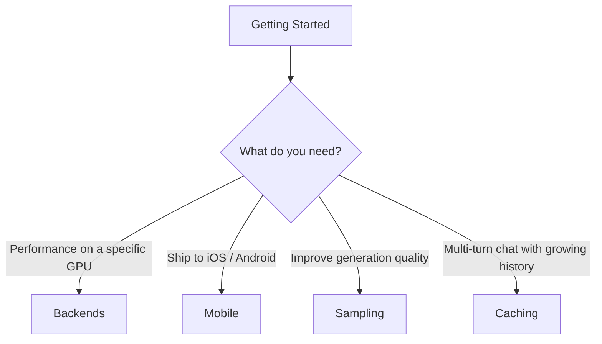

# Guides

The pages in this section go deeper than the [Getting Started
guide](../getting-started/index.md) on a single topic. They each
explain the *what* and the *why*, walk through a representative
code path, and link out to the relevant runnable example.

-   :material-chip: __[Backends & GPU offload](backends.md)__

    Pick a build-time backend (CPU, Metal, CUDA, Vulkan, ROCm, OpenCL,
    KleidiAI), offload as many layers as fit in VRAM, and use the
    `LlamaBackend` capability probes to detect what's available at
    runtime.

-   :material-cellphone: __[Mobile distribution](mobile.md)__

    The `release-perf` and `release-size` profiles, the iOS and
    Android build flags, the `MobilePreset` defaults, and the
    caveats around OpenCL + ICD loaders + the NDK.

-   :material-dice-multiple: __[Sampling strategies](sampling.md)__

    Every sampler `llama.cpp` exposes (greedy, top-k, top-p, min-p,
    typical, mirostat, dry, penalties, XTC, grammar…), how to chain
    them with `SamplerChain`, and recommended starting points.

-   :material-database-outline: __[Caching & session state](caching.md)__

    The in-process `RamCache`, the `sled`-backed `DiskCache`, and
    the manual `llama_state_get_data` / `llama_state_set_data`
    APIs. When the prompt cache helps (and when it doesn't).

## Reading order

There's no strict order — every guide is self-contained. The most
common paths through them are:

If you're unsure which guide is relevant, the [Features
index](../features/index.md) is a great starting point — it links to
the right guide for each feature, and most guides reference one or
two of the runnable [examples](../examples/index.md).
