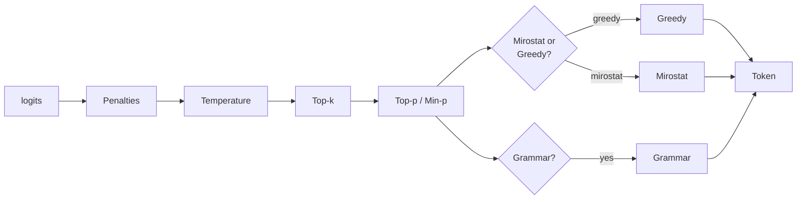

# Sampling strategies

`llama-crab` exposes every sampling strategy that `llama.cpp`
implements, all behind the [`LlamaSampler`] type. You can compose
multiple samplers into a chain with [`SamplerChain`]; the order of
the chain matters, because each stage sees the logits as transformed
by the previous one.

## Strategy catalogue

| Strategy | What it does | When to use it |
| --- | --- | --- |
| `greedy()` | Always pick the highest-probability token. | Deterministic output, code, factual Q&A. |
| `dist(seed)` | Uniform random sampling. | Sanity checks, synthetic data. |
| `top_k(k)` | Restrict to the top K tokens. | Avoid very-low-probability tail. |
| `top_p(p, min_keep)` | Nucleus sampling. | The workhorse for general chat. |
| `min_p(p, min_keep)` | Min-P sampling. | Newer alternative to top-p; tracks the most likely token. |
| `typical(p, min_keep)` | Locally-typical sampling. | Reduces the "wandering" of long generations. |
| `temp(t)` | Temperature scaling. | Combine with top-p / min-p to control entropy. |
| `temp_ext(t, delta, exp)` | Dynamic temperature (entropy-aware). | Smoother long-form text. |
| `xtc(p, t, min_keep, seed)` | Exclude top choices with probability `p`. | Avoid overly repetitive token runs. |
| `top_n_sigma(n)` | Top-N-Sigma. | Trim tokens more than N standard deviations below the max logit. |
| `mirostat(n_vocab, seed, tau, eta, m)` | Mirostat v1. | Maintain a target perplexity. |
| `mirostat_v2(seed, tau, eta)` | Mirostat v2. | Smoother than v1, no vocabulary-size dependency. |
| `penalties(last_n, repeat, freq, presence)` | Repetition / frequency / presence penalties. | Keep long generations from looping. |
| `dry(model, ...)` | "Don't Repeat Yourself" sampler. | Specifically target repeating n-grams. |
| `adaptive_p(target, decay, seed)` | Adaptive-P probabilistic. | Lower-temperature sampling with a target entropy. |
| `logit_bias(n_vocab, biases)` | Manual logit bias per token id. | Ban or boost specific tokens. |
| `infill(model)` | Code infill (FIM) sampler. | Pair with the FIM-specific prompt format. |
| `grammar(model, ...)` _(feature `common`)_ | GBNF-constrained sampling. | Force structured output. |

## Composing a chain

The recommended way is the [`SamplerChain`] builder:

```rust
use llama_crab::sampling::SamplerChain;

let chain = SamplerChain::new()
    .temp(0.8)
    .top_p(0.95, 1)
    .min_p(0.05, 1)
    .penalties(64, 1.1, 0.0, 0.0)
    .build();
```

### The golden order

The order of the stages is not arbitrary. A typical chain is:

1. **Penalties** — most aggressive. Prune bad tokens first so the
   remaining stages don't have to undo the work.
2. **Temperature / top-k / top-p / min-p / typical** — truncate the
   tail of the distribution.
3. **Mirostat / adaptive-p / dist / greedy** — pick one. Usually the
   last non-grammar stage.
4. **Grammar** (if any) — must be last. It overrides whatever the
   previous stage picked if the token is not in the grammar.



### Three chains to start with

=== "Creative writing"

    ```rust
    SamplerChain::new()
        .temp(0.9)
        .top_p(0.95, 1)
        .min_p(0.05, 1)
        .penalties(128, 1.1, 0.1, 0.1)
        .build()
    ```

=== "General chat"

    ```rust
    SamplerChain::new()
        .temp(0.7)
        .top_p(0.9, 1)
        .min_p(0.05, 1)
        .penalties(64, 1.1, 0.0, 0.0)
        .build()
    ```

=== "Deterministic (FIM, code)"

    ```rust
    SamplerChain::new()
        .temp(0.0)
        .build()
    ```

## Low-level API

If you need to bypass the builder — for example, to insert a
custom sampler stage — the raw API is also available:

```rust
use llama_crab::sampling::LlamaSampler;

let greedy = LlamaSampler::greedy();
let top_p  = LlamaSampler::top_p(0.95, 1);

let chain = LlamaSampler::chain(vec![top_p, greedy], false);
```

The `chain(samplers, strict)` helper returns `Option<LlamaSampler>`;
the second argument controls whether all samplers in the chain must
accept the token (`true`) or whether any of them can accept it
(`false`).

## Feeding the sampler

The sampler operates on a raw context handle. In the high-level
API you don't need to touch this — `Llama::create_completion_with_sampler`
and `Llama::create_chat_completion_with` wrap the loop. If you
drive the lower-level API directly:

```rust
use llama_crab::sampling::LlamaSampler;
use llama_crab::token::LlamaToken;

let mut sampler: LlamaSampler = SamplerChain::new().temp(0.7).build();

let ctx = llama.context().raw_handle();
let next: LlamaToken = unsafe { sampler.sample(ctx, -1) };
sampler.accept(next);
```

The `sample(ctx, idx)` argument is the token index in the batch
whose logits should be sampled. `-1` means "the last token in the
batch".

## Performance tips

- **Use the same sampler chain across requests.** The sampler holds
  state (penalties, mirostat buffers, etc.). Re-creating it per
  request resets the state.
- **Use `greedy` for benchmarks.** It's the fastest sampler and the
  most reproducible.
- **Use a `temp = 0.0` chain for "I want the obvious answer".**
  The actual sampler chosen by the `Llama` orchestrator when
  `temperature = 0.0` is `greedy`.
- **Constrain with a grammar when the output shape matters more
  than the wording.** See
  [JSON-Schema & GBNF grammars](../features/grammars.md).

## Where to next?

- [Speculative decoding](../features/speculative.md) — trade a
  small amount of extra compute for a large speedup on
  agreement-heavy workloads.
- [JSON-Schema & GBNF grammars](../features/grammars.md) — force
  the output to match a schema.
- [Caching & session state](caching.md) — keep the sampler state
  warm between requests.

[`LlamaSampler`]: https://docs.rs/llama-crab/latest/llama_crab/sampling/struct.LlamaSampler.html
[`SamplerChain`]: https://docs.rs/llama-crab/latest/llama_crab/sampling/struct.SamplerChain.html
