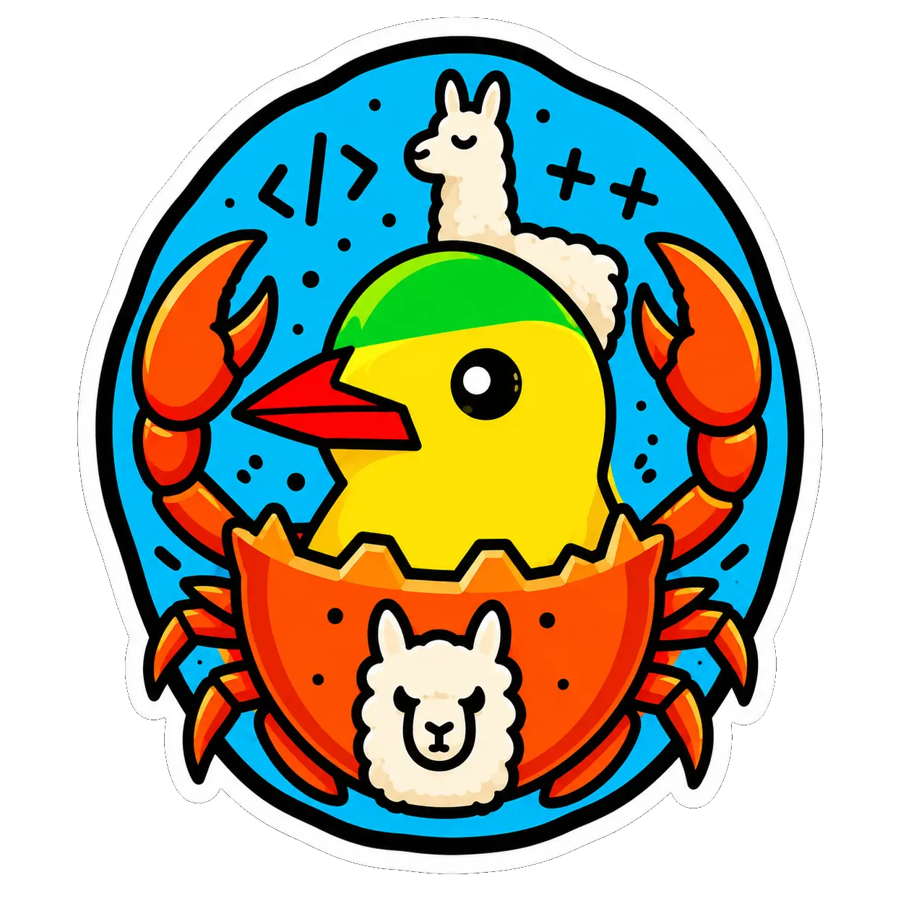

---
hide:
    - navigation
    - toc
---

<div align="center" markdown>



# **llama-crab**

**Safe, ergonomic and complete Rust bindings for [`llama.cpp`](https://github.com/ggml-org/llama.cpp).**

[](https://crates.io/crates/llama-crab)
[](https://docs.rs/llama-crab)
[](https://github.com/DominguesM/llama-crab/blob/main/rust-toolchain.toml)
[](https://github.com/DominguesM/llama-crab/blob/main/LICENSE-MIT)
[](https://github.com/ggml-org/llama.cpp)

</div>

---

## What is llama-crab?

`llama-crab` is a Rust workspace of library and server crates that
gives you a **100 % safe Rust API** over [`llama.cpp`](https://github.com/ggml-org/llama.cpp).
You can load any GGUF model, run text and chat completions, compute
embeddings, constrain generation with a GBNF grammar, drive vision-
language models through `mtmd`, or expose everything over HTTP — all
without touching a single `unsafe` block at the application level.

<div class="grid cards" markdown>

- :material-rocket-launch: **Get started in 5 minutes**

    Load a model and generate a completion with a handful of lines.

    [:octicons-arrow-right-24: Installation](getting-started/installation.md)
    [:octicons-arrow-right-24: Your first program](getting-started/first-program.md)

- :material-cog-outline: **Run on any hardware**

    CPU, Metal, CUDA, Vulkan, ROCm, OpenCL and KleidiAI — pick your
    backend at build time and offload as many layers as fit in VRAM.

    [:octicons-arrow-right-24: Backends & GPU offload](guides/backends.md)

- :material-cellphone: **Ship to phones and tablets**

    `release-size` and `release-perf` profiles, OpenCL + KleidiAI for
    Android, Metal for iOS, and `MobilePreset` for sensible defaults.

    [:octicons-arrow-right-24: Mobile distribution](guides/mobile.md)

- :material-eye-outline: **Vision & audio**

    Pair a text GGUF with an `mmproj` projector and feed images or
    audio into the same context.

    [:octicons-arrow-right-24: Multimodal](features/multimodal.md)

- :material-graph-outline: **Embeddings & reranking**

    Extract vectors with configurable pooling, run semantic search,
    or use a cross-encoder for higher-quality ranking.

    [:octicons-arrow-right-24: Embeddings](features/embeddings.md)

- :material-server: **HTTP server out of the box**

    `llama-crab-server` exposes the high-level API over an
    OpenAI-compatible HTTP interface with SSE streaming.

    [:octicons-arrow-right-24: Server](server/index.md)

</div>

## A taste of the API

=== "Plain text"

    ```rust
    use llama_crab::{Llama, LlamaParams};

    fn main() -> Result<(), Box<dyn std::error::Error>> {
        let mut llama = Llama::load(
            LlamaParams::new("models/qwen2.5-0.5b-instruct-q4_k_m.gguf")
                .with_n_ctx(2048)
                .with_n_gpu_layers(99),
        )?;

        let response = llama.create_completion("The capital of France is", 32)?;
        println!("{}", response.text);
        Ok(())
    }
    ```

=== "Chat"

    ```rust
    use llama_crab::chat::BuiltinTemplate;
    use llama_crab::high_level::chat_completion::{create_chat_completion_with, ChatMessage};
    use llama_crab::{Llama, LlamaParams, Role};

    fn main() -> Result<(), Box<dyn std::error::Error>> {
        let mut llama = Llama::load(
            LlamaParams::new("models/instruct.gguf").with_n_ctx(4096),
        )?;

        let messages = vec![
            ChatMessage::new(Role::System, "You are a concise assistant."),
            ChatMessage::new(Role::User, "Explain Rust ownership in one paragraph."),
        ];

        let response = create_chat_completion_with(
            &mut llama,
            &messages,
            BuiltinTemplate::ChatMl,
            &[],
            128,
        )?;

        println!("{}", response.content);
        Ok(())
    }
    ```

=== "Embeddings"

    ```rust
    use llama_crab::{Llama, LlamaParams};

    fn main() -> Result<(), Box<dyn std::error::Error>> {
        let mut llama = Llama::load(
            LlamaParams::new("models/bge-small-en-v1.5-q4_k_m.gguf")
                .with_n_ctx(512)
                .with_embeddings(true),
        )?;

        let embedding = llama.embed("Rust is memory-safe.", true)?;
        println!("dim = {}", embedding.len());
        Ok(())
    }
    ```

## Why llama-crab?

`llama-crab` is designed for applications that need direct access to
`llama.cpp` without giving up Rust's safety, packaging, or deployment
discipline.

<div class="grid cards" markdown>

- :material-shield-check: **Safe by default**

    The high-level API exposes no `unsafe` surface. FFI boundaries live
    behind typed wrappers, and raw access stays opt-in for the cases
    that truly need it.

- :material-puzzle-outline: **Complete feature surface**

    Sampling, chat formats, vision pipelines, JSON-Schema grammars,
    speculative decoding, embeddings, reranking, and KV cache flows are
    available from safe Rust APIs.

- :material-package-variant: **Reproducible builds**

    `llama.cpp` is pinned to a known commit, the build is explicit about
    enabled backends, and CI keeps the supported CPU / CUDA / Vulkan /
    Metal / ROCm combinations visible.

- :material-flash: **Performance first**

    Layer offload, flash attention, mobile presets, sampling chains,
    speculative decoding, and tool-call parsers are exposed without
    requiring application code to own custom kernels.

</div>

## Crates in this workspace

| Crate                                                                                       | Purpose                                                                      | When to use it                                                                            |
| ------------------------------------------------------------------------------------------- | ---------------------------------------------------------------------------- | ----------------------------------------------------------------------------------------- |
| [`llama-crab`](https://crates.io/crates/llama-crab)                                         | 100 % safe Rust API: model loading, sampling, chat, embeddings, server glue. | **Most applications.** This is the crate you depend on.                                   |
| [`llama-crab-sys`](https://crates.io/crates/llama-crab-sys)                                 | Raw FFI generated via `bindgen` over `wrapper.h` + CMake.                    | When you need direct access to llama.cpp symbols that the safe crate does not (yet) wrap. |
| [`llama-crab-server`](https://github.com/DominguesM/llama-crab/tree/main/crates/llama-crab-server) | HTTP binary built on top of `llama-crab`.                                    | When you want an OpenAI-compatible endpoint without writing one.                          |

## License

`llama-crab` is distributed under the **MIT License**. See
[`LICENSE-MIT`](https://github.com/DominguesM/llama-crab/blob/main/LICENSE-MIT)
for the full text.

---

!!! tip "Where to next?"

    - [Install the crate](getting-started/installation.md) and verify
      your toolchain.
    - Walk through the [architecture overview](core-concepts/architecture.md)
      to understand the major building blocks.
    - Skim the [examples index](examples/index.md) and copy the one
      closest to what you want to build.
