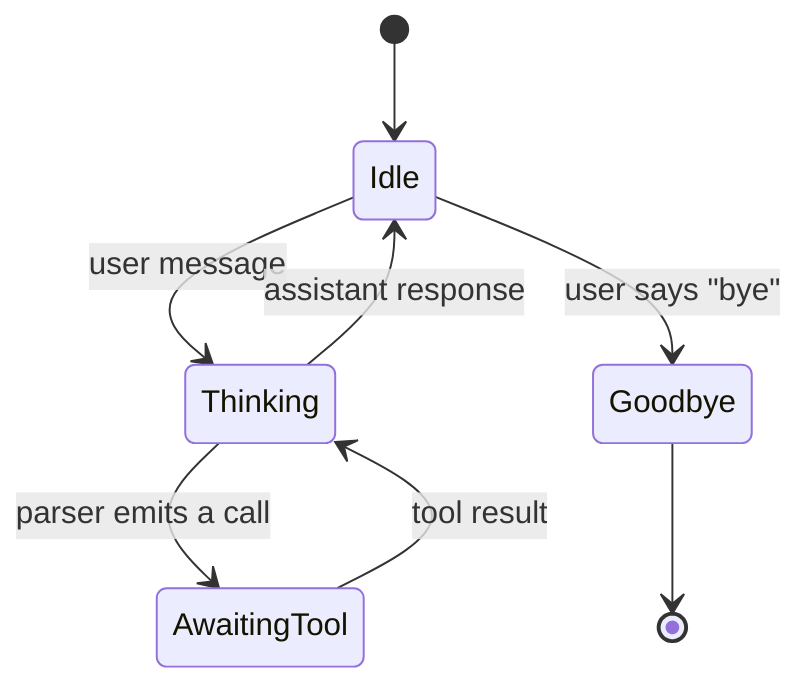
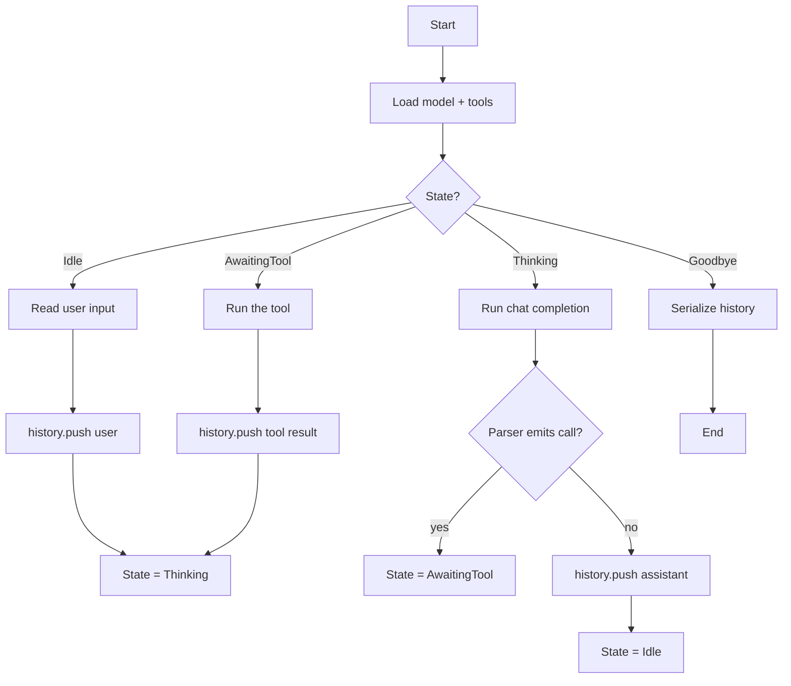

# Building a chatbot

This recipe turns the 80-line `stateful_chat` example into a
deployable agent. The three new pieces are: a **state machine** that
exposes a clean API, **tool calling** that lets the model invoke
your code, and **session persistence** that survives a restart.

## The state machine

A chatbot has at least four states:



The `ToolParser` is the boundary between "model is thinking" and
"model is asking us to do something". In Rust:

```rust
enum ChatState {
    Idle,
    Thinking,
    AwaitingTool { call: ToolCall },
    Goodbye,
}

struct Chatbot {
    state: ChatState,
    history: Vec<ChatMessage>,
    llama: Llama,
    tools: Vec<ToolDefinition>,
}
```

## The main loop



## A complete implementation

```rust
use llama_crab::chat::tool_call::{ToolFormat, ToolParser, ToolDefinition, ToolCall};
use llama_crab::chat::{BuiltinTemplate, ChatMessage, Role};
use llama_crab::high_level::chat_completion::create_chat_completion_with;
use llama_crab::{Llama, LlamaParams};
use serde_json::Value;

enum ChatState {
    Idle,
    Thinking,
    AwaitingTool { call: ToolCall },
    Goodbye,
}

struct Chatbot {
    state: ChatState,
    history: Vec<ChatMessage>,
    llama: Llama,
    tools: Vec<ToolDefinition>,
}

impl Chatbot {
    fn new(model_path: &str, tools: Vec<ToolDefinition>) -> Result<Self, Box<dyn std::error::Error>> {
        let llama = Llama::load(LlamaParams::new(model_path).with_n_ctx(4096))?;
        let history = vec![ChatMessage::new(
            Role::System,
            "You are a helpful assistant.",
        )];
        Ok(Self { state: ChatState::Idle, history, llama, tools })
    }

    fn user_turn(&mut self, message: &str) -> Result<String, Box<dyn std::error::Error>> {
        self.history.push(ChatMessage::new(Role::User, message));
        self.run_until_idle()
    }

    fn run_until_idle(&mut self) -> Result<String, Box<dyn std::error::Error>> {
        let mut last_assistant = String::new();
        loop {
            self.state = ChatState::Thinking;
            let resp = create_chat_completion_with(
                &mut self.llama,
                &self.history,
                BuiltinTemplate::ChatMl,
                &self.tools,
                256,
            )?;
            self.history.push(ChatMessage::new(Role::Assistant, resp.content.clone()));
            last_assistant = resp.content;

            let mut parser = ToolParser::new(ToolFormat::ChatMl);
            let calls: Vec<ToolCall> = parser.feed(&resp.content)
                .into_iter()
                .filter_map(|r| r.ok())
                .collect();

            if let Some(call) = calls.into_iter().next() {
                let result = self.invoke_tool(&call)?;
                self.history.push(ChatMessage::new_tool(&call.id, &result));
            } else {
                self.state = ChatState::Idle;
                return Ok(last_assistant);
            }
        }
    }

    fn invoke_tool(&self, call: &ToolCall) -> Result<String, Box<dyn std::error::Error>> {
        match call.name.as_str() {
            "get_weather" => {
                let city: String = serde_json::from_value(
                    call.arguments.get("city").cloned().unwrap_or(Value::Null),
                )?;
                Ok(format!("{{\"temperature\": 22, \"city\": \"{city}\"}}"))
            }
            _ => Ok("{\"error\": \"unknown tool\"}".into()),
        }
    }
}
```

## Tool definitions

A tool is a function name, a description, and a JSON Schema:

```rust
use llama_crab::chat::ToolDefinition;
use serde_json::json;

let tools = vec![
    ToolDefinition::new("get_weather", "Get the weather for a city")
        .with_parameters(json!({
            "type": "object",
            "properties": { "city": { "type": "string" } },
            "required": ["city"]
        })),
];
```

The model decides when to call the tool based on the user's input
and the tool's description.

## Trimming history

When the history grows past `n_ctx`, trim the oldest turns. The
[stateful chat guide](../features/stateful-chat.md) covers three
strategies: truncate head, summarise, or increase `n_ctx`.

```rust
fn trim_history(history: &mut Vec<ChatMessage>, keep: usize) {
    if history.len() > keep {
        let system = history[0].clone();
        *history = std::iter::once(system)
            .chain(history.iter().skip(1).rev().take(keep).rev().cloned())
            .collect();
    }
}
```

## Session persistence

`ChatMessage` is `Serialize + Deserialize`, so persistence is one
line:

```rust
let json = serde_json::to_string_pretty(&self.history)?;
std::fs::write("conversation.json", json)?;
```

To restore:

```rust
let raw = std::fs::read_to_string("conversation.json")?;
let history: Vec<ChatMessage> = serde_json::from_str(&raw)?;
```

## Adding a graceful shutdown

For long-running services, handle `SIGINT`:

```rust
use tokio::signal;

async fn shutdown_signal() {
    let _ = signal::ctrl_c().await;
}

#[tokio::main]
async fn main() -> Result<(), Box<dyn std::error::Error>> {
    let mut bot = Chatbot::new("model.gguf", tools)?;
    let stdin = tokio::io::stdin();
    let mut lines = stdin.lines();

    tokio::select! {
        _ = shutdown_signal() => {
            // Persist and exit.
            let json = serde_json::to_string_pretty(&bot.history)?;
            std::fs::write("conversation.json", json)?;
        }
        _ = async {
            while let Some(line) = lines.next_line().await? {
                if line.trim() == "/exit" { break; }
                let response = bot.user_turn(&line)?;
                println!("assistant> {response}");
            }
            Ok::<(), Box<dyn std::error::Error>>(())
        } => {}
    }
    Ok(())
}
```

## A note on the worker thread

`Llama` is not `Sync`, so you cannot share it across threads
freely. The recommended pattern is to put it on a dedicated worker
thread and send jobs to it. The
[server guide](../server/index.md) walks through this in detail.

## Where to next?

- [Chat & tool calling guide](../features/chat.md) — the parser
  matrix.
- [Stateful chat guide](../features/stateful-chat.md) — history
  trimming strategies.
- [Caching & session state](../guides/caching.md) — manual KV
  cache reuse.
- [Server](../server/index.md) — when you want to deploy the
  chatbot over HTTP.
