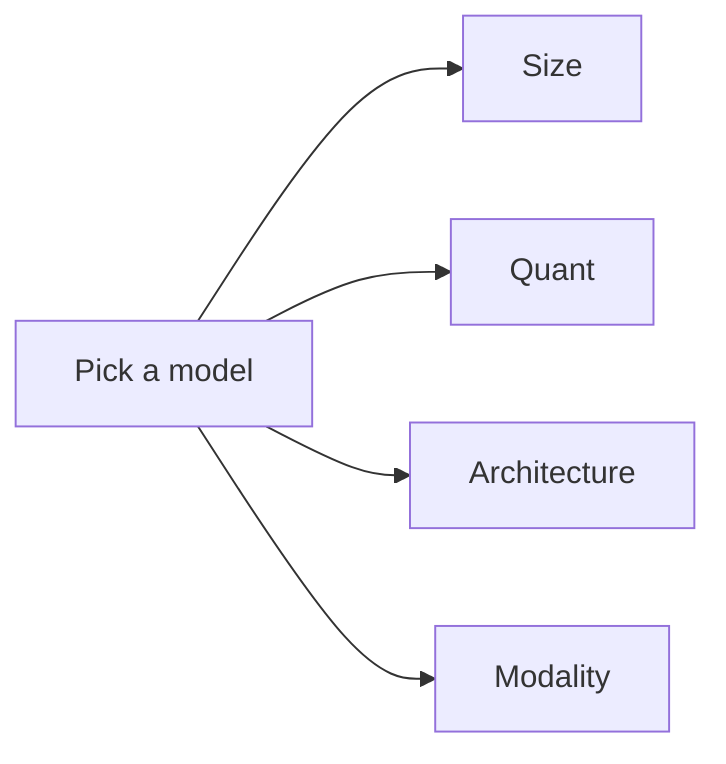

# Choosing a model

Picking the right GGUF for the job is mostly about four axes: **size**,
**quant**, **architecture** and **modality**. This page is a short
guide to each.

## The four axes

| Axis | What you choose | Trade-off |
| --- | --- | --- |
| **Size** | 0.5B / 1B / 3B / 7B / 13B / 70B parameters. | Larger = smarter but slower and more memory. |
| **Quant** | F16 / Q8_0 / Q6_K / Q5_K_M / Q4_K_M / Q3_K_M / Q2_K. | Smaller quant = less memory, slightly less accurate. |
| **Architecture** | Llama 3, Qwen 2.5, Gemma 3, Mistral, Phi-3, … | Each has a different chat template, tool format, and license. |
| **Modality** | Text, vision, audio, multimodal. | Vision needs `mtmd`; audio needs a matching projector. |

## A size cheat-sheet

| Size | Best for | Memory (Q4_K_M) | Speed on a 4090 |
| --- | --- | --- | --- |
| 0.5B | Demos, REPLs, smoke tests. | ~400 MB | ~120 tok/s. |
| 1B | Simple assistants, classification. | ~800 MB | ~90 tok/s. |
| 3B | Single-user chatbots. | ~2 GB | ~50 tok/s. |
| 7B | General-purpose assistants. | ~4 GB | ~30 tok/s. |
| 13B | Higher-quality assistants. | ~8 GB | ~20 tok/s. |
| 70B | Frontier-quality. | ~40 GB | ~6 tok/s. |

These numbers are for *generation*, not *retrieval*. Embedding
models are usually 0.1–0.5 GB.

## Picking a quant

| Quant | Bits per weight | Quality loss | When to use it |
| --- | --- | --- | --- |
| `F16` | 16 | None. | Reference. Almost never shipped. |
| `Q8_0` | 8 | Negligible. | When you have the VRAM. |
| `Q6_K` | 6.5 | Tiny. | Mid-budget. |
| `Q5_K_M` | 5.7 | Small. | Good default. |
| `Q4_K_M` | 4.8 | Noticeable on long contexts. | The most common default. |
| `Q3_K_M` | 3.9 | Visible on reasoning tasks. | When you need to save 1–2 GB. |
| `Q2_K` | 3.4 | Significant. | Only for very tight memory budgets. |

The `K` quantisations are a newer format that splits the weights
into "super-blocks" and applies a higher precision to the
sensitive ones. They generally produce better quality than the
non-`K` quants at the same bitrate.

## Picking an architecture

| Architecture | License | When to use it |
| --- | --- | --- |
| Llama 3 / 3.1 / 3.2 / 3.3 | Llama 3 community license. | General-purpose. Wide tooling support. |
| Qwen 2 / 2.5 | Apache 2.0. | Strong multilingual and tool-calling. |
| Gemma 2 / 3 | Gemma license. | Quality-per-parameter leader on the small end. |
| Mistral / Mixtral | Apache 2.0. | Strong instruct and tool calling. |
| Phi-3 / Phi-3.5 | MIT. | Small but capable; great for phones. |
| DeepSeek-V2 / V2.5 | DeepSeek license. | Strong coding and reasoning. |
| Command R / R+ | CC-BY-NC. | RAG-tuned; long context. |

For most users, the choice comes down to:

- **License compatibility** with your distribution channel.
- **Tool calling** — Qwen 2.5, Llama 3, Mistral and DeepSeek are
  the strongest.
- **Multilingual** — Qwen 2.5 and DeepSeek are the strongest.
- **Quality at small sizes** — Gemma 2 and Phi-3 are the strongest.

## Picking a modality

| Modality | Cargo feature | Projector needed? | When to use it |
| --- | --- | --- | --- |
| **Text only** | – | No. | Most chatbots, RAG, agents. |
| **Vision** | `mtmd` | Yes (`mmproj-*.gguf`). | Image Q&A, document extraction. |
| **Audio** | `mtmd` | Yes. | Speech-to-text, audio Q&A. |
| **Multimodal** | `mtmd` | Yes. | Combined inputs. |

The vision projector must match the text model. Gemma 4 and
LFM2.5-VL ship separate vision projectors; Qwen 2.5-VL has a single
multimodal GGUF.

## A recommended starter set

| Use case | Model |
| --- | --- |
| Demos and CI | `Qwen2.5-0.5B-Instruct-GGUF` (Q4_K_M, ~400 MB). |
| Single-user chatbot | `Qwen2.5-7B-Instruct-GGUF` (Q4_K_M, ~4 GB). |
| Frontier assistant | `Llama-3.3-70B-Instruct-GGUF` (Q4_K_M, ~40 GB). |
| Embeddings | `bge-small-en-v1.5-gguf` (~30 MB). |
| Reranker | `bge-reranker-base-Q4_K_M-GGUF` (~600 MB). |
| Vision | `gemma-4-E4B-it-GGUF` + `mmproj-gemma-4-E4B-it-BF16.gguf`. |
| Mobile phone | `Qwen2.5-0.5B-Instruct-GGUF` + `MobilePreset::Balanced`. |

## Where to next?

- [Performance tuning](performance.md) — measure tokens/sec on
  your hardware.
- [Mobile distribution](../guides/mobile.md) — the iOS and Android
  recipes.
- [Embeddings & reranking](../features/embeddings.md) — when you
  need a vector store.
