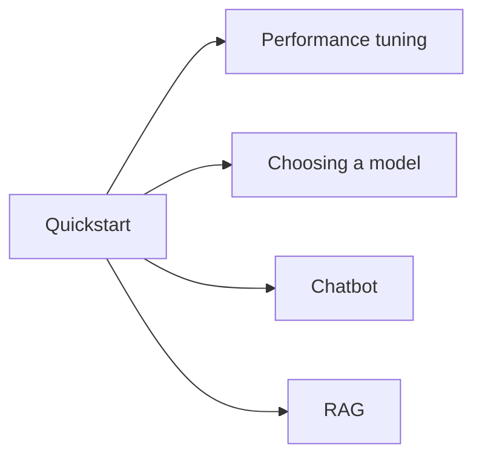

# Recipes

This section collects end-to-end recipes for the most common tasks.
Each recipe is a small, complete program with a one-line summary of
what it does, the full source, and a discussion of the trade-offs.

-   :material-speedometer: __[Performance tuning](performance.md)__

    Measure tokens per second, find the bottleneck, and tune
    `n_threads`, `n_gpu_layers`, batch size, and sampler chain to
    maximise throughput on your hardware.

-   :material-compare: __[Choosing a model](choosing-a-model.md)__

    Quant size vs. accuracy vs. speed vs. memory. A short guide to
    picking the right GGUF for the job.

-   :material-robot: __[Building a chatbot](chatbot.md)__

    From the 80-line REPL to a deployable agent: state machines,
    tool calls, history trimming, and session persistence.

-   :material-database-search: __[Building a RAG pipeline](rag.md)__

    Embed → store → retrieve → re-rank → answer. The full
    end-to-end pattern.

## Reading order

The recipes are independent — pick the one that matches your
current task. If you are new to `llama-crab`, the
[Performance tuning](performance.md) page is a good starting point
because it teaches you how to *measure* before you optimise.

