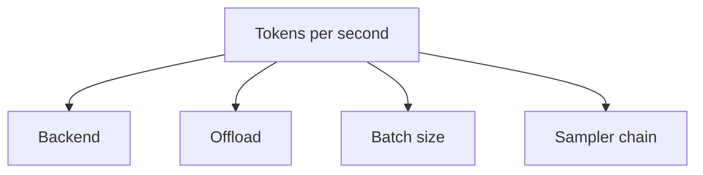

# Performance tuning

This recipe walks through the four levers you have over inference
performance: the **backend**, the **offload** strategy, the **batch
size** and the **sampler chain**. We measure first, then optimise.

## The four levers



| Lever | Effect on tokens/sec | When to tune it |
| --- | --- | --- |
| **Backend** | 5–10× (CPU → GPU). | When the model is too slow on CPU. |
| **Offload** | 2–4× per crossed layer. | When the model doesn't fit in VRAM. |
| **Batch size** | 1.2–2× for batched servers. | When you serve many requests in parallel. |
| **Sampler chain** | 1.05–1.5× (greedy is fastest). | When you have a tight latency budget. |

## Step 1: measure first

Don't optimise before measuring. The high-level `Completion` struct
carries the timings you need:

```rust
use llama_crab::{Llama, LlamaParams};

let mut llama = Llama::load(LlamaParams::new("model.gguf").with_n_ctx(2048))?;
let resp = llama.create_completion("The capital of France is", 200)?;
println!("tokens/sec = {}", 200.0 / resp.timings.total_sec);
```

The `CompletionTimings` struct has:

| Field | Meaning |
| --- | --- |
| `prompt_n` | Number of prompt tokens. |
| `prompt_sec` | Wall time for the prefill. |
| `predicted_n` | Number of generated tokens. |
| `predicted_sec` | Wall time for the decode loop. |
| `total_sec` | Total wall time. |

For a fair comparison, run the same prompt at the same
`max_tokens` across the configurations you want to test.

## Step 2: pick a backend

| Target | Cargo features | Typical tokens/sec (7B Q4_K_M) |
| --- | --- | --- |
| CPU only (M-series Mac) | `["openmp"]` | ~10 tok/s. |
| Apple Metal | `["metal", "openmp"]` | ~25 tok/s. |
| NVIDIA RTX 4090 | `["cuda", "openmp"]` | ~80 tok/s. |
| AMD MI300X | `["rocm", "openmp"]` | ~100 tok/s. |
| Vulkan (NVIDIA) | `["vulkan", "openmp"]` | ~70 tok/s. |

Numbers depend on quant, context length, prompt length and the
exact model. Use them as a sanity check, not a guarantee.

## Step 3: tune `n_gpu_layers`

`n_gpu_layers` is the single biggest knob for hybrid
CPU/GPU workloads. The rule of thumb:

| Model size | 8 GB GPU | 16 GB GPU | 24 GB GPU |
| --- | --- | --- | --- |
| 7B Q4_K_M | 99 layers | 99 layers | 99 layers |
| 13B Q4_K_M | 99 layers | 99 layers | 99 layers |
| 70B Q4_K_M | 10–15 layers | 20–25 layers | 35–40 layers |

To find the exact value for your model, increase `n_gpu_layers`
until you see "out of memory" errors, then back off by 5.

## Step 4: tune `n_threads`

CPU threads are most useful when (a) the model is too big to fit
in VRAM and the tail runs on the CPU, or (b) the prompt ingestion
phase is dominated by tokenisation (rare on small prompts).

A reasonable starting point is the number of **physical** cores
(not the total core count). On Apple Silicon, the number of
*performance* cores is a better target.

```rust
use llama_crab::{Llama, LlamaParams};

let mut llama = Llama::load(
    LlamaParams::new("model.gguf")
        .with_n_threads(num_cpus::get_physical()),
)?;
```

A few rules of thumb:

- Don't oversubscribe. More threads than physical cores causes
  context-switch overhead.
- On laptops, half the physical cores to avoid thermal throttling.
- The `n_threads_batch` setting (separate thread count for batches)
  is rarely needed; leave it at the default.

## Step 5: pick the right sampler chain

The sampler chain has a small per-token overhead, but the
*quality* of the generated text also matters. A few chains to
start with:

| Use case | Chain |
| --- | --- |
| Benchmarks | `temp(0.0)` (greedy). |
| Code | `temp(0.0)` (greedy) or `temp(0.2) + top_p(0.95)`. |
| General chat | `temp(0.7) + top_p(0.9) + min_p(0.05) + penalties(64, 1.1, 0, 0)`. |
| Creative writing | `temp(0.9) + top_p(0.95) + min_p(0.05) + penalties(128, 1.1, 0.1, 0.1)`. |
| Structured output | `temp(0.7) + top_p(0.9) + grammar`. |

`greedy` is the fastest sampler. `mirostat_v2` is roughly 1.5×
slower than `top_p + temp` for the same quality.

## Step 6: speculative decoding

On agreement-heavy workloads, speculative decoding can give a 2–3×
speedup. The recipe:

1. Start with `PromptLookupDecoding::new(2, 8)` and a small main
   model. Measure acceptance rate.
2. If acceptance is > 60 %, you're getting a free speedup.
3. If acceptance is < 30 %, switch to a small draft model or skip
   speculative decoding.

See the [speculative decoding guide](../features/speculative.md) for
the full menu.

## A worked example

Suppose a 7B Q4_K_M model runs at 10 tok/s on a MacBook Pro M2.
You have an RTX 4090 and want to push it to 80 tok/s.

1. Add the CUDA backend:
   ```toml
   llama-crab = { version = "0.1", default-features = false, features = ["cuda", "openmp"] }
   ```
2. Offload all layers:
   ```rust
   LlamaParams::new("model.gguf")
       .with_n_ctx(2048)
       .with_n_gpu_layers(99)
   ```
3. Measure:
   ```
   tokens/sec = 78
   ```
4. Try increasing `n_threads` from 4 to 8:
   ```
   tokens/sec = 82
   ```
5. Try `temp(0.0)` (greedy) instead of the default chain:
   ```
   tokens/sec = 88
   ```

The actual numbers depend on the exact hardware and the model; the
*process* is the same: measure, change one variable, measure again.

## Common pitfalls

| Pitfall | Symptom | Fix |
| --- | --- | --- |
| Building without the GPU feature | `supports_gpu_offload()` is `false`. | Add the right backend to the Cargo features. |
| `n_gpu_layers = 0` | Everything runs on the CPU. | Set it to the number of layers in the model. |
| `n_threads` > physical cores | Context-switch overhead. | Cap at physical cores. |
| Greedy sampler on a creative task | Repetitive, bland output. | Add temperature and top-p. |
| Speculative decoding on creative text | Acceptance < 30 %, negative speedup. | Use a different draft or skip speculative decoding. |

## Where to next?

- [Backends & GPU offload](../guides/backends.md) — the runtime
  configuration.
- [Sampling strategies](../guides/sampling.md) — the full sampler
  menu.
- [Speculative decoding](../features/speculative.md) — when
  agreement is high.
