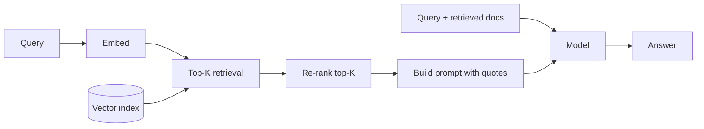
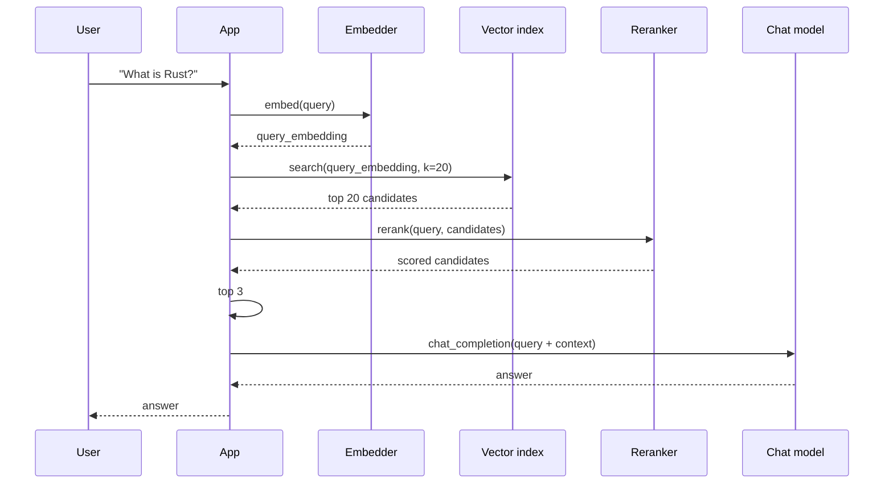

# Building a RAG pipeline

**Retrieval-Augmented Generation (RAG)** is the pattern of *retrieving*
relevant documents for a query, then *generating* an answer that
quotes them. This recipe walks through the full pipeline: embed →
store → retrieve → re-rank → answer.

## The pipeline



The five steps:

1. **Embed the query** with an embedding model.
2. **Retrieve the top K** most similar documents from a vector
   index.
3. **Re-rank the top K** with a cross-encoder for higher precision.
4. **Build a prompt** that includes the original query and the
   retrieved documents.
5. **Generate an answer** with the chat model.

## Step 1: embed

```rust
use llama_crab::context::params::PoolingType;
use llama_crab::{Llama, LlamaParams};

let mut embedder = Llama::load(
    LlamaParams::new("bge-small-en-v1.5-q4_k_m.gguf")
        .with_n_ctx(512)
        .with_embeddings(true)
        .with_pooling_type(PoolingType::Cls),
)?;

let query_embedding: Vec<f32> = embedder.embed("What is Rust?", true)?;
```

The `true` argument normalises the vector; with normalised vectors,
the dot product equals cosine similarity.

## Step 2: index

The index can be in-memory (for small corpora), a Rust-native HNSW
library, or a vector database. The minimum API the index needs to
expose is:

```rust
trait VectorIndex {
    fn insert(&mut self, id: &str, vec: &[f32]);
    fn search(&self, query: &[f32], k: usize) -> Vec<(String, f32)>;
}
```

For a production deployment, use [Qdrant](https://qdrant.tech/),
[pgvector](https://github.com/pgvector/pgvector), or
[Weaviate](https://weaviate.io/).

## Step 3: retrieve

```rust
let candidates: Vec<(String, f32)> = index.search(&query_embedding, 20);
```

A typical first-stage K is 20–100. The re-ranker then narrows this
to the top 3–5.

## Step 4: re-rank

The cross-encoder `Llama::rerank` is the right tool for this. Load
it with `PoolingType::Rank`:

```rust
use llama_crab::context::params::PoolingType;
use llama_crab::{Llama, LlamaParams};

let mut reranker = Llama::load(
    LlamaParams::new("bge-reranker-base-q4_k_m.gguf")
        .with_n_ctx(512)
        .with_embeddings(true)
        .with_pooling_type(PoolingType::Rank),
)?;

let documents: Vec<&str> = candidates.iter().map(|(doc, _)| doc.as_str()).collect();
let scores = reranker.rerank("What is Rust?", &documents)?;

// Sort and take the top 3.
let mut reranked: Vec<_> = candidates.iter().zip(scores).collect();
reranked.sort_by(|a, b| b.1.partial_cmp(&a.1).unwrap());
let top: Vec<_> = reranked.into_iter().take(3).collect();
```

## Step 5: build the prompt

The prompt format depends on the chat template. A common pattern:

```rust
use llama_crab::chat::{BuiltinTemplate, ChatMessage, render_builtin};
use llama_crab::Role;

let mut messages = vec![ChatMessage::new(
    Role::System,
    "You are a helpful assistant. Use the provided context to answer the user's question. \
     If the answer is not in the context, say you don't know.",
)];

// Add the retrieved documents as context.
let context = top.iter()
    .map(|(doc, _)| doc.as_str())
    .collect::<Vec<_>>()
    .join("\n\n");
messages.push(ChatMessage::new(Role::System, format!("Context:\n{context}")));

// Add the user question.
messages.push(ChatMessage::new(Role::User, "What is Rust?"));

// Render with a known template.
let prompt = render_builtin(BuiltinTemplate::ChatMl, &messages, &[], true);
```

## Step 6: generate

```rust
use llama_crab::high_level::chat_completion::create_chat_completion_with;
use llama_crab::chat::BuiltinTemplate;
use llama_crab::chat::ChatMessage;

let mut chat = Llama::load(LlamaParams::new("qwen2.5-7b-instruct-q4_k_m.gguf").with_n_ctx(4096))?;
let response = create_chat_completion_with(
    &mut chat, &messages, BuiltinTemplate::ChatMl, &[], 256,
)?;
println!("{}", response.content);
```

## Putting it all together



## Performance considerations

- **Index size** — for a 1 M document corpus, a Qdrant instance on
  a 16 GB RAM box can hold ~1 M 384-dim vectors.
- **Embedding throughput** — `embed_texts` batches the inference,
  amortising the model load cost. For 1 M documents, expect
  ~1 hour on a single A100.
- **Re-ranking throughput** — `rerank` is one model pass per pair.
  For 20 candidates, expect ~50 ms on a 4090.
- **End-to-end latency** — typically 200–500 ms for the retrieval
  pipeline plus the chat generation time.

## Common pitfalls

| Pitfall | What goes wrong | Fix |
| --- | --- | --- |
| Wrong pooling type | Similarity is `NaN` or close to zero. | Use `Cls` for BGE / GTE / E5. |
| Index stores unnormalised vectors | Dot product ≠ cosine similarity. | Normalise at insert time. |
| Re-ranker loaded with `Mean` pooling | `rerank` returns garbage scores. | Use `Rank` pooling. |
| Context too long for the chat model | The model truncates or errors. | Pick the top 3–5 candidates, not 20. |
| Model quotes but doesn't synthesise | The answer is just a paste. | Add a system prompt that asks the model to synthesise. |

## Where to next?

- [Embeddings & reranking guide](../features/embeddings.md) — the
  full reference.
- [Embeddings example](../examples/embeddings.md) — a runnable
  program.
- [Semantic search example](../examples/embedding-search.md) —
  cosine ranking over a small corpus.
- [Reranker example](../examples/reranker.md) — bi-encoder
  ranking demo.
