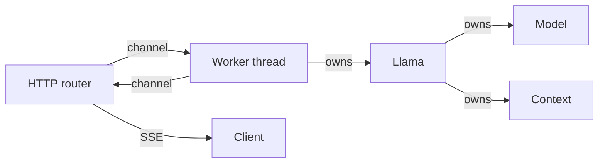

# Server

`llama-crab-server` is a thin HTTP binary built on top of the safe
`llama-crab` API. It keeps inference inside the Rust binding and uses
a worker thread that owns the model and context.

The server exposes an **OpenAI-compatible** surface (`/v1/chat/completions`,
`/v1/completions`, `/v1/embeddings`, `/v1/rerank`, `/v1/models`) plus
a few llama-crab-specific extensions (`/extras/tokenize`,
`/extras/detokenize`). It is the easiest way to drop a model behind
an HTTP endpoint without writing one yourself.

-   :material-play: __[Running the server](running.md)__

    The `cargo run` command, the command-line flags, the
    `LLAMA_CRAB_*` environment variables, and the available presets.

-   :material-api: __[API reference](api.md)__

    Every route, the request shape, the response shape, and the
    status codes. Includes a worked `curl` example for each.

-   :material-broadcast: __[Streaming](streaming.md)__

    Server-Sent Events for `stream: true` requests. The exact
    chunk order for chat and text completions.

-   :material-code-braces: __[Structured output](structured.md)__

    The `grammar`, `json_schema` and `response_format` request
    fields, and the GBNF pipeline they go through.

## Runtime shape

The server keeps model inference on a dedicated worker thread and
sends requests to it through channels. `Llama` owns a native model
and context and is intentionally not shared freely across threads.

The included binary uses this layout:

- One worker owns one `Llama` instance and processes requests
  sequentially.
- The HTTP router validates requests and forwards inference jobs to
  the worker.
- Streaming routes forward decoded chunks back to the HTTP task over
  a channel.

You can run several server processes or extend the crate with
several workers when you need parallel throughput.

## Why a separate binary?

The server is intentionally a thin wrapper:

- **Configuration** — CLI flags and env vars.
- **HTTP routing** — request parsing, response formatting.
- **Worker lifecycle** — startup, shutdown, error handling.
- **Streaming transport** — Server-Sent Events.
- **Errors** — converts `LlamaError` to OpenAI-style HTTP status
  codes.

Inference behavior remains in `llama-crab` so the CLI, library, and
server users exercise the same implementation. If you fork the
server for a custom integration, the only logic that needs to be
kept in sync is the HTTP layer — the model code stays the same.

## Where to next?

- [Running the server](running.md) — the boot command and the
  command-line flags.
- [API reference](api.md) — every route and its parameters.
- [Streaming](streaming.md) — the SSE contract.
