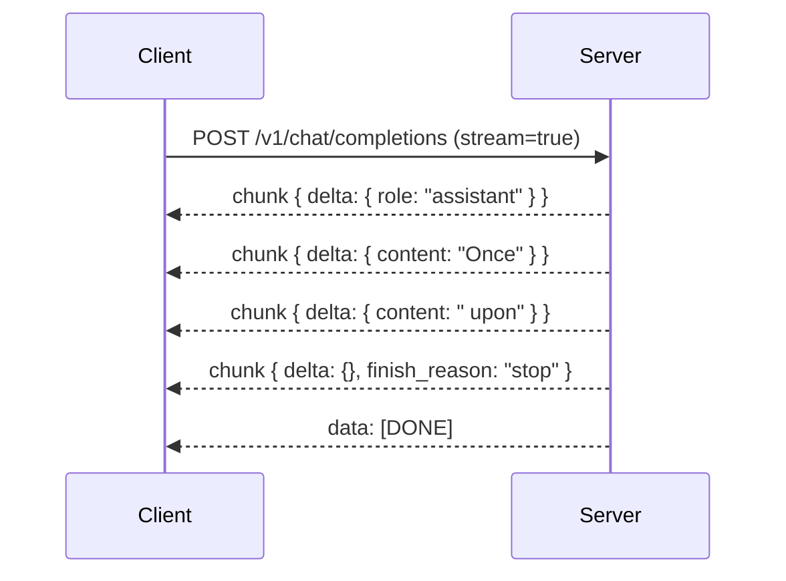

# Streaming

Set `"stream": true` on completion or chat requests to receive
Server-Sent Events. This page documents the exact chunk order, the
fields on each chunk, and the terminal frames.

## Server-Sent Events basics

The server emits one event per line, in the standard SSE format:

```
data: {"id":"...","object":"text_completion",...}

data: {"id":"...","object":"text_completion",...}

data: [DONE]
```

A blank line separates events. The `data:` prefix is mandatory;
clients use [`EventSource`](https://developer.mozilla.org/en-US/docs/Web/API/EventSource)
or any SSE library to read the stream.

## Text completion stream

`POST /v1/completions` with `"stream": true` emits chunks with
`choices[].text` carrying the incremental text:

```bash
curl -N http://127.0.0.1:8080/v1/completions \
  -H 'content-type: application/json' \
  -d '{"prompt":"Once upon a time","max_tokens":32,"stream":true}'
```

```
data: {"id":"cmpl-...","object":"text_completion","choices":[{"text":" Once","index":0}]}

data: {"id":"cmpl-...","object":"text_completion","choices":[{"text":" upon","index":0}]}

data: {"id":"cmpl-...","object":"text_completion","choices":[{"text":" a","index":0}]}

data: [DONE]
```

Set `"logprobs": true` to also receive per-token `tokens`,
`text_offset`, `token_logprobs` and `top_logprobs` in each chunk.

## Chat stream contract

`POST /v1/chat/completions` with `"stream": true` emits chunks in
this exact order:

1. A first chunk with `choices[0].delta` containing
   `{"role": "assistant"}` and no content. This frame is sent only
   after the server has finished validating `options`, the chat
   prompt, and the sampler, so a malformed request never produces a
   valid role frame.
2. Zero or more content chunks with `choices[0].delta.content` set
   to the text decoded in that step and `choices[0].delta.role`
   omitted.
3. A terminal chunk with `choices[0].delta` equal to `{}` and
   `choices[0].finish_reason` set to `"stop"`, `"length"`, or
   `"tool_calls"`.
4. A final `data: [DONE]` SSE frame.



If validation fails before generation, the stream ends with an
`error` SSE event carrying the validation message and **no** role
frame is emitted.

### Worked `curl` example

```bash
curl -N http://127.0.0.1:8080/v1/chat/completions \
  -H 'content-type: application/json' \
  -d '{
    "messages": [{"role":"user","content":"Hello!"}],
    "max_tokens": 16,
    "stream": true
  }'
```

The output looks like:

```
data: {"id":"chatcmpl-...","object":"chat.completion.chunk","choices":[{"index":0,"delta":{"role":"assistant"}}]}

data: {"id":"chatcmpl-...","object":"chat.completion.chunk","choices":[{"index":0,"delta":{"content":"Hi"}}]}

data: {"id":"chatcmpl-...","object":"chat.completion.chunk","choices":[{"index":0,"delta":{"content":" there"}}]}

data: {"id":"chatcmpl-...","object":"chat.completion.chunk","choices":[{"index":0,"delta":{},"finish_reason":"stop"}]}

data: [DONE]
```

## Streaming with tools

When the model emits a tool call, the chunks carry `delta.tool_calls`
with the incremental function arguments. The terminal chunk has
`finish_reason: "tool_calls"` instead of `"stop"`.

```bash
curl -N http://127.0.0.1:8080/v1/chat/completions \
  -H 'content-type: application/json' \
  -d '{
    "messages": [{"role":"user","content":"Weather in Tokyo?"}],
    "tools": [{
      "type": "function",
      "function": {
        "name": "get_weather",
        "description": "Get weather for a city",
        "parameters": {
          "type": "object",
          "properties": { "city": { "type": "string" } },
          "required": ["city"]
        }
      }
    }],
    "tool_choice": "auto",
    "stream": true
  }'
```

```
data: {"choices":[{"delta":{"role":"assistant"}}]}

data: {"choices":[{"delta":{"tool_calls":[{"index":0,"id":"call_weather","type":"function","function":{"name":"get_weather","arguments":""}}]}}]}

data: {"choices":[{"delta":{"tool_calls":[{"index":0,"function":{"arguments":"{\""}}]}}]}

data: {"choices":[{"delta":{"tool_calls":[{"index":0,"function":{"arguments":"city"}}]}}]}

data: {"choices":[{"delta":{"tool_calls":[{"index":0,"function":{"arguments":"\":\\\"Tokyo\\\"}"}}]}}]}

data: {"choices":[{"delta":{},"finish_reason":"tool_calls"}]}

data: [DONE]
```

## Errors during streaming

If the model errors mid-generation (e.g. an `LlamaError`), the
stream ends with an `error` SSE event:

```
event: error
data: {"message": "context overflow", "type": "server_error"}
```

The HTTP status code on the response is still `200` (SSE doesn't
carry a per-event status code); the client must read the event type
to detect the error.

## Client libraries

The chunks match the OpenAI streaming format, so any OpenAI client
library works after you point it at `http://127.0.0.1:8080/v1`:

=== "Python (openai)"

    ```python
    from openai import OpenAI

    client = OpenAI(base_url="http://127.0.0.1:8080/v1", api_key="not-needed")

    stream = client.chat.completions.create(
        model="local-model",
        messages=[{"role": "user", "content": "Hello!"}],
        stream=True,
    )
    for chunk in stream:
        delta = chunk.choices[0].delta
        if delta.content:
            print(delta.content, end="", flush=True)
    ```

=== "TypeScript (openai)"

    ```typescript
    import OpenAI from "openai";

    const client = new OpenAI({
        baseURL: "http://127.0.0.1:8080/v1",
        apiKey: "not-needed",
    });

    const stream = await client.chat.completions.create({
        model: "local-model",
        messages: [{ role: "user", content: "Hello!" }],
        stream: true,
    });

    for await (const chunk of stream) {
        const content = chunk.choices[0]?.delta?.content ?? "";
        process.stdout.write(content);
    }
    ```

## Where to next?

- [API reference](api.md) — every request field.
- [Structured output](structured.md) — combining `stream: true`
  with `response_format`.
- [Running the server](running.md) — boot flags and presets.
