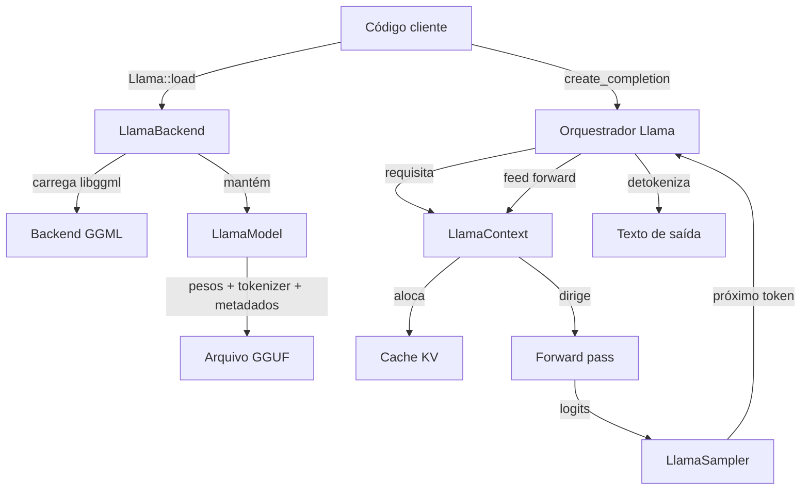
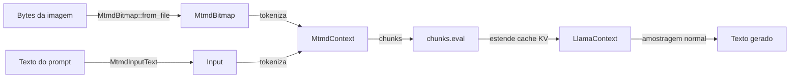

# Arquitetura

Esta página percorre o fluxo de dados de uma única requisição de
completion em `llama-crab`, do momento em que você chama
`Llama::load` até o último token gerado aterrissar em uma `String`.
É o modelo mental de que você precisa antes de poder ler a API de
baixo nível ou bater em uma parede que os helpers de alto nível não
mascaram.

## Quadro geral



O orquestrador de alto nível [`Llama`] possui o modelo, o contexto
e o sampler padrão. Ele expõe um punhado de métodos que escondem o
loop ilustrado acima atrás de uma única chamada de função:

```rust
let mut llama = Llama::load(LlamaParams::new("modelo.gguf"))?;
let resp = llama.create_completion("Hello", 32)?;
println!("{}", resp.text);
```

Quando você precisa de controle mais granular, cada passo do loop
é exposto através de uma API tipada. O restante desta página
descreve cada passo.

## Passo 1: Inicializar o backend

Antes de qualquer chamada ao llama.cpp, a biblioteca nativa tem
que ser inicializada. Isso configura o estado global do GGML,
registra os backends compilados no binário e configura os pools
de threads.

```rust
use llama_crab::LlamaBackend;

// Implícito, chamado por Llama::load:
let _backend = LlamaBackend::init()?;

// Explícito, se você dirige a API de baixo nível diretamente:
let _backend = LlamaBackend::init_numa(NumaStrategy::Distribute)?;
```

- `LlamaBackend::init()` — inicializa o backend padrão.
- `LlamaBackend::init_numa(strategy)` — o mesmo, mas com uma
  estratégia explícita de posicionamento NUMA (`Distribute`,
  `Isolate`, `Numactl`).
- O guard retornado possui o backend; derrubá-lo destrói o estado
  subjacente. Enquanto um `LlamaModel` ou `LlamaContext` estiver
  vivo, o backend também deve estar.

O guard é `Send + Sync`, então pode ficar em um `OnceLock` ou um
`Arc<LlamaBackend>` em um binário multithreaded.

## Passo 2: Carregar o modelo

O modelo contém os pesos, o tokenizador e os metadados armazenados
no contêiner GGUF. Carregar é o passo mais caro em qualquer
programa `llama-crab`: espere de 0,5 s (para um Q4 0,5B) a 30 s
(para um Q4 70B em um disco frio).

```rust
use llama_crab::{Llama, LlamaParams};

let mut llama = Llama::load(
    LlamaParams::new("modelo.gguf")
        .with_n_ctx(2048)
        .with_n_gpu_layers(99),
)?;
```

Por trás dos panos, o orquestrador:

1. Chama `LlamaBackend::init()` (ou reusa um guard existente).
2. Faz memory-map do arquivo GGUF (quando suportado) e analisa os
   metadados.
3. Cria um `LlamaModel`, que aloca os tensores de peso e os
   carrega no backend ativo (CPU, GPU, ou uma mistura).
4. Cria um `LlamaContext` padrão com o tamanho de contexto
   requisitado.

A struct `Llama` é essencialmente `LlamaModel + LlamaContext +
estado padrão`, então você raramente precisa tocar no modelo e
contexto diretamente quando fica no caminho de alto nível.

## Passo 3: Tokenizar o prompt

Tokenização converte uma string UTF-8 nos ids inteiros com os
quais o modelo opera. O tokenizador faz parte do arquivo GGUF (ou,
com a feature `hf-tokenizer`, pode ser carregado de um
`tokenizer.json` separado).

```rust
let prompt = "The capital of France is";
let tokens = llama.model().tokenize(prompt, /*add_bos*/ true, /*special*/ true)?;
```

Os helpers de alto nível tokenizam para você:

```rust
let resp = llama.create_completion(prompt, 32)?;
// → internamente: tokeniza → decode → loop de amostragem → detokeniza
```

## Passo 4: Forward pass (decode)

O prompt tokenizado é empacotado em um `LlamaBatch` e submetido ao
contexto com `decode`. Isso executa o modelo sobre o batch e retorna
os logits do último token.

```rust
use llama_crab::batch::LlamaBatch;

let mut batch = LlamaBatch::new(tokens.len(), 1);
batch.add_sequence(&tokens, 0, /*logits_all*/ false);
batch.prepare();
llama.context().decode(&batch)?;
```

O cache KV armazenado no contexto é atualizado in-place, então a
próxima chamada só precisa alimentar o token recém-gerado.

## Passo 5: Amostrar o próximo token

Os logits são passados para um `LlamaSampler`, que implementa uma
estratégia de decodificação particular. A cadeia padrão é
`greedy`, mas você pode compor uma cadeia customizada com
`SamplerChain`:

```rust
use llama_crab::sampling::{LlamaSampler, SamplerChain};

let mut sampler = SamplerChain::new()
    .temp(0.8)
    .top_p(0.95, 1)
    .min_p(0.05, 1)
    .penalties(64, 1.1, 0.0, 0.0)
    .build();

let next_token = unsafe { sampler.sample(llama.context().raw_handle(), -1) };
sampler.accept(next_token);
```

Veja o guia de [Estratégias de amostragem](../guides/sampling.md)
para o menu completo de samplers e cadeias recomendadas.

## Passo 6: Anexar e continuar

O token selecionado é realimentado no contexto como um novo batch
de tamanho 1. O cache KV é reusado, então esta passada forward é
a mais barata do loop.

```rust
use llama_crab::batch::LlamaBatch;

let single = LlamaBatch::one(next_token, n_past, 0, true);
llama.context().decode(&single)?;
n_past += 1;
```

Os passos 5 e 6 se repetem até o sampler emitir o token EOS, uma
sequência de parada ser correspondida, ou a contagem máxima de
tokens ser atingida.

## Passo 7: Detokenizar

Os ids de token selecionados são mapeados de volta para texto com
o tokenizador do modelo:

```rust
let text = llama.model().detokenize(&generated_tokens, /*special*/ false)?;
```

A struct `Completion` de alto nível combina os tokens gerados, o
texto, as log-probabilidades por token e as temporizações:

```rust
pub struct Completion {
    pub text: String,
    pub tokens: Vec<LlamaToken>,
    pub logprobs: Option<CompletionLogprobs>,
    pub timings: CompletionTimings,
    pub stop_reason: StopReason,
}
```

## Onde o stack multimodal se encaixa

A feature `mtmd` adiciona um pipeline paralelo para entradas de
visão e áudio. O modelo de texto permanece o mesmo; os tipos
`MtmdContext` e `MtmdBitmap` codificam imagens (ou áudio) no mesmo
fluxo de tokens usado pelo resto da API.



Veja o [guia Multimodal](../features/multimodal.md) para o fluxo
completo.

## Por onde ir a partir daqui

- [Ciclo de vida](lifecycle.md) — quando o modelo e o contexto
  sobem e descem, e como compartilhá-los entre threads.
- [Estratégias de amostragem](../guides/sampling.md) — todo sampler
  disponível e como encadeá-los.
- [Backends & offload de GPU](../guides/backends.md) — o que o
  backend ativo faz com o fluxo de dados acima.

[`Llama`]: https://docs.rs/llama-crab/latest/llama_crab/struct.Llama.html
