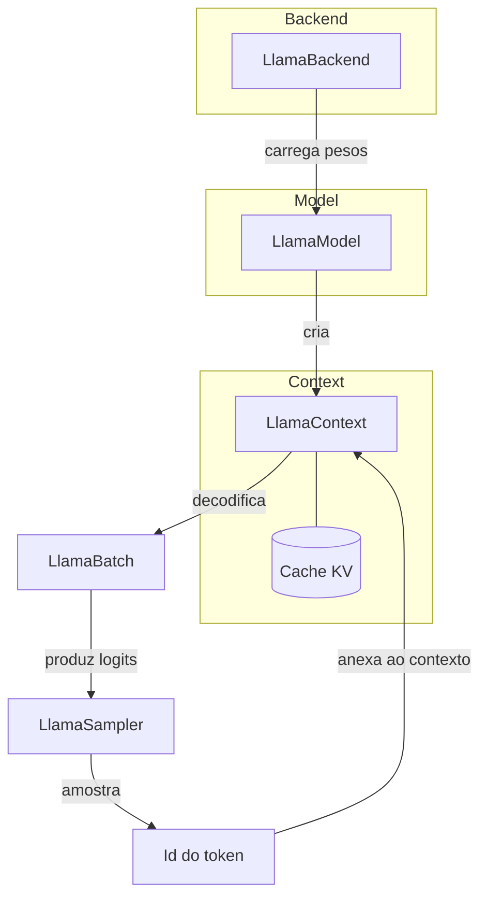

# Conceitos Fundamentais

Esta seção explica o *porquê* por trás da API do `llama-crab`. Leia
uma vez antes de mergulhar em uma funcionalidade específica, e
volte aqui quando a assinatura de um método não fizer o que você
esperava.

-   :material-sitemap-outline: __[Arquitetura](architecture.md)__

    O quadro geral: a relação entre `LlamaBackend`, `LlamaModel`,
    `LlamaContext`, `LlamaBatch`, `LlamaSampler` e `Llama`. Um
    diagrama do fluxo de dados dentro de uma única passada forward.

-   :material-recycle: __[Ciclo de vida](lifecycle.md)__

    Quando o backend sobe e desce? Quem é dono do modelo? Qual é a
    maneira segura de compartilhar um modelo entre threads? Como
    liberar um contexto quando você não precisa mais dele?

-   :material-alert-circle-outline: __[Tratamento de erros](errors.md)__

    O enum `LlamaError`, como mapeá-lo para erros voltados ao
    usuário, e os padrões que a API segura usa para expor "modelo
    não encontrado", "contexto muito grande", "backend não
    inicializado" e similares.

## Modelo mental

Um pedido para "completar um prompt" percorre este loop uma vez
por token gerado:

1. Os pesos do modelo são carregados de um arquivo GGUF em um
   `LlamaModel`.
2. Um `LlamaContext` é criado sobre o modelo, alocando o cache KV
   que armazenará chaves e valores de atenção.
3. O prompt é tokenizado em um `Vec<LlamaToken>`, empacotado em um
   `LlamaBatch` e submetido ao contexto com `decode`.
4. Os logits produzidos pela passada forward são passados para um
   `LlamaSampler`, que seleciona o próximo token.
5. O token selecionado é anexado ao contexto (reusando o cache KV)
   e o loop continua até o sampler emitir EOS ou uma condição de
   parada ser atingida.
6. Os tokens selecionados são detokenizados de volta em texto.

O orquestrador de alto nível [`Llama`] esconde os passos 3–5 atrás
de uma única chamada de método. Os tipos de nível mais baixo em
[`llama_crab::context`], [`llama_crab::batch`] e
[`llama_crab::sampling`] dão a você controle total sobre cada passo
quando precisar.

## As três camadas da API

`llama-crab` é intencionalmente um crate de três camadas:

| Camada | Crate / módulo | Quando usar |
| --- | --- | --- |
| **Orquestrador de alto nível** | [`Llama`] | 95% das aplicações. A fachada ergonômica e segura. |
| **Blocos de construção de nível médio** | [`LlamaModel`], [`LlamaContext`], [`LlamaBatch`], [`LlamaSampler`], [`MtmdContext`] | Quando você precisa de controle manual sobre batching, sessões, avaliação multimodal, cadeias de amostragem, etc. |
| **FFI bruta** | [`llama_crab_sys`] | Apenas quando você precisa de um símbolo do llama.cpp que a camada segura não expõe. O crate de alto nível reexporta os wrappers seguros de que você precisa. |

A maior parte deste guia trabalha no **nível médio** — os blocos de
construção — porque eles explicam *o que está acontecendo* sob os
panos dos helpers de alto nível. Código de produção pode ficar no
alto nível a menos que você bata em uma parede.

## Uma nota sobre segurança

`llama-crab` é construído sobre C++ que aloca, libera e compartilha
memória através de ponteiros brutos. A fronteira `unsafe` é
intencionalmente estreita:

- `llama_crab_sys` contém todas as declarações FFI `unsafe` e as
  poucas funções `unsafe` necessárias para encapsulá-las.
- O crate seguro em cima é anotado com
  `#![deny(unsafe_op_in_unsafe_fn)]` e uma configuração rigorosa de
  clippy, então a API pública é `unsafe`-free em 100% dos call sites
  documentados.
- Algumas saídas de escape de baixo nível (handles brutos de
  contexto, `*mut llama_context` brutos, `chunks.eval`, as
  reexportações FFI) são expostas atrás de `unsafe fn` para que o
  compilador possa verificar que você aceita a responsabilidade
  pelas invariantes.

A regra de ouro: **se você não vê um bloco `unsafe` no seu código,
a camada segura está te protegendo.**

## Por onde ir a partir daqui

- [Arquitetura](architecture.md) — o fluxo de dados, as
  responsabilidades de cada tipo, e como ler a API segura como uma
  camada fina sobre a FFI.
- [Ciclo de vida](lifecycle.md) — quando o backend vive, quando o
  modelo vive, e como compartilhar um modelo entre threads.
- [Tratamento de erros](errors.md) — o enum `LlamaError` e os
  padrões para converter erros da biblioteca em erros da aplicação.

[`Llama`]: https://docs.rs/llama-crab/latest/llama_crab/struct.Llama.html
[`LlamaModel`]: https://docs.rs/llama-crab/latest/llama_crab/model/struct.LlamaModel.html
[`LlamaContext`]: https://docs.rs/llama-crab/latest/llama_crab/context/struct.LlamaContext.html
[`LlamaBatch`]: https://docs.rs/llama-crab/latest/llama_crab/batch/struct.LlamaBatch.html
[`LlamaSampler`]: https://docs.rs/llama-crab/latest/llama_crab/sampling/struct.LlamaSampler.html
[`MtmdContext`]: https://docs.rs/llama-crab/latest/llama_crab/multimodal/struct.MtmdContext.html
[`llama_crab_sys`]: https://docs.rs/llama-crab-sys
