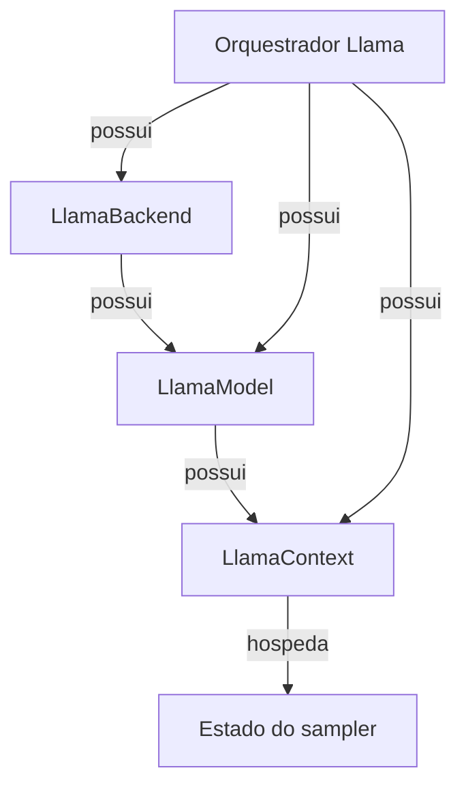
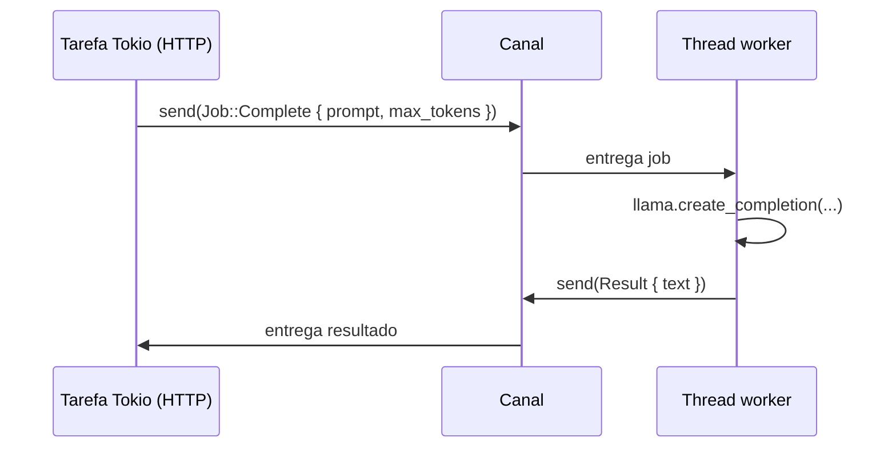
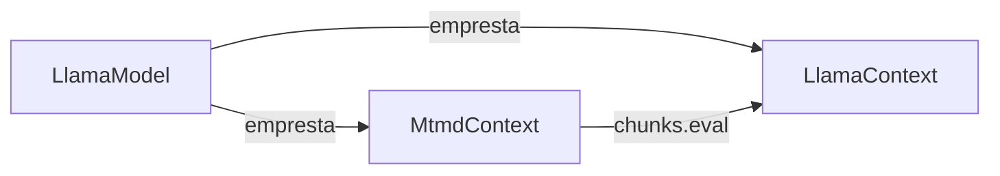

# Ciclo de vida

Esta página documenta os *lifetimes* dos principais tipos em
`llama-crab`. É a resposta para perguntas como "quando o backend
desce?", "posso compartilhar um modelo entre threads?" e "como
libero um contexto?".

## Grafo de posse



A struct de alto nível `Llama` possui o backend, o modelo e o
contexto todos de uma vez. Derrube o `Llama` e toda a stack desce
em ordem reversa: contexto → modelo → backend.

Quando você dirige a API de baixo nível diretamente, a regra é a
mesma, mas declarada explicitamente:

> Um `LlamaContext` é emprestado de um `LlamaModel`, que é
> emprestado de um `LlamaBackend`. Derrube-os nessa ordem:
> contexto primeiro, depois modelo, depois backend.

## Quando o backend é inicializado?

`LlamaBackend::init()` é chamado automaticamente por `Llama::load`.
Se você constrói um `LlamaModel` e um `LlamaContext` à mão, você
deve segurar um guard `LlamaBackend` por todo o tempo de vida do
modelo e do contexto. O padrão mais seguro é:

```rust
use llama_crab::LlamaBackend;

let backend = LlamaBackend::init()?;          // 1
let model = llama_crab::model::LlamaModel::load(
    "modelo.gguf",
    &Default::default(),
    backend.handle(),                        // 2
)?;
let context = model.new_context(
    llama_crab::context::params::LlamaContextParams::default(),
    backend.handle(),                        // 3
)?;
drop(context);                                // 4
drop(model);
drop(backend);
```

1. O guard possui o estado global do GGML.
2. O modelo segura um `BackendHandle` (uma referência emprestada
   ao backend).
3. O contexto faz o mesmo.
4. Ordem reversa no drop.

## Compartilhando um modelo entre threads

`LlamaModel` e `LlamaContext` **não** são `Sync`. Eles envolvem
objetos C++ que mantêm ponteiros brutos e estado mutável, e a
camada segura impõe acesso single-threaded em tempo de compilação.

O padrão recomendado é colocar o estado de inferência atrás de uma
thread de trabalho dedicada e enviar jobs para ela:



É exatamente assim que [`llama-crab-server`](../server/index.md) é
construído. Se você precisa de inferência paralela, execute várias
threads worker, cada uma com sua própria `Llama`.

### Quando um modelo é `Send`?

`LlamaModel` e `LlamaContext` são `Send`, apenas não `Sync`. O
bound `Send` significa que você pode movê-los entre threads, desde
que apenas uma thread os toque por vez. O padrão mais simples de
"mover e voltar" é mantê-los dentro de um `Mutex<Llama>` em uma
thread dedicada.

### Quando um modelo é `Sync`?

Não é. Se você realmente precisa de acesso paralelo de múltiplas
threads, **carregue o modelo duas vezes** (uma por worker). É o
que o design "um worker, um modelo" do servidor encoraja.

## Liberando um contexto cedo

Se você tem um orquestrador `Llama` de longa duração mas quer
liberar o cache KV entre requisições, derrube o contexto e recrie:

```rust
{
    let mut llama = Llama::load(LlamaParams::new("modelo.gguf"))?;
    // Use llama para um lote de requisições…
    drop(llama.context().take());   // ainda não exposto — ilustração
}
// Memória liberada.
```

Na API atual, a maneira mais limpa de liberar o contexto é derrubar
o `Llama` inteiro e recarregar. Se você precisa de controle mais
granular, use os tipos de baixo nível `LlamaModel` + `LlamaContext`
e gerencie-os você mesmo.

## Cleanup em pânico

A struct `Llama` e seus componentes são guards RAII que
implementam `Drop` sobre recursos C++. Se seu `main` entrar em
pânico dentro de uma chamada `Llama::load`, o `Llama`
parcialmente construído (se houver) é derrubado, que por sua vez
derruba os objetos C++ que possui. Não há chamada explícita de
`teardown`.

Para um servidor, prefira envolver cada worker em um [`scopeguard`]
ou um tipo RAII customizado para que um pânico em uma requisição
não corrompa o estado da próxima.

[`scopeguard`]: https://crates.io/crates/scopeguard

## Ciclo de vida do stack multimodal

Quando a feature `mtmd` está habilitada, um `MtmdContext` é um
recurso top-level separado que **empresta** o `LlamaModel`:



Derrube o `MtmdContext` antes do `LlamaContext`, e o `LlamaContext`
antes do `LlamaModel`. A struct de alto nível `Llama` não possui
um `MtmdContext`; você o cria ao lado:

```rust
let mut llama = Llama::load(LlamaParams::new("gemma-4-it.gguf"))?;
let mtmd = MtmdContext::init_from_file("gemma-4-it-mmproj.gguf", llama.model())?;
// … use mtmd junto com llama.context() …
drop(mtmd);   // antes de llama
```

## Por onde ir a partir daqui

- [Arquitetura](architecture.md) — o fluxo de dados de uma única
  passada forward.
- [Tratamento de erros](errors.md) — o que acontece quando uma
  chamada FFI falha e como mapear para um erro voltado ao usuário.
- [Servidor](../server/index.md) — a implementação de referência
  do padrão de thread worker.
