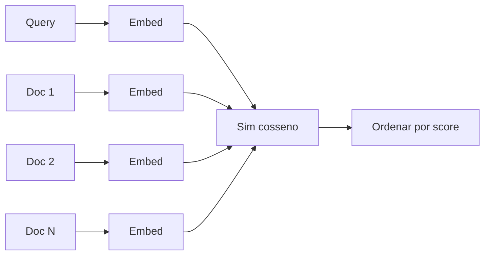

# `embedding_search` — Busca semântica

Incorpora uma query e um corpus fixo pequeno com um modelo BGE,
depois ranqueia o corpus por similaridade cosseno. O fluxo
clássico de "dada uma query, encontre os documentos mais
próximos" em ~50 linhas.

## Execute

=== "Um comando"

    ```bash
    ./examples/run.sh embedding_search
    ```

=== "Manual"

    ```bash
    ./scripts/download_models.sh bge
    cargo run --release --bin run_embeddings
    ```

Baixa o `bge-small-en-v1.5-q4_k_m.gguf` (~30 MB).

## O que ele faz

```rust
use llama_crab::context::params::PoolingType;
use llama_crab::{Llama, LlamaParams};

let mut llama = Llama::load(
    LlamaParams::new("models/bge-small-en-v1.5-q4_k_m.gguf")
        .with_n_ctx(512)
        .with_embeddings(true)
        .with_pooling_type(PoolingType::Cls),
)?;

let corpus = &[
    "Rust is a memory-safe systems language without a garbage collector.",
    "Python is a high-level dynamic language with duck typing.",
    "The Eiffel Tower is one of the most visited monuments in the world.",
    "Borrow checking enforces lifetimes at compile time in Rust.",
];

let q = llama.embed("What programming language is safest?", true)?;
let mut scored: Vec<(usize, f32)> = corpus.iter().enumerate()
    .map(|(i, doc)| {
        let v = llama.embed(doc, true).unwrap();
        let sim: f32 = q.iter().zip(v.iter()).map(|(a, b)| a * b).sum();
        (i, sim)
    })
    .collect();
scored.sort_by(|a, b| b.1.partial_cmp(&a.1).unwrap());
```

Como os embeddings são L2-normalizados, o produto escalar é igual
à similaridade cosseno.

## Saída esperada

```
📊 results (cosine similarity, higher = more similar):
   0.823  doc-1  Rust is a memory-safe systems language without a garbage collector.
   0.741  doc-4  Borrow checking enforces lifetimes at compile time in Rust.
   0.312  doc-2  Python is a high-level dynamic language with duck typing.
   0.088  doc-3  The Eiffel Tower is one of the most visited monuments in the world.

Query: What programming language is safest?
Top match: doc-1 (cosine = 0.823)
```

## Como a pontuação funciona



Cada documento é embedado independentemente. Com vetores
L2-normalizados, o produto escalar é igual à similaridade cosseno.
O exemplo usa um loop single-threaded; para milhares de documentos,
faça batch dos embeddings através de `embed_texts`.

## Escalando

Para um corpus real, substitua a lista em memória por um índice
de vetores:

- [HNSW em Rust puro](https://crates.io/crates/hnsw) — sem
  serviço externo.
- [Qdrant](https://crates.io/crates/qdrant-client) — DB de
  vetores de produção.
- [pgvector](https://github.com/pgvector/pgvector) — Postgres com
  suporte a vetores.

A invariante chave: o índice armazena vetores L2-normalizados, e
as queries também são normalizadas. Então produto escalar =
similaridade cosseno e você pode usar o mesmo tipo de índice para
ambos.

## Variações comuns

=== "Corpus diferente"

    ```rust
    let corpus = &[
        "How to make sourdough bread at home",
        "The capital of France is Paris",
        "Tips for a good night's sleep",
    ];
    let q = llama.embed("bread baking tips", true)?;
    ```

=== "Top-K em vez de ranqueamento completo"

    ```rust
    scored.sort_by(|a, b| b.1.partial_cmp(&a.1).unwrap());
    let top_3: Vec<_> = scored.iter().take(3).collect();
    ```

## Código-fonte completo

[`examples/embedding_search/src/main.rs`](https://github.com/DominguesM/llama-crab/tree/main/examples/embedding_search/src/main.rs).

## Por onde ir a partir daqui

- [Reranker](reranker.md) — quando você precisa de ranqueamentos
  de maior qualidade no top K.
- [Guia de embeddings & reranking](../features/embeddings.md) — a
  referência completa.
- [Receita de RAG](../recipes/rag.md) — embeddings em um pipeline
  de recuperação.
