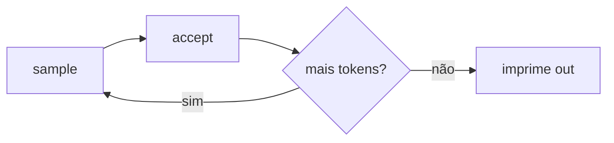

# `mtmd` — API `mtmd.h` bruta

Um contraparte de baixo nível para o exemplo [`vision`](vision.md):
carrega um modelo de texto e um projetor `mmproj`, embute uma
imagem e um prompt em uma lista de chunks, depois dirige o loop
de decodificação à mão. Use isso quando precisar de acesso direto
a `MtmdBitmap` / `MtmdInputText` / `chunks.eval`.

O exemplo de alto nível [`vision`](vision.md) faz a mesma coisa
em menos linhas através do helper `MtmdContext`.

## Execute

=== "Um comando"

    ```bash
    ./examples/run.sh mtmd gemma4
    ```

=== "Manual"

    ```bash
    ./scripts/download_models.sh gemma4
    cargo run --release --bin mtmd -- \
      models/gemma-4-E4B-it-Q4_K_M.gguf \
      models/mmproj-gemma-4-E4B-it-BF16.gguf \
      tests/fixtures/test_image.png \
      "Descreva esta imagem em uma frase curta."
    ```

Baixa o GGUF de texto Gemma 4 + seu projetor mmproj (~5 GB total).

## O que ele faz

```rust
use llama_crab::batch::LlamaBatch;
use llama_crab::multimodal::{default_media_marker, MtmdBitmap, MtmdContext, MtmdInputText};
use llama_crab::sampling::LlamaSampler;
use llama_crab::token::LlamaToken;
use llama_crab::{Llama, LlamaParams};

let mut llama = Llama::load(LlamaParams::new("modelo.gguf").with_n_ctx(4096))?;
let mtmd = MtmdContext::init_from_file("mmproj.gguf", llama.model())?;

let bitmap = MtmdBitmap::from_file("image.png")?;
let marker = default_media_marker();
let prompt = format!("{marker}\nDescreva esta imagem em uma frase curta.");

let chunks = mtmd.tokenize(MtmdInputText::new(&prompt), &[&bitmap])?;

let ctx_ptr = llama.context().raw_handle();
let mut n_past = unsafe {
    chunks.eval(&mtmd, ctx_ptr, 0, 0, llama.context().n_batch() as i32, true)?
};

// Loop de decodificação padrão com um sampler greedy.
let mut sampler = LlamaSampler::greedy()?;
let eos = llama.model().token_eos();
let mut out = String::new();
for i in 0..96 {
    let idx = if i == 0 { -1 } else { 0 };
    let tok: LlamaToken = unsafe { sampler.sample(ctx_ptr, idx) };
    sampler.accept(tok);
    if tok == eos { break; }
    out.push_str(&llama.model().detokenize(&[tok], false)?);
    let single = LlamaBatch::one(tok, n_past + i as i32, 0, true);
    llama.context().decode(&single)?;
}
println!("{out}");
```

## Passo a passo

### `default_media_marker()`

O marcador é a string especial que o projetor espera na posição de
cada imagem. O marcador é específico do modelo:

- Gemma 4 usa `<start_of_image>`.
- LFM2.5-VL usa `<|image|>`.

`default_media_marker()` retorna o que o `MtmdContext` carregado
espera, então você não precisa hardcodar.

### `MtmdInputText`

A parte de texto do prompt. Pode incluir o marcador inline (como
acima) ou confiar no projetor para inserir o marcador
automaticamente.

### `chunks.eval`

Avalia os chunks multimodais no cache KV:

```rust
let new_n_past = unsafe {
    chunks.eval(&mtmd, ctx_ptr, 0, 0, llama.context().n_batch() as i32, true)?
};
```

- `&mtmd` — o contexto ativo.
- `ctx_ptr` — o `*mut llama_context` bruto de
  `llama.context().raw_handle()`.
- `seq_id` — geralmente `0`.
- `n_past` — geralmente `0` (iniciar uma posição fresca) ou a
  posição atual se quiser estender um contexto existente.
- `n_batch` — o tamanho lógico do batch; use
  `llama.context().n_batch()`.
- `logits_last` — `true` para que a próxima amostra leia a posição
  correta.

A função retorna o novo `n_past`, que é onde o sampler deve
começar.

### O loop de decodificação

O resto do exemplo é um loop de sampler padrão:



`LlamaSampler::greedy()` é o sampler mais rápido e o mais
reproduzível. Para saída de maior qualidade, construa um
`SamplerChain`.

## Modelos testados

| Modelo | Status |
| --- | --- |
| `lmstudio-community/gemma-4-E4B-it-GGUF` | ✅ |
| `unsloth/LFM2.5-VL-1.6B-GGUF` | ✅ |
| `Qwen2.5-VL` | Compatível via mtmd. |
| `Llama-3.2-Vision` | Compatível via mtmd. |

O mesmo fluxo é exercitado pelos testes de integração em
`crates/llama-crab/tests/gemma4_vision.rs` e
`crates/llama-crab/tests/lfm_vl_vision.rs`.

## Código-fonte completo

[`examples/mtmd/src/main.rs`](https://github.com/DominguesM/llama-crab/tree/main/examples/mtmd/src/main.rs).

## Por onde ir a partir daqui

- [Guia multimodal](../features/multimodal.md) — o fluxo de dados
  e a API de avaliação de chunks.
- [Visão (alto nível)](vision.md) — se você não precisa do loop
  bruto.
- [Servidor com visão](../server/api.md#chat-multimodal) — o
  caminho HTTP.
