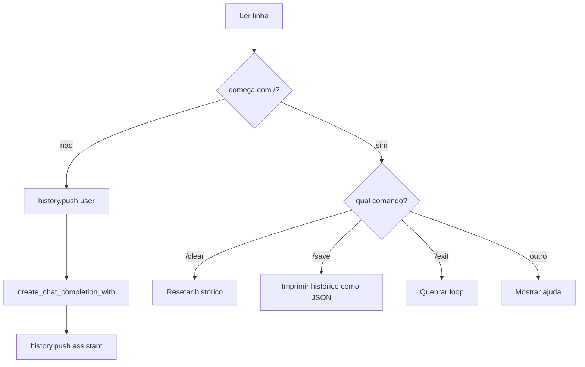

# `stateful_chat` — REPL interativo

Um REPL de chat multi-turno que cresce o histórico de conversa a
cada turno. Suporta `/clear`, `/save` e EOF para sair. O modelo é
carregado uma vez e reutilizado; apenas a lista de mensagens cresce.

## Execute

=== "Um comando"

    ```bash
    ./examples/run.sh stateful_chat
    ```

=== "Manual"

    ```bash
    ./scripts/download_models.sh smol
    cargo run --release --bin run_chat
    ```

Baixa o `Qwen2.5-0.5B-Instruct-GGUF` (~400 MB).

## Comandos

| Comando | Ação |
| --- | --- |
| `/exit` | Sair (também `/quit`, `/q` ou Ctrl+D). |
| `/clear` | Resetar histórico (mantém a mensagem de sistema). |
| `/save` | Imprime a conversa como JSON. |
| qualquer outra coisa | Enviada como mensagem do usuário. |

## O que ele faz

```rust
use llama_crab::chat::BuiltinTemplate;
use llama_crab::high_level::chat_completion::{create_chat_completion_with, ChatMessage};
use llama_crab::{Llama, LlamaParams, Role};

let mut llama = Llama::load(LlamaParams::new("modelo.gguf").with_n_ctx(4096))?;

let mut history: Vec<ChatMessage> = vec![
    ChatMessage::new(Role::System,
        "You are a helpful, concise assistant. Always reply in English, in under 2 sentences."),
];

// A cada turno do usuário:
history.push(ChatMessage::new(Role::User, "What is Rust?"));
let resp = create_chat_completion_with(
    &mut llama, &history, BuiltinTemplate::ChatMl, &[], 128,
)?;
history.push(ChatMessage::new(Role::Assistant, resp.content));
```

O histórico é o contexto inteiro. Cada chamada de alto nível
re-envia e re-avalia o histórico renderizado. As APIs de
cache/sessão de prompt são ferramentas manuais para loops de baixo
nível; elas não são usadas automaticamente por
`create_chat_completion_with`.

## Saída esperada

```
🦀 llama-crab interactive chat
   model : models/qwen2.5-0.5b-instruct-q4_k_m.gguf
   commands: /exit  /clear  /save

> What is Rust?
  (0.81s)
assistant> Rust is a memory-safe systems programming language.

> /save
[
  { "role": "system", ... },
  { "role": "user", "content": "What is Rust?" },
  { "role": "assistant", "content": "Rust is a ..." }
]
```

## Parsing de comandos

O REPL faz parse da linha de entrada e despacha:



## Cortando o histórico

O tamanho do contexto limita o número de tokens que o modelo pode
ver. Quando o histórico cresce além de `n_ctx`, o REPL corta os
turnos mais antigos (mantendo a mensagem de sistema):

```rust
const MAX_HISTORY_TURNS: usize = 40;

if history.len() > MAX_HISTORY_TURNS {
    let system = history[0].clone();
    history = std::iter::once(system)
        .chain(history.into_iter().skip(1).rev().take(MAX_HISTORY_TURNS).rev())
        .collect();
}
```

Para uma estratégia mais inteligente, veja o
[guia de chat com estado](../features/stateful-chat.md).

## Persistindo a sessão

O comando `/save` serializa o histórico para JSON. O REPL não
carrega automaticamente no próximo início, mas você pode adicionar
uma flag `--load <arquivo>` e chamar:

```rust
let raw = std::fs::read_to_string(path)?;
let history: Vec<ChatMessage> = serde_json::from_str(&raw)?;
```

## Código-fonte completo

[`examples/stateful_chat/src/main.rs`](https://github.com/DominguesM/llama-crab/tree/main/examples/stateful_chat/src/main.rs).

## Por onde ir a partir daqui

- [Receita de chatbot](../recipes/chatbot.md) — transforme este
  REPL em um agente deployável.
- [Cache & estado de sessão](../guides/caching.md) — pule
  reavaliar turnos anteriores.
- [Tool calling](tools.md) — adicione chamadas de função ao
  loop.
