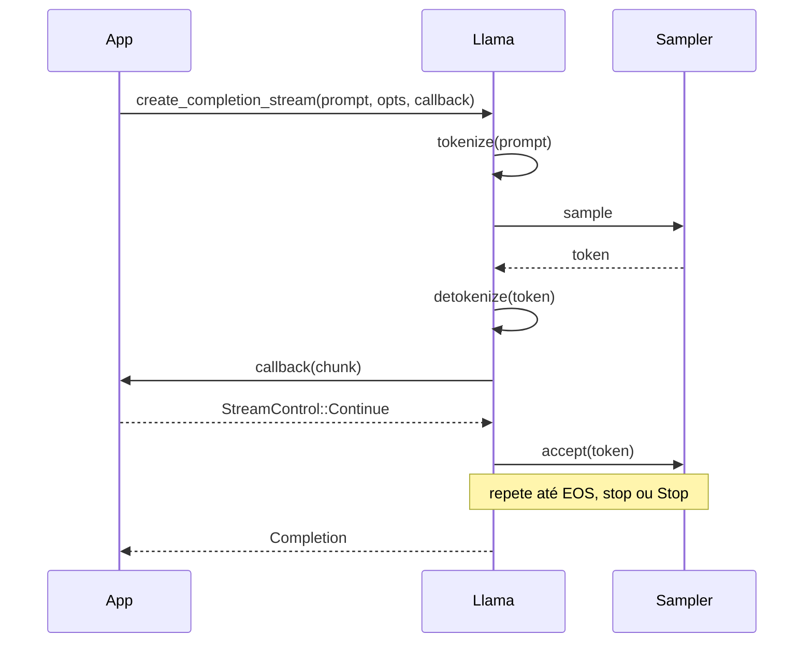

# `streaming` — Streaming de tokens de alto nível

Use `Llama::create_completion_stream` quando quiser saída
síncrona token a token enquanto ainda recebe a `Completion` final.
O callback recebe chunks de texto conforme ficam disponíveis e
retorna `StreamControl::Continue` ou `StreamControl::Stop`.

## Execute

```bash
./examples/run.sh streaming
```

Baixa o mesmo modelo Qwen2.5 0.5B de ~400 MB que o exemplo
`quickstart`.

## O que ele faz

```rust
use std::io::{self, Write};

use llama_crab::{CompletionOptions, Llama, LlamaParams, StreamControl};

fn main() -> Result<(), Box<dyn std::error::Error>> {
    let mut llama = Llama::load(LlamaParams::new("modelo.gguf").with_n_ctx(512))?;
    let prompt = "Escreva uma frase curta sobre Rust.";
    let mut stdout = io::stdout().lock();

    let mut write_error: Option<io::Error> = None;
    let completion = llama.create_completion_stream(
        prompt,
        CompletionOptions::new(64).with_stop_sequence("\n\n"),
        |chunk| {
            if let Err(err) = write!(stdout, "{}", chunk.text).and_then(|_| stdout.flush()) {
                write_error = Some(err);
                return StreamControl::Stop;
            }
            StreamControl::Continue
        },
    )?;

    if let Some(err) = write_error {
        return Err(err.into());
    }
    writeln!(stdout)?;
    Ok(())
}
```

## Capturando erros de I/O

O callback não pode retornar um `Result`, então capture erros de
I/O e retorne `StreamControl::Stop`; depois que o stream retorna,
propague o erro capturado:

```rust
let mut write_error: Option<io::Error> = None;

let completion = llama.create_completion_stream(
    "Escreva uma frase curta sobre Rust.",
    CompletionOptions::new(64),
    |chunk| {
        if let Err(err) = write!(stdout, "{}", chunk.text).and_then(|_| stdout.flush()) {
            write_error = Some(err);
            return StreamControl::Stop;
        }
        StreamControl::Continue
    },
)?;

if let Some(err) = write_error {
    return Err(err.into());
}
```

Para demos rápidos onde erros de stdout não são importantes, o
callback pode ignorá-los:

```rust
llama.create_completion_stream(
    "Escreva uma frase curta sobre Rust.",
    CompletionOptions::new(64),
    |chunk| {
        let _ = write!(stdout, "{}", chunk.text);
        let _ = stdout.flush();
        StreamControl::Continue
    },
)?;
```

## Parando o stream cedo

Retornar `StreamControl::Stop` do callback interrompe o loop de
geração. A `Completion` retornada pela chamada ainda é populada
com o que foi gerado até então:

```rust
let mut stopped = false;
let completion = llama.create_completion_stream(
    "Liste 10 cores, uma por linha:",
    CompletionOptions::new(256),
    |chunk| {
        print!("{}", chunk.text);
        if chunk.text.contains("done") {
            stopped = true;
            return StreamControl::Stop;
        }
        StreamControl::Continue
    },
)?;
println!("\nparou: {stopped}");
```

## Como funciona internamente



O helper de streaming usa o mesmo caminho de completion de alto
nível que `create_completion`: limpa a sequência 0 antes de cada
chamada e não habilita reuso automático do cache de prompt entre
chamadas. Para amostragem customizada, batching ou reuso manual de
KV/sessão, use as APIs de contexto, batch e sampler de baixo nível
diretamente.

## Streaming + log-probabilidades

Se você definir `logprobs = true` nas opções, cada chunk carrega
as log-probabilidades por token:

```rust
CompletionOptions::new(64)
    .with_logprobs(true, 5)
```

O campo `chunk.logprobs` é `Some(...)` em cada chunk, incluindo o
parcial. Use o campo para exibir alternativas em uma UI ou para
computar uma pontuação de confiança.

## Streaming + tools

Streaming funciona com o pipeline de chat e tool calling. O schema
do chunk corresponde ao formato SSE da OpenAI. Veja o
[guia de streaming do servidor](../server/streaming.md) para a
ordem exata dos chunks.

## Código-fonte completo

[`examples/streaming/src/main.rs`](https://github.com/DominguesM/llama-crab/tree/main/examples/streaming/src/main.rs).

## Por onde ir a partir daqui

- [Chat com estado](stateful-chat.md) — REPL multi-turno.
- [Guia de estratégias de amostragem](../guides/sampling.md) —
  cadeias de sampler customizadas.
- [Streaming do servidor](../server/streaming.md) — o mesmo fluxo
  sobre HTTP.
