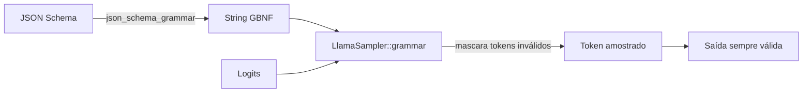

# `structured` — Saída JSON restrita

O exemplo usa uma gramática JSON Schema → GBNF para forçar o modelo
a emitir apenas JSON válido de uma forma específica. A saída é
garantida como parseável, independentemente do tamanho do modelo
ou da formulação do prompt.

## Execute

```bash
cargo run -p structured --release -- modelo.gguf
```

O primeiro argumento posicional é o caminho para qualquer GGUF de
texto.

## O que ele faz

```rust
use llama_crab::high_level::completion::json_schema_grammar;
use llama_crab::high_level::completion::CompletionOptions;
use llama_crab::sampling::{LlamaSampler, SamplerChain};
use llama_crab::{Llama, LlamaParams};
use serde_json::json;

fn main() -> Result<(), Box<dyn std::error::Error>> {
    let schema = json!({
        "type": "object",
        "properties": {
            "name": { "type": "string" },
            "age":  { "type": "integer" }
        },
        "required": ["name", "age"]
    });
    let grammar_text = json_schema_grammar(&schema).unwrap();
    let mut llama = Llama::load(LlamaParams::new("modelo.gguf").with_n_ctx(1024))?;
    let grammar = unsafe { LlamaSampler::grammar(llama.model(), &grammar_text, "root")? };
    let greedy = LlamaSampler::greedy()?;
    let mut sampler = SamplerChain::new()
        .add_sampler(grammar)
        .add_sampler(greedy)
        .build();
    let resp = llama.create_completion_with_sampler(
        "Gere uma pessoa fictícia como JSON: ",
        CompletionOptions::new(32),
        &mut sampler,
    )?;
    println!("{}", resp.text);
    Ok(())
}
```

## Saída esperada

```
{"name": "Alice", "age": 30}
```

O modelo pode emitir qualquer nome ou idade; a forma é fixa.

## Como funciona



O sampler de gramática roda **após** todo outro sampler na cadeia.
Ele olha para o contexto atual, computa o conjunto de tokens que
manteriam a saída válida contra a gramática, e mascara os logits
de todos os outros tokens para `-inf`. O próximo sampler na cadeia
então escolhe da distribuição mascarada.

O resultado: o modelo literalmente não pode emitir um token que
quebraria a gramática.

## Features JSON-Schema suportadas

O conversor entende um subconjunto útil de JSON Schema 2020-12:

| Feature | Status |
| --- | --- |
| `type: object` com `properties`, `required`, `additionalProperties` | ✅ |
| `type: array` com `items`, `prefixItems`, `minItems`, `maxItems` | ✅ |
| `type: string` com `minLength`, `maxLength`, `pattern` | ✅ |
| `type: integer` / `number` com `minimum`, `maximum`, … | ✅ |
| `type: boolean`, `null` | ✅ |
| `enum`, `const` | ✅ |
| `format: date-time`, `email`, `uri`, `uuid` | ✅ |
| `oneOf`, `anyOf`, `allOf` | ✅ |
| `$ref` (local `#/definitions/...`) | ✅ |
| `definitions`, `$defs` | ✅ |

Veja o [guia de gramáticas](../features/grammars.md) para a tabela
completa.

## Um schema mais complexo

Suponha que você queira uma lista de pessoas, cada uma com nome,
idade e email opcional:

```rust
let schema = json!({
    "type": "array",
    "items": {
        "type": "object",
        "properties": {
            "name":  { "type": "string" },
            "age":   { "type": "integer", "minimum": 0 },
            "email": { "type": "string", "format": "email" }
        },
        "required": ["name", "age"]
    },
    "minItems": 1,
    "maxItems": 5
});
```

A gramática é gerada, a cadeia de sampler é construída, e a saída
é sempre um array de 1 a 5 elementos de objetos pessoa válidos.

## Combinando com amostragem

O sampler de gramática é *adicionado* à cadeia, não uma substituição
para ela. Uma cadeia típica é:

```rust
let mut sampler = SamplerChain::new()
    .temp(0.7)                    // temperatura
    .top_p(0.9, 1)                // nucleus
    .add_sampler(grammar)         // gramática (deve ser a última)
    .add_sampler(greedy)
    .build();
```

Colocar a gramática por último garante que todo token que a cadeia
emite mantém a saída válida.

## Armadilhas comuns

| Armadilha | O que dá errado | Correção |
| --- | --- | --- |
| Feature `common` não habilitada | `LlamaSampler::grammar` não está no escopo. | Adicione `features = ["common"]` à dependência. |
| Schema sem palavra-chave `type` | Gramática não é restrita. | Adicione `type: object` (ou o que for a raiz). |
| Sampler de gramática roda **antes** de outro sampler | O segundo sampler escolhe um token inválido. | Sempre coloque o sampler de gramática **por último** na cadeia. |
| Modelo é muito pequeno | Saída é válida mas semanticamente off. | Aumente o tamanho do modelo ou melhore o prompt. |

## Código-fonte completo

[`examples/structured/src/main.rs`](https://github.com/DominguesM/llama-crab/tree/main/examples/structured/src/main.rs).

## Por onde ir a partir daqui

- [Guia de gramáticas](../features/grammars.md) — a API segura
  subjacente.
- [Saída estruturada do servidor](../server/structured.md) — o
  campo HTTP `response_format`.
- [Tool calling](tools.md) — quando a saída estruturada é uma
  *chamada de função*, use o pipeline de chat em vez disso.
