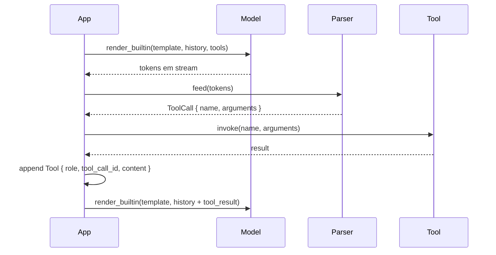

# `tools` — Tool / function calling

O exemplo pede ao modelo para invocar uma tool; a resposta é parseada
de volta em uma struct `ToolCall`. Use como ponto de partida para
qualquer fluxo de function-calling.

## Execute

```bash
cargo run --bin tools --release -- modelo.gguf
```

O primeiro argumento posicional é o caminho para um GGUF
instruct-aware ciente de tools (Qwen 2.5, Hermes, Llama 3, Mistral, …).

## O que ele faz

```rust
use llama_crab::chat::tool_call::{ToolDefinition, ToolFormat, ToolParser};
use llama_crab::chat::{BuiltinTemplate, render_builtin};
use llama_crab::high_level::chat_completion::ChatMessage;
use llama_crab::{Llama, LlamaParams, Role};

fn main() -> Result<(), Box<dyn std::error::Error>> {
    let tool = ToolDefinition::new("get_weather", "Get the weather for a city")
        .with_parameters(serde_json::json!({
            "type": "object",
            "properties": { "city": { "type": "string" } },
            "required": ["city"]
        }));
    let prompt = render_builtin(
        BuiltinTemplate::Qwen2_5,
        &[ChatMessage::new(Role::User, "Weather in Tokyo?")],
        &[tool.clone()],
        true,
    );
    let mut llama = Llama::load(LlamaParams::new("modelo.gguf").with_n_ctx(2048))?;
    let resp = llama.create_completion(&prompt, 64)?;
    let mut parser = ToolParser::new(ToolFormat::ChatMl);
    let calls: Vec<_> = parser
        .feed(&resp.text)
        .into_iter()
        .filter_map(|r| r.ok())
        .collect();
    for call in calls {
        println!("name: {}", call.name);
        println!("args: {}", call.arguments);
    }
    Ok(())
}
```

## Saída esperada

```
name: get_weather
args: {"city": "Tokyo"}
```

A tool call real depende do modelo. O exemplo afirma a *forma* da
chamada, não o valor específico.

## Formatos suportados

O enum `ToolFormat` escolhe o parser certo para o template de chat:

| Formato | Sintaxe gatilho | Notas |
| --- | --- | --- |
| `ChatMl` | `<tool_call>{...}</tool_call>` | Qwen, Hermes e outros modelos baseados em ChatML. |
| `Mistral` | `[TOOL_CALLS][{...}]` | Modelos instruct Mistral e Mixtral. |
| `Llama3` | `<\|python_tag\|>{...}` | Llama 3.1/3.2 instruct com tools embutidas. |
| `Plain` | `{...}` (qualquer objeto JSON) | Fallback para modelos sem formato definido. |
| `Functionary` | `<\|start\|>function<\|message\|>...<\|call\|>` | Functionary v2 (protocolo de tool multi-turno). |

Escolha o formato que corresponde ao template de chat que você
usou em `render_builtin`:

```rust
use llama_crab::chat::tool_call::{ToolParser, ToolFormat};

let mut parser = ToolParser::new(ToolFormat::ChatMl);
```

## O loop completo

O exemplo faz apenas um turno. Um agente real precisa de três
passos a mais:



### 1. Execute a tool

```rust
let result = match call.name.as_str() {
    "get_weather" => {
        let city: String = serde_json::from_value(
            call.arguments.get("city").cloned().unwrap_or_default()
        )?;
        fake_weather_api(city)
    }
    _ => return Ok(()),
};
```

### 2. Anexe o resultado ao histórico

```rust
history.push(ChatMessage::new_tool(
    &call.id,        // tool_call_id
    &result,         // content
));
```

### 3. Re-prompt

```rust
let next_resp = create_chat_completion_with(
    &mut llama,
    &history,
    BuiltinTemplate::Qwen2_5,
    &tools,
    128,
)?;
```

O modelo agora vê o resultado da tool e produz a resposta voltada
ao usuário.

## Armadilhas comuns

| Armadilha | O que dá errado | Correção |
| --- | --- | --- |
| Template e parser não combinam | O modelo emite uma tool call mas o parser não vê. | Use a mesma família de template para ambos. |
| `tool_choice` nomeia uma função desconhecida | O servidor retorna `400 Bad Request` antes da geração. | Valide o nome da função antes de enviar. |
| Tool retorna JSON inválido | O próximo turno falha em fazer parse. | Sempre retorne JSON válido de uma tool. |
| Modelo emite uma tool call E texto | O parser pega ambos. | Use `parser.feed()` e ignore texto após a tag de fechamento. |

## Código-fonte completo

[`examples/tools/src/main.rs`](https://github.com/DominguesM/llama-crab/tree/main/examples/tools/src/main.rs).

## Por onde ir a partir daqui

- [Guia de chat & tool calling](../features/chat.md) — a matriz
  template / parser.
- [Receita de chatbot](../recipes/chatbot.md) — transforme o loop
  acima em um agente deployável.
- [API do servidor](../server/api.md#chat-com-tools) — o caminho
  HTTP.
