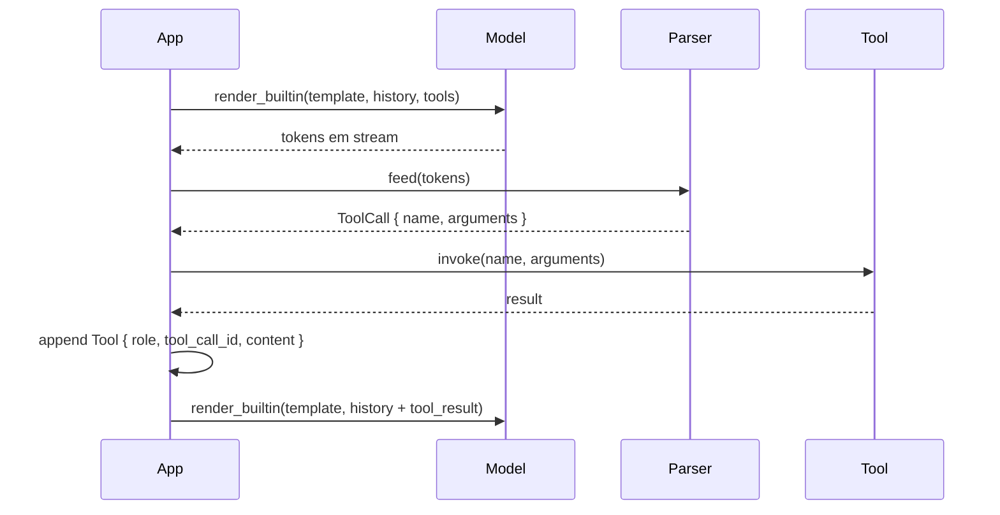
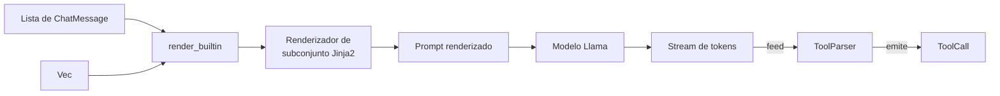

# Chat & tool calling

`llama-crab` oferece um pipeline de chat completo: mensagens
baseadas em papel, renderização de template Jinja2 (com um motor de
subconjunto embutido e 14 templates nomeados), um parser de
tool-call em streaming, e um helper de alto nível que conecta tudo
junto.

## Mensagens

Uma conversa é um `Vec<ChatMessage>`, onde cada mensagem tem um
[`Role`] e um corpo de string:

```rust
use llama_crab::chat::{ChatMessage, Role};

let messages = vec![
    ChatMessage::new(Role::System, "Você é um assistente prestativo."),
    ChatMessage::new(Role::User, "Oi!"),
];
```

Os papéis suportados são:

| Papel | Uso típico |
| --- | --- |
| `Role::System` | Define a persona, instruções e restrições. Vai primeiro. |
| `Role::User` | Os turnos do usuário final. |
| `Role::Assistant` | As respostas anteriores do modelo. Usado para histórico multi-turno. |
| `Role::Tool` | O resultado de uma tool call. Carrega o `tool_call_id` e a saída. |

Um `ChatMessage` também pode carregar `tool_calls` (um
`Vec<ToolCall>`) no papel assistant, e o `tool_call_id`
correspondente no papel tool. Veja a seção [Tool calling](#tool-calling).

## Templates de chat

Modelos de chat esperam suas entradas em um formato específico —
tipicamente um template Jinja2 que envolve a conversa em marcadores
`<|im_start|>` / `<|im_end|>`, formata as tools como um JSON
Schema, e assim por diante. `llama-crab` vem com:

- Um **renderizador de subconjunto Jinja2** que suporta as
  primitivas usadas por 95% dos modelos de chat reais: `if`, `for`,
  `set`, acesso a atributo e subscrito, filtros, literais de
  lista e dict, `and`, `or`, `not`, `in`.
- **14 templates embutidos** que cobrem os modelos open-weights
  mais populares: `Plain`, `ChatMl`, `Llama2`, `Llama3`, `Mistral`,
  `Qwen2`, `Qwen2_5`, `Phi3`, `Gemma`, `CommandR`, `DeepSeek2`,
  `CodeFim`, `FunctionaryV2` e `OpenChat`.

A lista completa vive na referência do [`BuiltinTemplate` enum].

### Renderizando manualmente

Quando você precisa do prompt renderizado sem rodar inferência, use
[`render_builtin`]:

```rust
use llama_crab::chat::{BuiltinTemplate, render_builtin, ChatMessage, Role};

let prompt = render_builtin(
    BuiltinTemplate::Llama3,
    &[ChatMessage::new(Role::User, "Oi")],
    &[],      // sem tools
    true,     // adiciona o turn-prefix do assistant
);
```

O último argumento controla se deve ou não anexar o "turn prefix"
do assistant (ex. `<|start|>assistant\n` para Llama 3). Defina
como `true` quando o modelo deve continuar, `false` quando você
está inspecionando o prompt renderizado.

### Auto-detecção a partir dos metadados GGUF

A maioria dos arquivos GGUF modernos declara seu template de chat
nos metadados. Use [`detect_chat_format`] para lê-lo e escolher um
`BuiltinTemplate` que combine:

```rust
use llama_crab::chat::detect_chat_format;
use llama_crab::model::ModelMetadata;

let metadata = llama.model().metadata();
let template = detect_chat_format(&metadata);
```

Se a arquitetura nos metadados não é reconhecida,
`detect_chat_format` retorna `BuiltinTemplate::Plain` (um fallback
que apenas concatena as mensagens com separadores `### `).

### O helper de alto nível

O caminho mais rápido para uma completion de chat é
`Llama::create_chat_completion_with`:

```rust
use llama_crab::chat::BuiltinTemplate;
use llama_crab::high_level::chat_completion::{create_chat_completion_with, ChatMessage};
use llama_crab::{Llama, LlamaParams, Role};

let mut llama = Llama::load(LlamaParams::new("modelo.gguf").with_n_ctx(4096))?;

let messages = vec![
    ChatMessage::new(Role::System, "Você é um assistente conciso."),
    ChatMessage::new(Role::User, "Explique ownership em Rust em um parágrafo."),
];

let response = create_chat_completion_with(
    &mut llama,
    &messages,
    BuiltinTemplate::ChatMl,
    &[],      // tools
    128,      // max tokens
)?;

println!("{}", response.content);
```

O [`ChatCompletionResponse`] retornado carrega o conteúdo do
assistant, as temporizações por token e a razão de parada.

## Tool calling

Muitos modelos instruct modernos são treinados para *chamar
funções* em resposta a mensagens do usuário. `llama-crab` expõe:

- Um tipo [`ToolDefinition`] que espelha o schema de function-
  calling da OpenAI.
- Um tipo [`ToolParser`] que escaneia a saída do modelo em busca
  de tool calls e emite valores [`ToolCall`] tipados.
- Cinco parsers [`ToolFormat`] embutidos, um por template de chat:
  `ChatMl`, `Mistral`, `Llama3`, `Plain`, `FunctionaryV2`.

### Definindo uma tool

Uma tool é um nome de função, uma descrição e um JSON Schema para
os parâmetros:

```rust
use llama_crab::chat::ToolDefinition;
use serde_json::json;

let tool = ToolDefinition::new("get_weather", "Obtém o clima para uma cidade")
    .with_parameters(json!({
        "type": "object",
        "properties": { "city": { "type": "string" } },
        "required": ["city"]
    }));
```

Passe um slice de tools para `render_builtin` (ou
`create_chat_completion_with`) e o template as renderiza no formato
esperado. O modelo então:

- Chama uma das tools (emitindo um bloco estruturado `<tool_call>`,
  ou uma lista `[TOOL_CALLS] [...]`, ou um objeto JSON prefixado com
  `<|python_tag|>`, dependendo do formato).
- Responde normalmente sem chamar nenhuma tool.

### Parsing da resposta

A saída do modelo é alimentada em um `ToolParser` stateful que
emite calls completas conforme elas aparecem. Este é o formato
certo para streaming, porque tool calls geralmente se materializam
uma de cada vez ao longo de múltiplos tokens:

```rust
use llama_crab::chat::tool_call::{ToolFormat, ToolParser};

let mut parser = ToolParser::new(ToolFormat::ChatMl);

let response = r#"<tool_call>{"name": "get_weather", "arguments": {"city": "Tokyo"}}</tool_call>"#;
let calls: Vec<_> = parser.feed(response).into_iter().filter_map(|r| r.ok()).collect();
assert_eq!(calls.len(), 1);
```

O parser é **stateful**: alimente token a token conforme o modelo
gera, e ele emitirá calls completas conforme elas aparecem.

### Formatos suportados

| Formato | Sintaxe gatilho | Notas |
| --- | --- | --- |
| `ChatMl` | `<tool_call>{...}</tool_call>` | Qwen, Hermes e outros modelos baseados em ChatML. |
| `Mistral` | `[TOOL_CALLS][{...}]` | Modelos instruct Mistral e Mixtral. |
| `Llama3` | `<\|python_tag\|>{...}` | Llama 3.1/3.2 instruct com tools embutidas. |
| `Plain` | `{...}` (qualquer objeto JSON) | Fallback para modelos sem formato definido. |
| `FunctionaryV2` | `<\|start\|>function<\|message\|>...<\|call\|>` | Functionary v2 (protocolo de tool multi-turno). |

### O loop completo



### Tool calling multi-turno

Depois que a tool roda, anexe o resultado ao histórico como uma
mensagem `Role::Tool` e chame o modelo novamente:

```rust
use llama_crab::chat::{ChatMessage, Role};

history.push(ChatMessage::new(
    Role::Tool,
    /* tool_call_id */ "call_weather",
    /* content      */ r#"{"temperature": 22}"#,
));

let response = create_chat_completion_with(
    &mut llama, &history, BuiltinTemplate::ChatMl, &[tool], 128,
)?;
```

O modelo agora tem o resultado da tool em seu contexto e pode
responder à pergunta original do usuário.

## Como a renderização funciona



O renderizador Jinja2 é puro Rust e não chama Python. O subconjunto
que ele suporta cobre 95% dos templates do mundo real; se você
encontrar um modelo que precise de uma primitiva não suportada,
abra uma issue.

## Por onde ir a partir daqui

- [Referência de templates de chat embutidos](../reference/chat-templates.md) —
  a lista completa, com um snippet de cada template.
- [Exemplo de tool calling](../examples/tools.md) — um programa
  executável que define uma tool, envia uma requisição, faz
  parsing da resposta e re-prompta com o resultado da tool.
- [Chat com estado](stateful-chat.md) — chat multi-turno com
  histórico crescente e persistência de sessão.

[`Role`]: https://docs.rs/llama-crab/latest/llama_crab/enum.Role.html
[`ChatMessage`]: https://docs.rs/llama-crab/latest/llama_crab/chat/struct.ChatMessage.html
[`BuiltinTemplate` enum]: https://docs.rs/llama-crab/latest/llama_crab/chat/enum.BuiltinTemplate.html
[`render_builtin`]: https://docs.rs/llama-crab/latest/llama_crab/chat/fn.render_builtin.html
[`detect_chat_format`]: https://docs.rs/llama-crab/latest/llama_crab/chat/fn.detect_chat_format.html
[`ChatCompletionResponse`]: https://docs.rs/llama-crab/latest/llama_crab/chat/struct.ChatCompletionResponse.html
[`ToolDefinition`]: https://docs.rs/llama-crab/latest/llama_crab/chat/struct.ToolDefinition.html
[`ToolParser`]: https://docs.rs/llama-crab/latest/llama_crab/chat/tool_call/struct.ToolParser.html
[`ToolFormat`]: https://docs.rs/llama-crab/latest/llama_crab/chat/tool_call/enum.ToolFormat.html
[`ToolCall`]: https://docs.rs/llama-crab/latest/llama_crab/chat/tool_call/struct.ToolCall.html
