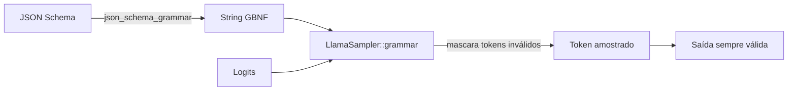

# JSON-Schema & gramáticas GBNF

Decodificação restrita é a maneira mais confiável de fazer um
modelo emitir saída estruturada. `llama-crab` vem com um
conversor puro-Rust de JSON-Schema → GBNF que suporta um subconjunto
útil de [JSON Schema 2020-12](https://json-schema.org/draft/2020-12/json-schema-core.html),
e um sampler de gramática GBNF que restringe os logits do modelo
para corresponder à gramática a cada passo.

## Como funciona



O sampler de gramática roda **após** todo outro sampler na cadeia.
Ele olha para o contexto atual (os tokens gerados até agora) e a
gramática GBNF, computa o conjunto de tokens que manteriam a saída
válida, e mascara os logits de todos os outros tokens para
`-inf`. O próximo sampler na cadeia então escolhe da distribuição
mascarada.

O resultado: o modelo literalmente não pode emitir um token que
quebraria a gramática. A saída é garantida como válida contra o
schema, independentemente do tamanho do modelo ou do prompt.

## Quickstart

```rust
use llama_crab::high_level::completion::json_schema_grammar;
use serde_json::json;

let schema = json!({
    "type": "object",
    "properties": {
        "name": { "type": "string" },
        "age":  { "type": "integer" }
    },
    "required": ["name", "age"]
});
let grammar = json_schema_grammar(&schema).unwrap();
```

A função retorna uma `String` contendo uma gramática GBNF válida.
Passe para o sampler de gramática:

```rust
use llama_crab::sampling::LlamaSampler;
use llama_crab::high_level::completion::CompletionOptions;
use llama_crab::{Llama, LlamaParams};

let mut llama = Llama::load(LlamaParams::new("modelo.gguf"))?;
let grammar = unsafe { LlamaSampler::grammar(llama.model(), &grammar_text, "root")? };
let greedy = LlamaSampler::greedy();
let mut sampler = LlamaSampler::chain(vec![grammar, greedy], false)?;

let completion = llama.create_completion_with_sampler(
    "Retorne um objeto: ",
    CompletionOptions::new(64),
    &mut sampler,
)?;
```

`LlamaSampler::grammar` é protegido pela feature do Cargo `common`.
O exemplo completo está em
[`examples/structured/`](../examples/structured.md).

## Features JSON-Schema suportadas

O conversor entende um subconjunto útil de JSON Schema 2020-12:

| Feature | Status |
| --- | --- |
| `type: object` com `properties`, `required`, `additionalProperties` | ✅ |
| `type: array` com `items`, `prefixItems`, `minItems`, `maxItems` | ✅ |
| `type: string` com `minLength`, `maxLength`, `pattern` | ✅ |
| `type: integer` / `number` com `minimum`, `maximum`, `exclusiveMinimum`, `exclusiveMaximum` | ✅ |
| `type: boolean`, `null` | ✅ |
| `enum` (string, integer, boolean, null) | ✅ |
| `const` | ✅ |
| `format: date-time`, `email`, `uri`, `uuid` | ✅ |
| `oneOf`, `anyOf`, `allOf` | ✅ |
| `$ref` (local, `#/definitions/...`) | ✅ |
| `definitions`, `$defs` | ✅ |
| Palavras-chave condicionais (`if`, `then`, `else`) | Parcial |
| Schemas recursivos | Parcial (apenas `$ref` de um nível) |

Se uma feature que você precisa estiver faltando, abra uma issue
com o snippet do schema. O conversor é projetado para crescer com
os casos de uso que a comunidade encontra.

## Um exemplo trabalhado

Suponha que você queira que o modelo emita uma lista de "pessoas",
cada uma com nome, idade e email. O schema é:

```json
{
  "type": "array",
  "items": {
    "type": "object",
    "properties": {
      "name":  { "type": "string" },
      "age":   { "type": "integer", "minimum": 0 },
      "email": { "type": "string", "format": "email" }
    },
    "required": ["name", "age"]
  },
  "minItems": 1,
  "maxItems": 5
}
```

A gramática GBNF que o conversor produz é aproximadamente:

```
root   ::= arr
arr    ::= "[" item (", " item)* "]"
item   ::= "{" pair (", " pair)* "}"
pair   ::= string ":" (number|string)
string ::= "\"" char+ "\""
number ::= [0-9]+
char   ::= [^"\\] | "\\" ["\\nrt]
```

Quando o modelo gera, o sampler de gramática só permite tokens que
mantêm a saída parcial em um caminho para uma regra `root` válida.
A saída é sempre JSON parseável que corresponde ao schema.

### Performance

Gramáticas têm uma pequena sobrecarga por token — o sampler de
gramática avalia a gramática contra a saída parcial a cada passo.
Na prática o custo é dominado pela passada forward do modelo, não
pelo sampler, então o tempo total até a conclusão é usualmente
comparável à geração sem restrições. A gramática também é mais
apertada do que uma GBNF escrita à mão, porque o conversor
otimiza para a estrutura do schema.

## Gramáticas customizadas

Para controle total, construa uma string GBNF à mão e passe
diretamente para o sampler `grammar` (protegido pela feature
`common`):

```rust
let grammar_text = r#"
root   ::= "answer=" answer
answer ::= "yes" | "no"
"#;
let grammar = unsafe { LlamaSampler::grammar(llama.model(), grammar_text, "root")? };
```

GBNF é uma linguagem de gramática pequena, tipo BNF. A [especificação
GBNF do llama.cpp](https://github.com/ggml-org/llama.cpp/blob/master/grammars/README.md)
cobre a sintaxe completa.

## Quando usar gramáticas vs few-shot

| Abordagem | Confiabilidade | Flexibilidade | Custo |
| --- | --- | --- | --- |
| **Decodificação restrita por gramática** | 100% saída válida. | Saída travada na gramática. | Pequena sobrecarga por token. |
| **Prompting few-shot** | 80–95% saída válida (depende do modelo). | Qualquer coisa que o modelo possa expressar. | Nenhum. |
| **Modo JSON + parser** | Alto (a maioria dos modelos emite JSON válido quando pedido). | O schema tem que ser sugerido no prompt. | Nenhum, mais um parser post-hoc. |

O sampler de gramática é a escolha certa quando:

- O schema é fixo e conhecido de antemão.
- Código downstream espera saída bem tipada (sem parser de
  fallback).
- O custo de uma saída inválida é alto (ex. um insert em banco de
  dados).

## Armadilhas comuns

| Armadilha | O que dá errado | Correção |
| --- | --- | --- |
| Schema sem palavra-chave `type` | Conversor cai para "qualquer valor", que não é restrito. | Adicione `type: object` (ou o que for a raiz). |
| Schema recursivo com aninhamento profundo | Conversor trunca a recursão em um nível. | Achate o schema ou use `anyOf` com profundidade fixa. |
| Sampler de gramática roda **antes** de outro sampler | O segundo sampler escolhe um token inválido. | Sempre coloque o sampler de gramática **por último** na cadeia. |
| `LlamaSampler::grammar` retorna `None` | A feature `common` não está habilitada. | Adicione `features = ["common"]` à dependência. |
| Modelo ignora a gramática | O modelo é pequeno demais ou o prompt é ruim. | Aumente o tamanho do modelo; verifique se o prompt menciona a saída esperada. |

## Por onde ir a partir daqui

- [Exemplo de saída estruturada](../examples/structured.md) — um
  programa executável que emite um objeto JSON.
- [Saída estruturada do servidor](../server/structured.md) — o
  campo `response_format` na API HTTP.
- [Tools](chat.md) — quando a saída estruturada é uma *chamada de
  função*, use o pipeline de chat em vez disso.
