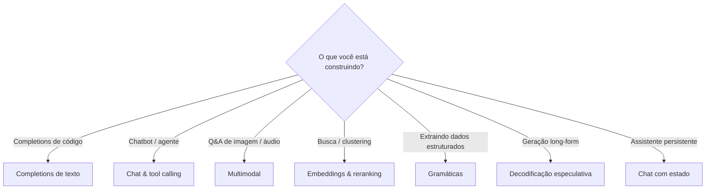

# Funcionalidades

Esta seção documenta cada funcionalidade pública da API do
`llama-crab`. Cada página vai ponta a ponta: o porquê, o como, as
armadilhas e um exemplo executável completo.

-   :material-text-box-outline: __[Completions de texto](text-completion.md)__

    Prompt simples → texto. Sequências de parada, log-probabilidades,
    streaming, best-of-N e FIM (fill-in-the-middle) para código.

-   :material-message-text-outline: __[Chat & tool calling](chat.md)__

    Mensagens baseadas em papel, 14 templates Jinja2 embutidos, um
    renderizador de subconjunto Jinja2, o parser de tool-call para
    ChatML / Mistral / Llama 3 / Functionary, e parsing
    incremental.

-   :material-image-multiple-outline: __[Multimodal (visão + áudio)](multimodal.md)__

    Combine um GGUF de texto com um projetor `mmproj`, decodifique
    imagens locais em `MtmdBitmap`, avalie chunks multimodais e
    continue a geração com a cadeia de sampler normal.

-   :material-vector-circle: __[Embeddings & reranking](embeddings.md)__

    Pooling Mean / CLS / Last, vetores L2-normalizados, busca
    semântica e o helper cross-encoder `Llama::rerank`.

-   :material-code-braces: __[JSON-Schema & gramáticas GBNF](grammars.md)__

    Converta um documento JSON Schema 2020-12 em uma gramática
    GBNF e use o sampler de gramática para forçar o modelo a
    emitir apenas saída válida. A maneira mais confiável de obter
    dados estruturados de um modelo.

-   :material-fast-forward: __[Decodificação especulativa](speculative.md)__

    O modelo de rascunho `PromptLookupDecoding` (sem pesos extras)
    e o trait `DraftModel` para plugar seu próprio rascunho. A
    função livre `speculative_decode` dirige o passo de
    verificação.

-   :material-history: __[Chat com estado](stateful-chat.md)__

    Chat multi-turno com um histórico crescente. Auto-detecção de
    template, estratégias de corte de histórico e persistência de
    sessão.

## Escolhendo a funcionalidade certa para o trabalho

Se você não tem certeza por onde começar, o [exemplo
`quickstart`](../examples/quickstart.md) percorre plain completion,
chat, FIM e embeddings em um único programa de ~80 linhas.
