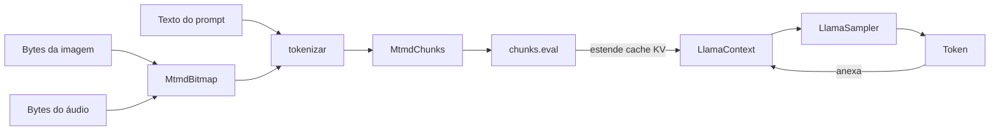

# Multimodal (visão + áudio)

Com a feature do Cargo `mtmd`, `llama-crab` expõe o stack multimodal
do `llama.cpp`. Esta página explica como combinar um GGUF de texto
com um projetor `mmproj`, decodificar imagens locais (e áudio) em
`MtmdBitmap`, avaliar chunks multimodais e continuar a geração com
a cadeia de sampler normal.

## A feature `mtmd`

```toml title="Cargo.toml"
[dependencies]
llama-crab = { version = "0.1", features = ["mtmd"] }
```

A feature porta o módulo `llama_crab::multimodal`: `MtmdContext`,
`MtmdBitmap`, `MtmdInputText` e o método `chunks.eval`. Sem ela,
os tipos simplesmente não existem (então seu código falha em
compilar, não em runtime — uma escolha deliberada de design para
manter o binário padrão pequeno).

## O fluxo de dados



O prompt de texto e os bitmaps são tokenizados **juntos** em uma
lista de chunks. Os chunks são então avaliados com `chunks.eval`,
que estende o cache KV da mesma forma que uma chamada `decode`
normal. Após a avaliação, o modelo tem o prefixo multimodal em
seu contexto e você pode amostrar texto como de costume.

## Carregando um modelo multimodal

Um fluxo de trabalho multimodal precisa de dois arquivos GGUF:

- O **modelo de texto** (ex. Gemma 4 E4B, LFM2.5-VL, Qwen2.5-VL).
- O **projetor mmproj** que faz a ponte entre o encoder de
  modalidade e o modelo de texto. O arquivo é geralmente chamado
  `mmproj-<modelo>.gguf`.

```rust,no_run
use llama_crab::multimodal::MtmdContext;
use llama_crab::{Llama, LlamaParams};

let mut llama = Llama::load(
    LlamaParams::new("gemma-4-E4B-it-Q4_K_M.gguf").with_n_ctx(4096),
)?;
let mtmd = MtmdContext::init_from_file("gemma-4-E4B-it-mmproj.gguf", llama.model())?;
```

`MtmdContext` toma emprestado o `LlamaModel`, então o modelo deve
viver mais que o contexto multimodal.

## Construindo um prompt multimodal

`MtmdInputText` carrega a parte de texto, e uma lista de bitmaps
carrega a mídia. O texto geralmente contém um marcador que diz ao
tokenizador onde inserir os embeddings da imagem; use
`default_media_marker()` para obter o marcador que o `mmproj`
atual espera:

```rust,no_run
use llama_crab::multimodal::{default_media_marker, MtmdBitmap, MtmdInputText};

let marker = default_media_marker();
let prompt = format!("{marker}\nDescreva esta imagem em uma frase curta.");

let bitmap = MtmdBitmap::from_file("imagem.png")?;
let chunks = mtmd.tokenize(
    MtmdInputText::new(&prompt),
    &[&bitmap],
)?;
```

`MtmdBitmap::from_file` aceita PNG, JPEG e BMP. Para dados RGB
brutos, use `MtmdBitmap::from_image_data(width, height, &rgb_bytes)`.

### Configuração do bitmap

`MtmdContext::bitmap_config()` retorna um builder com knobs para
redimensionamento de imagem e aspect ratio:

```rust,no_run
let bitmap = MtmdBitmap::from_file("imagem.png")?
    .resize_to(896, 896)?;   // reduz imagens grandes
```

A maioria dos VLMs tem uma resolução de entrada ótima em torno de
336×336 a 896×896. Imagens maiores desperdiçam memória sem
melhorar as respostas do modelo.

## Avaliando os chunks

`chunks.eval` é `unsafe` porque escreve em um ponteiro de contexto
bruto. O ponteiro deve apontar para um contexto vivo, sem alias,
pertencente ao chamador:

```rust,no_run
let ctx_ptr = llama.context().raw_handle();
let new_n_past = unsafe {
    chunks.eval(&mtmd, ctx_ptr, 0, 0, llama.context().n_batch() as i32, true)?
};
```

Os argumentos são:

| Argumento | Significado |
| --- | --- |
| `&mtmd` | O `MtmdContext` ativo. |
| `ctx_ptr` | Um `*mut llama_context` de um `LlamaContext` vivo. |
| `seq_id` | O id da sequência a estender (geralmente `0`). |
| `n_past` | A posição inicial no cache KV (geralmente `0` ou a posição atual). |
| `n_batch` | O tamanho lógico do batch (use `llama.context().n_batch()`). |
| `logits_last` | Se deve ou não ler os logits do último token (defina como `true` para amostrar após a chamada). |

A função retorna o novo `n_past`, que é a posição a partir da qual
o sampler deve começar.

## Amostrando texto após o prefixo multimodal

Uma vez que os chunks estão avaliados, amostre com uma cadeia
`LlamaSampler` normal:

```rust,no_run
use llama_crab::batch::LlamaBatch;
use llama_crab::sampling::LlamaSampler;
use llama_crab::token::LlamaToken;

let mut sampler = LlamaSampler::greedy()?;
let eos = llama.model().token_eos();
let mut out = String::new();
let mut next_pos = new_n_past;

for _ in 0..128 {
    let tok: LlamaToken = unsafe { sampler.sample(ctx_ptr, -1) };
    sampler.accept(tok);
    if tok == eos { break; }
    if let Ok(piece) = llama.model().detokenize(&[tok], false) {
        out.push_str(&piece);
    }
    let single = LlamaBatch::one(tok, next_pos, 0, true);
    llama.context().decode(&single)?;
    next_pos += 1;
}
println!("{out}");
```

O exemplo completo vive em [`examples/mtmd/`](../examples/mtmd.md).

## Áudio

`MtmdBitmap` também carrega áudio. Os formatos de áudio exatos
suportados dependem do modelo e do projetor. No momento da escrita:

- **LFM2.5-VL** aceita PCM mono de 16 kHz.
- **Gemma 4** é apenas texto + imagem.

```rust,no_run
use llama_crab::multimodal::MtmdBitmap;

let audio = MtmdBitmap::from_audio_file("clip.wav")?;
let chunks = mtmd.tokenize(
    MtmdInputText::new("Transcreva o áudio."),
    &[&audio],
)?;
```

Se o projetor é capaz de áudio, a mesma chamada `chunks.eval`
funciona sem mudanças.

## Modelos testados

| Modelo | Modalidade | Status |
| --- | --- | --- |
| `lmstudio-community/gemma-4-E4B-it-GGUF` | Visão | Testado na CI. |
| `unsloth/LFM2.5-VL-1.6B-GGUF` | Visão | Testado na CI. |
| `Qwen2.5-VL` | Visão | Compatível via `mtmd`. |
| `Llama-3.2-Vision` | Visão | Compatível via `mtmd`. |
| `LLaVA-1.5/1.6` | Visão | Compatível via `mtmd`. |

Os testes de integração em [`crates/llama-crab/tests/`](https://github.com/DominguesM/llama-crab/tree/main/crates/llama-crab/tests)
exercitam tanto Gemma 4 quanto LFM2.5-VL em um conjunto fixo de
imagens de teste e pulam de forma limpa quando o modelo não está
no disco.

## Armadilhas

| Armadilha | O que dá errado | Correção |
| --- | --- | --- |
| `mmproj` errado para o modelo de texto | `MtmdContext::init_from_file` falha ou `chunks.eval` produz nonsense. | Use o projetor que vem com a família do modelo (ex. `mmproj-gemma-4-...` para Gemma 4). |
| Modelo de áudio carregado contra um projetor de imagem | `chunks.eval` retorna "no audio token in the chunk". | Use um projetor que suporte a modalidade que você quer. |
| Imagem muito grande | Out-of-memory ou avaliação extremamente lenta. | Use `MtmdBitmap::resize_to` para reduzir para a resolução ótima do VLM. |
| Múltiplos bitmaps em um prompt | O VLM pode atender à imagem errada. | Verifique a colocação do marcador no prompt de texto. |

## Por onde ir a partir daqui

- [Exemplo de visão](../examples/vision.md) — API de alto nível
  `MtmdContext`.
- [Exemplo de mtmd](../examples/mtmd.md) — API mtmd.h bruta, para
  usuários avançados.
- [Receita: chatbot](../recipes/chatbot.md) — combinando visão +
  tool calling + chat em um único agente.
