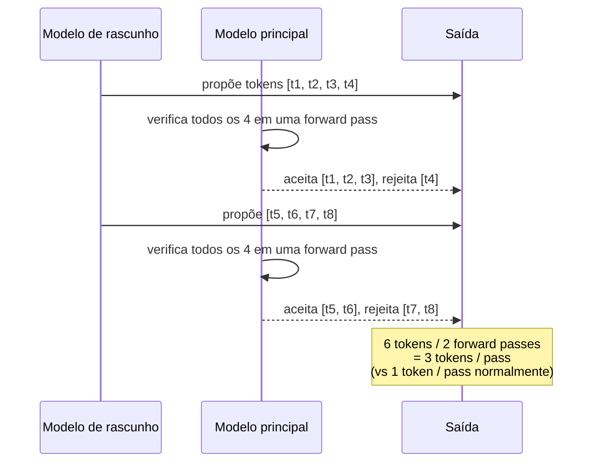

# Decodificação especulativa

Decodificação especulativa troca uma pequena quantidade de
computação extra por um grande speedup em cargas de trabalho com
alta concordância. Um passo de **rascunho** barato propõe `n`
tokens candidatos; o modelo principal os verifica em uma única
passada forward. Os tokens aceitos custam um passo de decodificação
cada um, igual à amostragem greedy — mas você também os ganhou
"de graça" se o rascunho estava certo.



A contagem aceita depende de quão bem o rascunho concorda com o
modelo principal. Para prompts repetitivos (código, listas, RAG
que cita o contexto) a aceitação pode chegar a 80–90%; para geração
criativa aberta cai abaixo de 50%, e a sobrecarga pode exceder a
economia.

## Os dois sabores em `llama-crab`

| Sabor | O que você fornece | Quando usar |
| --- | --- | --- |
| [`PromptLookupDecoding`] | Nada — rascunha a partir de n-gramas no prompt. | O rascunho mais barato possível. Funciona em código, listas, RAG, FIM. |
| Seu próprio `DraftModel` | Um modelo menor, um trie, um autômato de regex, … | Quando a aceitação de prompt-lookup é baixa demais, ou você tem um pequeno modelo de rascunho disponível. |

## Prompt-lookup n-gram

`PromptLookupDecoding` é um modelo de rascunho zero-config. Ele
procura os últimos `k` tokens da sequência atual anteriormente no
prompt e emite o que veio depois deles como o rascunho. Funciona
extremamente bem em:

- Código com padrões repetidos.
- Listas (1, 2, 3, …; a, b, c, …).
- Respostas RAG que citam o prompt.
- Infill FIM, onde o corpo da função aparece antes no arquivo.

```rust
use llama_crab::speculative::{DraftModel, PromptLookupDecoding};
use llama_crab::{Llama, LlamaParams};

let llama = Llama::load(LlamaParams::new("modelo.gguf").with_n_ctx(2048))?;
let prompt = "Rust is fast and memory safe. Rust is fast";
let tokens = llama.model().tokenize(prompt, true, true)?;

let draft = PromptLookupDecoding::new(3, 8);
let drafted = draft.draft(&tokens, 8);
```

### Knobs de ajuste

| Knob | Descrição | Faixa típica |
| --- | --- | --- |
| `max_ngram_size` | Quantos tokens finais formam a chave de busca. | 2–4 |
| `num_pred_tokens` | Quantos tokens emitir quando uma correspondência é encontrada. | 4–16 |

`max_ngram_size` maior encontra mais correspondências mas é mais
sensível a pequenas edições. `num_pred_tokens` maior reduz a
sobrecarga de verificação por token aceito, mas um rascunho errado
é mais caro de recuperar.

## Modelos de rascunho customizados

Implemente o trait [`DraftModel`] para qualquer coisa que possa
propor tokens — um GGUF quantizado menor carregado em uma segunda
`Llama`, um autômato de regex, uma máquina de estados finita, um
trie de frases comuns, …

```rust
use llama_crab::speculative::DraftModel;
use llama_crab::token::LlamaToken;

struct AlwaysHello;
impl DraftModel for AlwaysHello {
    fn draft(&self, _input: &[LlamaToken], n: usize) -> Vec<LlamaToken> {
        // Substitua por: amostre n tokens do seu modelo menor.
        Vec::new()
    }
}
```

Um padrão comum é carregar um modelo de rascunho 0.5B e um modelo
alvo 70B, ambos na mesma GPU, e deixar o rascunho propor 8–16
tokens por vez. Taxas de aceitação de 60–80% são típicas para
cargas de trabalho de chat.

## Dirigindo um passo especulativo

A função livre [`speculative_decode`] alimenta o rascunho através
do contexto principal, amostra em cada posição, aceita o prefixo
mais longo que corresponde e retorna os tokens aceitos:

```rust
use llama_crab::speculative::{DraftModel, PromptLookupDecoding, speculative_decode};
use llama_crab::sampling::LlamaSampler;

let main_ctx: *mut llama_crab_sys::llama_context = llama.context().raw_handle();
let mut sampler = LlamaSampler::greedy()?;
let draft = PromptLookupDecoding::new(2, 4);
let history: Vec<LlamaToken> = Vec::new();

let accepted: Vec<LlamaToken> = unsafe {
    speculative_decode(main_ctx, &mut sampler, &draft, &history, 4)
};
```

A função é `unsafe` porque `main_ctx` deve apontar para um contexto
vivo, sem alias, pertencente ao chamador. O orquestrador de alto
nível `Llama` expõe o handle bruto através de
`llama.context().raw_handle()` quando você precisa dele.

## Quando a decodificação especulativa ajuda

- **Alta aceitação de rascunho** — entradas repetitivas, FIM,
  saída estruturada, respostas RAG que citam o prompt.
- **Passo de rascunho barato** — buscas de n-grama são
  nanossegundos; um modelo de rascunho pequeno deve ser 5–10×
  menor que o modelo principal.
- **Latência de usuário único** — ganhos de throughput desaparecem
  sob batching porque o modelo principal já está ocupado.

## Quando não ajuda

- **Geração criativa aberta** — aceitação cai abaixo de ~50%.
- **Modelos minúsculos** — a sobrecarga come a economia.
- **Servidores fortemente em batch** — o modelo principal já está
  saturado.
- **O modelo de rascunho é grande o suficiente para ser lento por
  conta própria** — o rascunho deve ser pequeno o suficiente para
  que uma passada forward de rascunho seja mais barata que uma
  passada forward principal.

## Armadilhas

| Armadilha | O que dá errado | Correção |
| --- | --- | --- |
| `n` maior que `n_batch` | O rascunho estoura o batch. | Mantenha `n ≤ n_batch / 2`. |
| Rascunho usa um tokenizer diferente | Ids de token incompatíveis quebram o passo de verificação. | Certifique-se de que ambos os modelos usam tokenizers compatíveis. |
| Rascunho propõe a partir de um contexto obsoleto | Aceitação é mais baixa do que deveria. | O rascunho vê o mesmo prompt que o modelo principal. |
| Passo especulativo dentro de uma sequência longa em batch | Verificação pula algumas posições do cache KV. | Resete o cache entre requisições. |

## Por onde ir a partir daqui

- [Exemplo de decodificação especulativa](../examples/speculative.md) —
  um programa executável que demonstra `PromptLookupDecoding`.
- [Estratégias de amostragem](../guides/sampling.md) — combine
  decodificação especulativa com uma cadeia de sampler
  customizada.
- [Receita de ajuste de performance](../recipes/performance.md) —
  meça throughput com e sem decodificação especulativa.

[`speculative`]: https://docs.rs/llama-crab/latest/llama_crab/speculative/index.html
[`DraftModel`]: https://docs.rs/llama-crab/latest/llama_crab/speculative/trait.DraftModel.html
[`PromptLookupDecoding`]: https://docs.rs/llama-crab/latest/llama_crab/speculative/struct.PromptLookupDecoding.html
[`speculative_decode`]: https://docs.rs/llama-crab/latest/llama_crab/speculative/fn.speculative_decode.html
[`Llama`]: https://docs.rs/llama-crab/latest/llama_crab/struct.Llama.html
