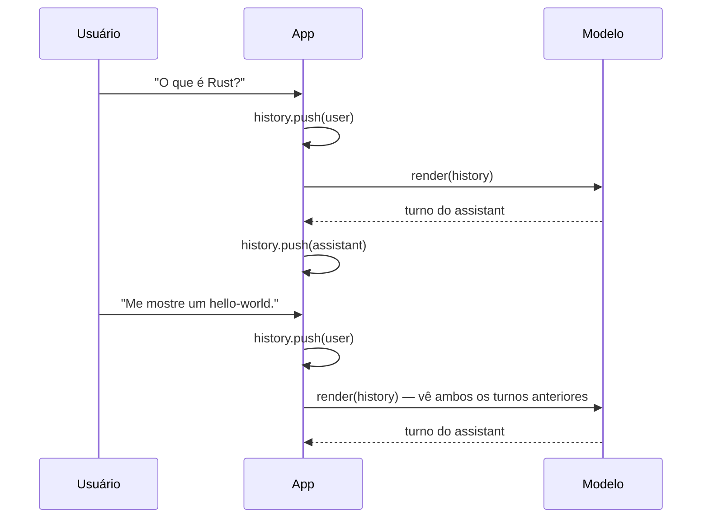
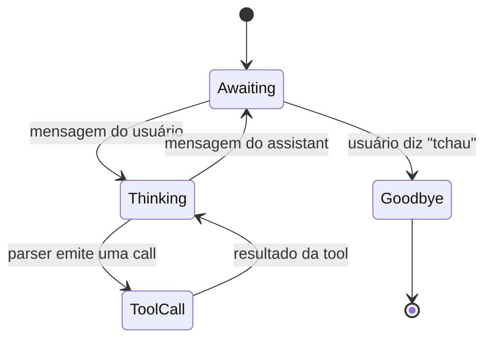

# Chat com estado

Um chat com estado mantém o histórico de conversa vivo entre
turnos para que o modelo veja o contexto completo a cada vez. No
nível da API isso é apenas um `Vec<ChatMessage>` crescente que você
reenvia a cada turno; o helper de completion de chat de alto nível
faz o resto.



Em v0.1.x, os helpers de completion de alto nível não restauram
automaticamente entradas do cache de prompt. `create_completion`
limpa a sequência 0 do KV antes de cada chamada, e
`create_chat_completion_with` usa esse caminho. Use as APIs de
contexto/sessão de baixo nível se precisar de reuso manual do KV
— veja o [guia de Cache & estado de sessão](../guides/caching.md).

## Loop mínimo

```rust
use llama_crab::chat::{BuiltinTemplate, ChatMessage};
use llama_crab::high_level::chat_completion::create_chat_completion_with;
use llama_crab::{Llama, LlamaParams, Role};

let mut llama = Llama::load(LlamaParams::new("modelo.gguf").with_n_ctx(4096))?;

let mut history: Vec<ChatMessage> = vec![
    ChatMessage::new(Role::System, "Você é um assistente conciso."),
];

// Primeiro turno do usuário.
history.push(ChatMessage::new(Role::User, "O que é Rust?"));
let resp = create_chat_completion_with(
    &mut llama, &history, BuiltinTemplate::ChatMl, &[], 128,
)?;
history.push(ChatMessage::new(Role::Assistant, resp.content));

// Segundo turno do usuário — o modelo vê a troca anterior.
history.push(ChatMessage::new(Role::User, "Me mostre um hello-world."));
let resp = create_chat_completion_with(
    &mut llama, &history, BuiltinTemplate::ChatMl, &[], 128,
)?;
```

O REPL interativo completo (com `/clear`, `/save`, tratamento de
EOF) está no [exemplo `stateful_chat`](../examples/stateful-chat.md).

## Escolhendo um template

Os metadados GGUF do modelo geralmente declaram seu template de
chat. Use `detect_chat_format` nos metadados para lê-lo, ou force
um conhecido com `BuiltinTemplate::ChatMl`, `Llama3`, `Qwen2`, e
similares.

```rust
use llama_crab::chat::detect_chat_format;

let metadata = llama.model().metadata();
let template = detect_chat_format(&metadata);
```

Se a arquitetura nos metadados não é reconhecida, o fallback é
`BuiltinTemplate::Plain` (um separador `### ` simples). Isso
quase nunca é o que você quer para um modelo de chat — prefira um
template explícito.

## Cortando o histórico

`LlamaParams::with_n_ctx(N)` limita o número de tokens que o
contexto pode segurar. Quando o histórico cresce além disso, você
tem três opções:

1. **Truncar a cabeça** — derrube os turnos user/assistant mais
   antigos, mantenha a mensagem de sistema. O mais simples e o que
   a maioria das UIs de chat faz.
2. **Resumir** — periodicamente substitua os turnos mais antigos
   por uma única mensagem `Role::System` de resumo.
3. **`n_ctx` maior** — pague mais memória e latência por passo.

### Truncar a cabeça

```rust
// Mantenha a mensagem de sistema + os últimos N turnos.
let keep_tail = 20;
if history.len() > keep_tail {
    let system = history[0].clone();
    history = std::iter::once(system)
        .chain(history.into_iter().skip(1).rev().take(keep_tail).rev())
        .collect();
}
```

### Resumo periódico

```rust
// Rode a cada 10 turnos — chame o próprio modelo para resumir os
// turnos antigos, substitua-os por uma única mensagem System.
let summary = llama.create_chat_completion(
    &vec![/* prompt de sumarização */],
    256,
)?;
history.insert(1, ChatMessage::new(Role::System, summary.content));
```

## Persistência de sessão

Para retomar uma conversa após o processo sair, serialize o
histórico com `serde_json` e recarregue no próximo início. Se
você também precisa de reuso de KV, persista e restaure o estado
de sessão manualmente através das APIs de baixo nível descritas
em [Cache & estado de sessão](../guides/caching.md).

```rust
let json = serde_json::to_string_pretty(&history)?;
std::fs::write("conversation.json", json)?;

// No próximo início:
let raw = std::fs::read_to_string("conversation.json")?;
let history: Vec<ChatMessage> = serde_json::from_str(&raw)?;
```

## Máquinas de estado para chatbots

Um chatbot real frequentemente precisa de mais do que um histórico
plano:



Implemente isso com um enum:

```rust
enum ChatState {
    Awaiting,
    Thinking,
    ToolCall { name: String, arguments: serde_json::Value },
    Goodbye,
}
```

A [Receita de chatbot](../recipes/chatbot.md) percorre uma
implementação completa.

## Por onde ir a partir daqui

- [Exemplo `stateful_chat`](../examples/stateful-chat.md) — um
  REPL executável com `/clear`, `/save` e tratamento de EOF.
- [Chat & tool calling](chat.md) — quando a máquina de estado
  inclui tool calls.
- [Cache & estado de sessão](../guides/caching.md) — reuso manual
  do cache KV para pular reavaliar turnos anteriores.
