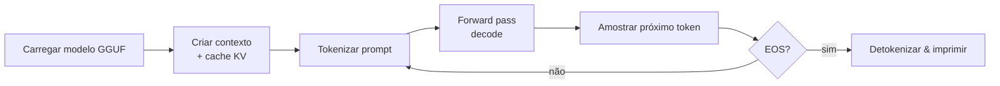

# Seu primeiro programa

Esta página mostra um `main.rs` completo e executável que exercita
os caminhos mais comuns da API do `llama-crab`: carregar um modelo,
rodar uma completion de texto, rodar uma completion de chat
multi-turno e imprimir ambos. No final você terá um binário
autocontido que pode copiar para o seu próprio projeto.

## O que vamos construir



Por baixo dos panos, `Llama::create_completion` faz as etapas
**C → G** para você em uma única chamada; mantemos elas explícitas
no exemplo abaixo para que você possa ver o fluxo de dados.

## 1. O programa completo

Coloque isso em um novo projeto Cargo e ajuste o caminho do modelo:

```rust title="src/main.rs"
use llama_crab::chat::ChatMessage;
use llama_crab::{Llama, LlamaParams, Role};

fn main() -> Result<(), Box<dyn std::error::Error>> {
    // 1. Carrega o modelo a partir de um arquivo GGUF. Ajuste o
    //    caminho para um modelo real na sua máquina.
    let mut llama = Llama::load(
        LlamaParams::new("models/qwen2.5-0.5b-instruct-q4_k_m.gguf")
            .with_n_ctx(2048)
            .with_n_threads(4),
    )?;

    // 2. Completion de texto simples.
    let resp = llama.create_completion("The capital of France is", 24)?;
    println!("completion> {}", resp.text);

    // 3. Completion de chat multi-turno. `create_chat_completion`
    //    usa um template padrão; escolha um específico com
    //    `create_chat_completion_with` para ter controle total.
    let history = vec![
        ChatMessage::new(Role::System, "You are a concise assistant."),
        ChatMessage::new(Role::User, "What is Rust?"),
    ];
    let resp = llama.create_chat_completion(&history, 128)?;
    println!("assistant> {}", resp.content);

    Ok(())
}
```

Um `Cargo.toml` correspondente:

```toml title="Cargo.toml"
[package]
name = "hello-crab"
version = "0.1.0"
edition = "2021"

[dependencies]
llama-crab = "0.1"
```

## 2. Execute

```bash
cargo run --release
```

O primeiro build leva alguns minutos (CMake + `llama.cpp` + o
crate da API segura). Builds subsequentes ficam em cache. Saída
esperada:

```
completion>  Paris. The City of Light, famous for the Eiffel Tower...
assistant> Rust is a memory-safe systems programming language that...
```

O texto exato depende do modelo e dos padrões de amostragem; o
importante é que ambas as chamadas retornem sem erro.

## 3. Passo a passo

### Carregando um modelo

```rust
let mut llama = Llama::load(
    LlamaParams::new("caminho/para/modelo.gguf")
        .with_n_ctx(2048)
        .with_n_threads(4),
)?;
```

- `LlamaParams::new(caminho)` — aceita um caminho para um arquivo
  `.gguf`.
- `.with_n_ctx(2048)` — tamanho do cache KV (prompt + tokens
  gerados). 2048 é suficiente para sessões de chat curtas; suba
  para 4096–8192 para contextos mais longos.
- `.with_n_threads(4)` — threads de CPU usadas para ingestão do
  prompt e decodificação. O padrão é o número de cores físicos;
  diminua em laptops para evitar throttling térmico.

O `?` propaga o [`LlamaError`](../core-concepts/errors.md); veja a
[página de tratamento de erros](../core-concepts/errors.md) para a
lista completa de variantes.

### Completion de texto

```rust
let resp = llama.create_completion("The capital of France is", 24)?;
```

- O primeiro argumento é o **prompt** (qualquer `&str` ou `String`).
- O segundo argumento é o **número máximo de tokens** a serem
  gerados. A geração também para no EOS ou em uma sequência de
  parada configurada através de [`CompletionOptions`](../features/text-completion.md).
- O [`Completion`] retornado carrega `.text`, as log-probabilidades
  por token, as temporizações do modelo e a lista de ids de tokens
  gerados.

### Completion de chat multi-turno

```rust
let history = vec![
    ChatMessage::new(Role::System, "You are a concise assistant."),
    ChatMessage::new(Role::User, "What is Rust?"),
];
let resp = llama.create_chat_completion(&history, 128)?;
```

- O histórico é uma lista de [`ChatMessage`]s com um dos papéis em
  [`Role`]: `System`, `User`, `Assistant` ou `Tool`.
- `create_chat_completion` escolhe um template padrão; para uso
  em produção use [`create_chat_completion_with`] e passe o
  [`BuiltinTemplate`] que corresponde ao seu modelo.
- O resultado é um [`ChatCompletionResponse`] com `.content` (a
  resposta do assistente) e as temporizações por token.

## 4. Por onde ir a partir daqui

| Objetivo | Próxima página |
| --- | --- |
| Adicionar tools / function calling | [Chat & tool calling](../features/chat.md) |
| Trocar para um sampler diferente | [Estratégias de amostragem](../guides/sampling.md) |
| Fazer streaming de tokens à medida que são gerados | [Exemplo de streaming](../examples/streaming.md) |
| Calcular embeddings | [Embeddings & reranking](../features/embeddings.md) |
| Rodar em uma GPU | [Backends & offload de GPU](../guides/backends.md) |
| Distribuir em mobile | [Distribuição mobile](../guides/mobile.md) |
| Construir um chatbot com histórico | [Chat com estado](../features/stateful-chat.md) |
| Expor o modelo via HTTP | [Servidor](../server/index.md) |

[`Completion`]: https://docs.rs/llama-crab/latest/llama_crab/struct.Completion.html
[`ChatMessage`]: https://docs.rs/llama-crab/latest/llama_crab/chat/struct.ChatMessage.html
[`ChatCompletionResponse`]: https://docs.rs/llama-crab/latest/llama_crab/chat/struct.ChatCompletionResponse.html
[`Role`]: https://docs.rs/llama-crab/latest/llama_crab/enum.Role.html
[`BuiltinTemplate`]: https://docs.rs/llama-crab/latest/llama_crab/chat/enum.BuiltinTemplate.html
[`create_chat_completion_with`]: https://docs.rs/llama-crab/latest/llama_crab/high_level/chat_completion/fn.create_chat_completion_with.html
