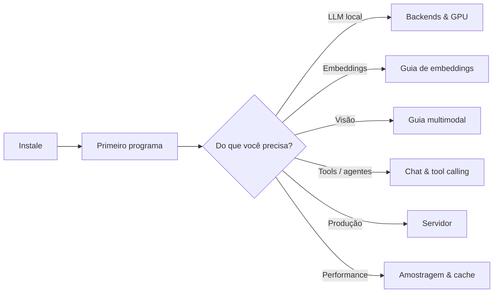

# Primeiros Passos

Bem-vindo ao `llama-crab`! Esta seção leva você de "tenho o Rust
instalado" a "tenho um modelo gerando texto na minha máquina" em
três passos curtos. As páginas abaixo assumem que você já tem uma
toolchain Rust recente e um ambiente de build C/C++ funcional.

-   :material-download: __[Instalação](installation.md)__

    Adicione `llama-crab` ao seu `Cargo.toml`, instale as ferramentas
    de sistema necessárias (CMake, um compilador C/C++, o SDK da
    plataforma para sua GPU) e escolha o conjunto certo de features
    do Cargo para seu alvo.

-   :material-play: __[Seu primeiro programa](first-program.md)__

    Um programa completo e executável que carrega um modelo, executa
    uma completion de texto e uma completion de chat, e imprime os
    resultados. Também mostramos o menor modelo possível para
    verificar a toolchain ponta a ponta.

-   :material-tune: __[Features do Cargo](cargo-features.md)__

    Um mergulho profundo nas flags de feature que selecionam o
    backend (`openmp`, `metal`, `cuda`, `vulkan`, `rocm`, `opencl`,
    `kleidiai`), ativam multimodal (`mtmd`), o sampler de gramática
    (`common`, `llguidance`), o cache KV em disco (`disk-cache`) e
    algumas features de integração.

-   :material-folder-outline: __[Estrutura do projeto](project-layout.md)__

    Onde colocar seu `Cargo.toml`, como conectar seus binários, como
    baixar um modelo e como integrar os helpers do `examples/run.sh`
    ao seu próprio fluxo de trabalho.

## O que você vai precisar

| Ferramenta | Versão | Por quê |
| --- | --- | --- |
| Rust | **1.88** ou mais recente (fixado em `rust-toolchain.toml`) | O crate usa features da edição 2024 e uma API `std::sync` recente. |
| CMake | **3.18** ou mais recente | `llama-crab-sys` constrói o `llama.cpp` a partir do código-fonte via CMake. |
| Compilador C/C++ | Qualquer um aceito pelo `llama.cpp` (clang 14+, GCC 11+, MSVC 2022, Apple clang) | Compila o código-fonte C/C++ empacotado. |
| SDK da plataforma | Xcode CLT (macOS), build-essential (Debian/Ubuntu) ou equivalente | Necessário pelo backend de GPU escolhido (Metal, CUDA, Vulkan, …). |
| Hugging Face CLI | latest | Opcional: acelera o download inicial de modelos. `pip install -U huggingface_hub` |

Se você só quer *ler* a documentação, não precisa de nada disso.
Se você quer compilar, instale as linhas acima e vá para a
[página de Instalação](installation.md).

## Ordem de leitura recomendada

Escolha o caminho que corresponde ao que você quer construir, e o
[índice de Guias](../guides/index.md) e o [índice de
Funcionalidades](../features/index.md) têm resumos de uma página
para cada tópico com exemplos executáveis.
