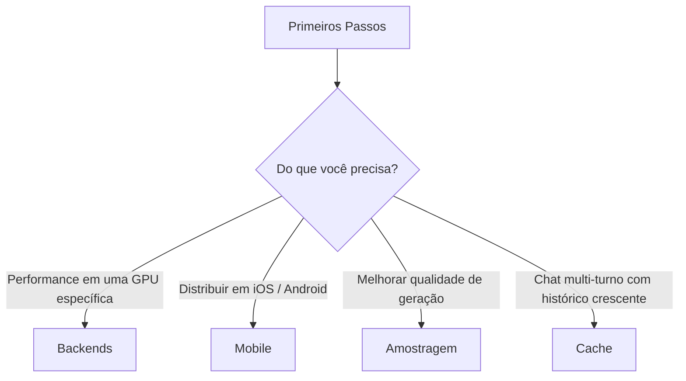

# Guias

As páginas desta seção vão mais fundo do que o [guia de Primeiros
Passos](../getting-started/index.md) em um único tópico. Cada uma
explica o *o quê* e o *porquê*, percorre um caminho de código
representativo, e linka para o exemplo executável relevante.

-   :material-chip: __[Backends & offload de GPU](backends.md)__

    Escolha um backend em tempo de build (CPU, Metal, CUDA, Vulkan,
    ROCm, OpenCL, KleidiAI), descarregue quantas camadas couberem
    na VRAM, e use as sondas de capacidade `LlamaBackend` para
    detectar o que está disponível em tempo de execução.

-   :material-cellphone: __[Distribuição mobile](mobile.md)__

    Os perfis `release-perf` e `release-size`, as flags de build
    para iOS e Android, os padrões `MobilePreset` e as
    ressalvas sobre OpenCL + ICD loaders + NDK.

-   :material-dice-multiple: __[Estratégias de amostragem](sampling.md)__

    Cada sampler que o `llama.cpp` expõe (greedy, top-k, top-p,
    min-p, typical, mirostat, dry, penalties, XTC, grammar…), como
    encadeá-los com `SamplerChain`, e pontos de partida
    recomendados.

-   :material-database-outline: __[Cache & estado de sessão](caching.md)__

    O `RamCache` em processo, o `DiskCache` baseado em `sled` e as
    APIs manuais `llama_state_get_data` / `llama_state_set_data`.
    Quando o cache de prompt ajuda (e quando não ajuda).

## Ordem de leitura

Não há uma ordem estrita — cada guia é autocontido. Os caminhos
mais comuns através deles são:

Se você não tem certeza de qual guia é relevante, o [índice de
Funcionalidades](../features/index.md) é um ótimo ponto de partida
— ele linka para o guia certo para cada feature, e a maioria dos
guias referencia um ou dois dos [exemplos](../examples/index.md)
executáveis.
