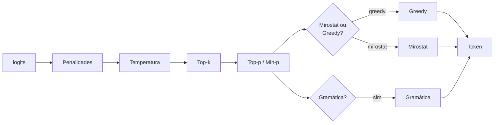

# Estratégias de amostragem

`llama-crab` expõe cada estratégia de amostragem que o `llama.cpp`
implementa, todas atrás do tipo [`LlamaSampler`]. Você pode compor
múltiplos samplers em uma cadeia com [`SamplerChain`]; a ordem da
cadeia importa, porque cada estágio vê os logits como transformados
pelo anterior.

## Catálogo de estratégias

| Estratégia | O que faz | Quando usar |
| --- | --- | --- |
| `greedy()` | Sempre escolhe o token de maior probabilidade. | Saída determinística, código, Q&A factual. |
| `dist(seed)` | Amostragem aleatória uniforme. | Sanity checks, dados sintéticos. |
| `top_k(k)` | Restringe aos top K tokens. | Evita a cauda de probabilidade muito baixa. |
| `top_p(p, min_keep)` | Amostragem nucleus. | O cavalo de batalha para chat geral. |
| `min_p(p, min_keep)` | Amostragem Min-P. | Alternativa mais nova ao top-p; rastreia o token mais provável. |
| `typical(p, min_keep)` | Amostragem localmente típica. | Reduz o "vagar" de gerações longas. |
| `temp(t)` | Escalonamento de temperatura. | Combine com top-p / min-p para controlar entropia. |
| `temp_ext(t, delta, exp)` | Temperatura dinâmica (ciente de entropia). | Texto long-form mais suave. |
| `xtc(p, t, min_keep, seed)` | Exclui escolhas top com probabilidade `p`. | Evita corridas de token excessivamente repetitivas. |
| `top_n_sigma(n)` | Top-N-Sigma. | Corta tokens mais de N desvios padrão abaixo do logit máximo. |
| `mirostat(n_vocab, seed, tau, eta, m)` | Mirostat v1. | Mantém uma perplexidade alvo. |
| `mirostat_v2(seed, tau, eta)` | Mirostat v2. | Mais suave que v1, sem dependência do tamanho do vocabulário. |
| `penalties(last_n, repeat, freq, presence)` | Penalidades de repetição / frequência / presença. | Evita loops em gerações longas. |
| `dry(model, ...)` | Sampler "Don't Repeat Yourself". | Mira especificamente em n-gramas repetidos. |
| `adaptive_p(target, decay, seed)` | P adaptativo probabilístico. | Amostragem de menor temperatura com entropia alvo. |
| `logit_bias(n_vocab, biases)` | Bias de logit manual por id de token. | Bane ou impulsiona tokens específicos. |
| `infill(model)` | Sampler de infill de código (FIM). | Emparelhe com o formato de prompt específico de FIM. |
| `grammar(model, ...)` _(feature `common`)_ | Amostragem restrita por GBNF. | Força saída estruturada. |

## Compondo uma cadeia

A maneira recomendada é o builder [`SamplerChain`]:

```rust
use llama_crab::sampling::SamplerChain;

let chain = SamplerChain::new()
    .temp(0.8)
    .top_p(0.95, 1)
    .min_p(0.05, 1)
    .penalties(64, 1.1, 0.0, 0.0)
    .build();
```

### A ordem de ouro

A ordem dos estágios não é arbitrária. Uma cadeia típica é:

1. **Penalidades** — mais agressivo. Pode tokens ruins primeiro
   para que os estágios restantes não tenham que desfazer o
   trabalho.
2. **Temperatura / top-k / top-p / min-p / typical** — truncam a
   cauda da distribuição.
3. **Mirostat / adaptive-p / dist / greedy** — escolha um.
   Usualmente o último estágio não-gramática.
4. **Gramática** (se houver) — deve ser o último. Sobrescreve o
   que o estágio anterior escolheu se o token não está na gramática.



### Três cadeias para começar

=== "Escrita criativa"

    ```rust
    SamplerChain::new()
        .temp(0.9)
        .top_p(0.95, 1)
        .min_p(0.05, 1)
        .penalties(128, 1.1, 0.1, 0.1)
        .build()
    ```

=== "Chat geral"

    ```rust
    SamplerChain::new()
        .temp(0.7)
        .top_p(0.9, 1)
        .min_p(0.05, 1)
        .penalties(64, 1.1, 0.0, 0.0)
        .build()
    ```

=== "Determinístico (FIM, código)"

    ```rust
    SamplerChain::new()
        .temp(0.0)
        .build()
    ```

## API de baixo nível

Se você precisa contornar o builder — por exemplo, para inserir
um estágio de sampler customizado — a API bruta também está
disponível:

```rust
use llama_crab::sampling::LlamaSampler;

let greedy = LlamaSampler::greedy();
let top_p  = LlamaSampler::top_p(0.95, 1);

let chain = LlamaSampler::chain(vec![top_p, greedy], false);
```

O helper `chain(samplers, strict)` retorna `Option<LlamaSampler>`;
o segundo argumento controla se todos os samplers na cadeia devem
aceitar o token (`true`) ou se qualquer um deles pode aceitar
(`false`).

## Alimentando o sampler

O sampler opera em um handle de contexto bruto. Na API de alto
nível você não precisa tocar nisso — `Llama::create_completion_with_sampler`
e `Llama::create_chat_completion_with` encapsulam o loop. Se você
dirige a API de baixo nível diretamente:

```rust
use llama_crab::sampling::LlamaSampler;
use llama_crab::token::LlamaToken;

let mut sampler: LlamaSampler = SamplerChain::new().temp(0.7).build();

let ctx = llama.context().raw_handle();
let next: LlamaToken = unsafe { sampler.sample(ctx, -1) };
sampler.accept(next);
```

O argumento `sample(ctx, idx)` é o índice do token no batch cujos
logits devem ser amostrados. `-1` significa "o último token no
batch".

## Dicas de performance

- **Use a mesma cadeia de sampler entre requisições.** O sampler
  mantém estado (penalidades, buffers mirostat, etc.). Recriá-lo
  por requisição reseta o estado.
- **Use `greedy` para benchmarks.** É o sampler mais rápido e o
  mais reproduzível.
- **Use uma cadeia com `temp = 0.0` para "quero a resposta
  óbvia".** O sampler real escolhido pelo orquestrador `Llama`
  quando `temperature = 0.0` é `greedy`.
- **Restrinja com uma gramática quando a forma da saída importa
  mais que a redação.** Veja [JSON-Schema & gramáticas
  GBNF](../features/grammars.md).

## Por onde ir a partir daqui

- [Decodificação especulativa](../features/speculative.md) —
  troque uma pequena quantidade de computação extra por um grande
  speedup em cargas de trabalho com alta concordância.
- [JSON-Schema & gramáticas GBNF](../features/grammars.md) —
  force a saída a corresponder a um schema.
- [Cache & estado de sessão](caching.md) — mantenha o estado do
  sampler quente entre requisições.

[`LlamaSampler`]: https://docs.rs/llama-crab/latest/llama_crab/sampling/struct.LlamaSampler.html
[`SamplerChain`]: https://docs.rs/llama-crab/latest/llama_crab/sampling/struct.SamplerChain.html
