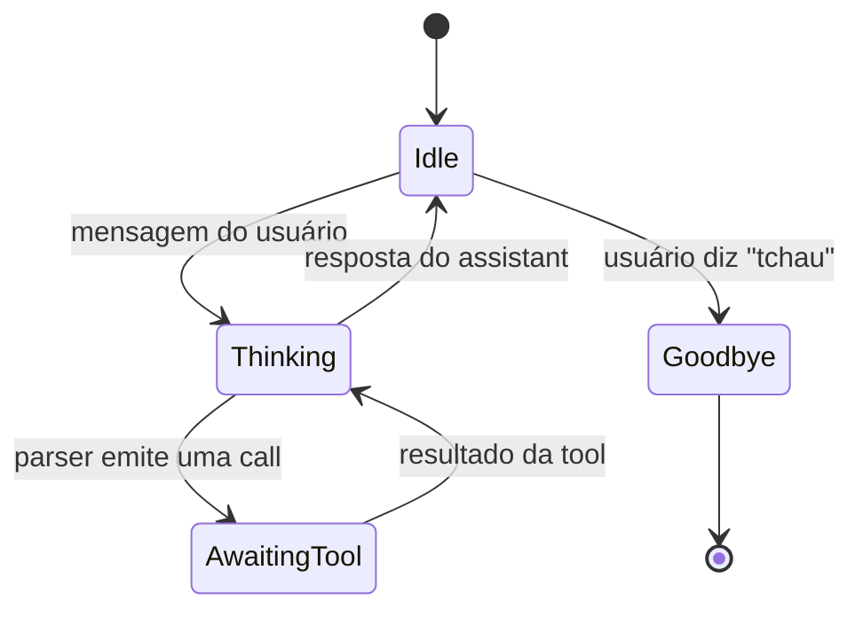
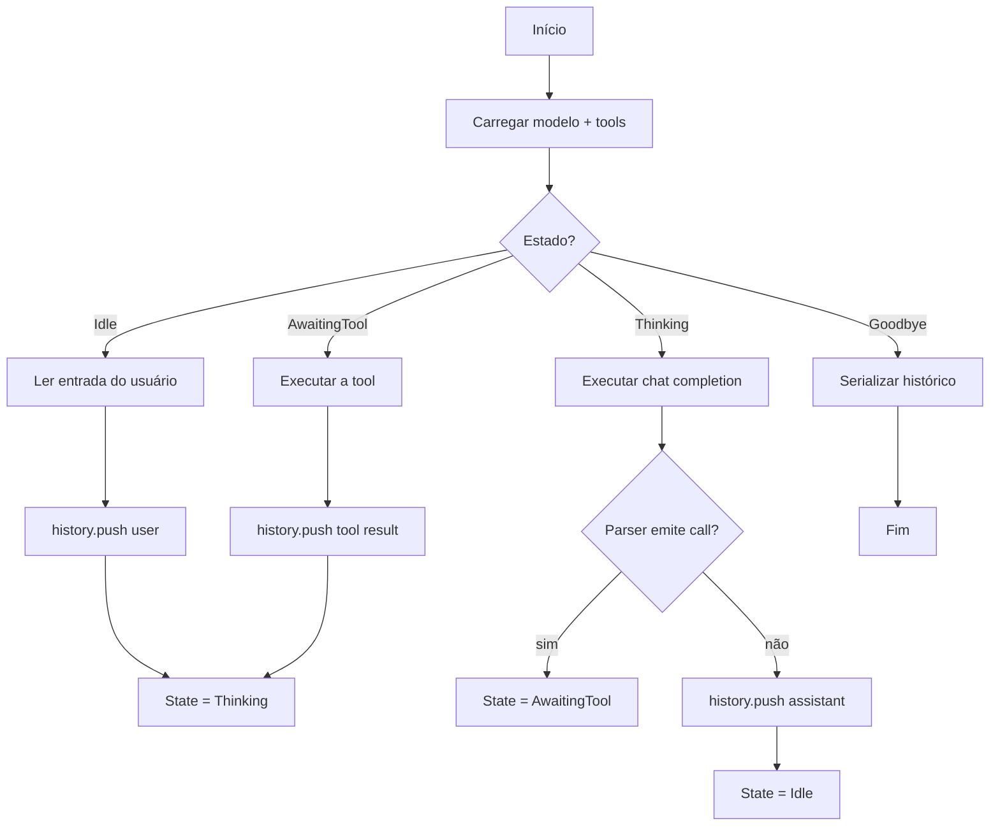

# Construindo um chatbot

Esta receita transforma o exemplo `stateful_chat` de 80 linhas em
um agente deployável. As três novas peças são: uma **máquina de
estado** que expõe uma API limpa, **tool calling** que permite ao
modelo invocar seu código, e **persistência de sessão** que
sobrevive a um restart.

## A máquina de estado

Um chatbot tem pelo menos quatro estados:



O `ToolParser` é a fronteira entre "modelo está pensando" e
"modelo está pedindo para fazermos algo". Em Rust:

```rust
enum ChatState {
    Idle,
    Thinking,
    AwaitingTool { call: ToolCall },
    Goodbye,
}

struct Chatbot {
    state: ChatState,
    history: Vec<ChatMessage>,
    llama: Llama,
    tools: Vec<ToolDefinition>,
}
```

## O loop principal



## Uma implementação completa

```rust
use llama_crab::chat::tool_call::{ToolFormat, ToolParser, ToolDefinition, ToolCall};
use llama_crab::chat::{BuiltinTemplate, ChatMessage, Role};
use llama_crab::high_level::chat_completion::create_chat_completion_with;
use llama_crab::{Llama, LlamaParams};
use serde_json::Value;

enum ChatState {
    Idle,
    Thinking,
    AwaitingTool { call: ToolCall },
    Goodbye,
}

struct Chatbot {
    state: ChatState,
    history: Vec<ChatMessage>,
    llama: Llama,
    tools: Vec<ToolDefinition>,
}

impl Chatbot {
    fn new(model_path: &str, tools: Vec<ToolDefinition>) -> Result<Self, Box<dyn std::error::Error>> {
        let llama = Llama::load(LlamaParams::new(model_path).with_n_ctx(4096))?;
        let history = vec![ChatMessage::new(
            Role::System,
            "Você é um assistente prestativo.",
        )];
        Ok(Self { state: ChatState::Idle, history, llama, tools })
    }

    fn user_turn(&mut self, message: &str) -> Result<String, Box<dyn std::error::Error>> {
        self.history.push(ChatMessage::new(Role::User, message));
        self.run_until_idle()
    }

    fn run_until_idle(&mut self) -> Result<String, Box<dyn std::error::Error>> {
        let mut last_assistant = String::new();
        loop {
            self.state = ChatState::Thinking;
            let resp = create_chat_completion_with(
                &mut self.llama,
                &self.history,
                BuiltinTemplate::ChatMl,
                &self.tools,
                256,
            )?;
            self.history.push(ChatMessage::new(Role::Assistant, resp.content.clone()));
            last_assistant = resp.content;

            let mut parser = ToolParser::new(ToolFormat::ChatMl);
            let calls: Vec<ToolCall> = parser.feed(&resp.content)
                .into_iter()
                .filter_map(|r| r.ok())
                .collect();

            if let Some(call) = calls.into_iter().next() {
                let result = self.invoke_tool(&call)?;
                self.history.push(ChatMessage::new_tool(&call.id, &result));
            } else {
                self.state = ChatState::Idle;
                return Ok(last_assistant);
            }
        }
    }

    fn invoke_tool(&self, call: &ToolCall) -> Result<String, Box<dyn std::error::Error>> {
        match call.name.as_str() {
            "get_weather" => {
                let city: String = serde_json::from_value(
                    call.arguments.get("city").cloned().unwrap_or(Value::Null),
                )?;
                Ok(format!("{{\"temperature\": 22, \"city\": \"{city}\"}}"))
            }
            _ => Ok("{\"error\": \"unknown tool\"}".into()),
        }
    }
}
```

## Definições de tools

Uma tool é um nome de função, uma descrição e um JSON Schema:

```rust
use llama_crab::chat::ToolDefinition;
use serde_json::json;

let tools = vec![
    ToolDefinition::new("get_weather", "Obtém o clima para uma cidade")
        .with_parameters(json!({
            "type": "object",
            "properties": { "city": { "type": "string" } },
            "required": ["city"]
        })),
];
```

O modelo decide quando chamar a tool com base na entrada do
usuário e na descrição da tool.

## Cortando o histórico

Quando o histórico cresce além de `n_ctx`, corte os turnos mais
antigos. O [guia de chat com estado](../features/stateful-chat.md)
cobre três estratégias: truncar a cabeça, resumir, ou aumentar
`n_ctx`.

```rust
fn trim_history(history: &mut Vec<ChatMessage>, keep: usize) {
    if history.len() > keep {
        let system = history[0].clone();
        *history = std::iter::once(system)
            .chain(history.iter().skip(1).rev().take(keep).rev().cloned())
            .collect();
    }
}
```

## Persistência de sessão

`ChatMessage` é `Serialize + Deserialize`, então persistência é
uma linha:

```rust
let json = serde_json::to_string_pretty(&self.history)?;
std::fs::write("conversation.json", json)?;
```

Para restaurar:

```rust
let raw = std::fs::read_to_string("conversation.json")?;
let history: Vec<ChatMessage> = serde_json::from_str(&raw)?;
```

## Adicionando um shutdown gracioso

Para serviços de longa duração, trate `SIGINT`:

```rust
use tokio::signal;

async fn shutdown_signal() {
    let _ = signal::ctrl_c().await;
}

#[tokio::main]
async fn main() -> Result<(), Box<dyn std::error::Error>> {
    let mut bot = Chatbot::new("modelo.gguf", tools)?;
    let stdin = tokio::io::stdin();
    let mut lines = stdin.lines();

    tokio::select! {
        _ = shutdown_signal() => {
            // Persiste e sai.
            let json = serde_json::to_string_pretty(&bot.history)?;
            std::fs::write("conversation.json", json)?;
        }
        _ = async {
            while let Some(line) = lines.next_line().await? {
                if line.trim() == "/exit" { break; }
                let response = bot.user_turn(&line)?;
                println!("assistant> {response}");
            }
            Ok::<(), Box<dyn std::error::Error>>(())
        } => {}
    }
    Ok(())
}
```

## Uma nota sobre a thread worker

`Llama` não é `Sync`, então você não pode compartilhá-lo livremente
entre threads. O padrão recomendado é colocá-lo em uma thread
worker dedicada e enviar jobs para ela. O [guia do servidor](../server/index.md)
percorre isso em detalhe.

## Por onde ir a partir daqui

- [Guia de chat & tool calling](../features/chat.md) — a matriz
  de parsers.
- [Guia de chat com estado](../features/stateful-chat.md) —
  estratégias de corte de histórico.
- [Cache & estado de sessão](../guides/caching.md) — reuso manual
  do cache KV.
- [Servidor](../server/index.md) — quando você quer fazer deploy
  do chatbot sobre HTTP.
