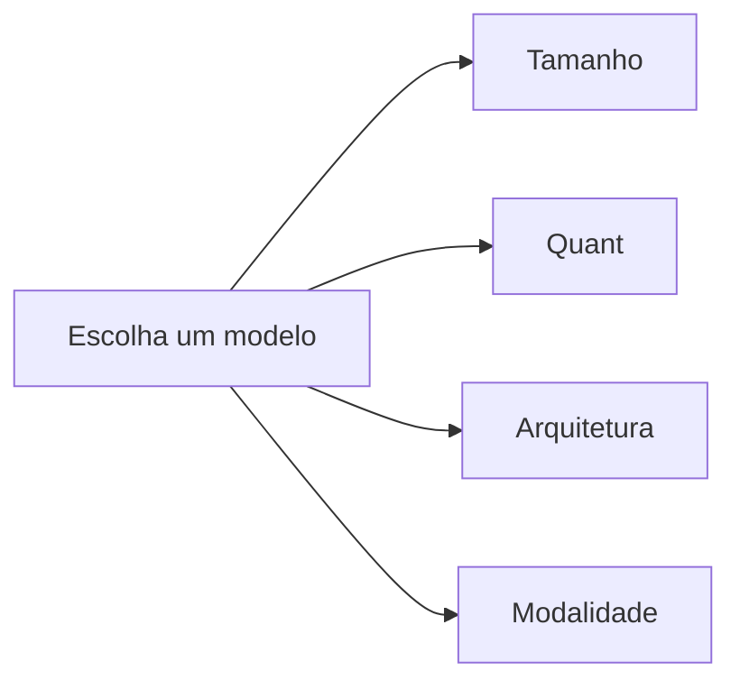

# Escolhendo um modelo

Escolher o GGUF certo para o trabalho é principalmente sobre
quatro eixos: **tamanho**, **quant**, **arquitetura** e
**modalidade**. Esta página é um guia curto para cada um.

## Os quatro eixos

| Eixo | O que você escolhe | Trade-off |
| --- | --- | --- |
| **Tamanho** | 0.5B / 1B / 3B / 7B / 13B / 70B parâmetros. | Maior = mais inteligente mas mais lento e mais memória. |
| **Quant** | F16 / Q8_0 / Q6_K / Q5_K_M / Q4_K_M / Q3_K_M / Q2_K. | Quant menor = menos memória, ligeiramente menos preciso. |
| **Arquitetura** | Llama 3, Qwen 2.5, Gemma 3, Mistral, Phi-3, … | Cada uma tem um template de chat, formato de tool e licença diferentes. |
| **Modalidade** | Texto, visão, áudio, multimodal. | Visão precisa de `mtmd`; áudio precisa de um projetor compatível. |

## Uma cheat-sheet de tamanho

| Tamanho | Melhor para | Memória (Q4_K_M) | Velocidade em uma 4090 |
| --- | --- | --- | --- |
| 0.5B | Demos, REPLs, smoke tests. | ~400 MB | ~120 tok/s. |
| 1B | Assistentes simples, classificação. | ~800 MB | ~90 tok/s. |
| 3B | Chatbots de usuário único. | ~2 GB | ~50 tok/s. |
| 7B | Assistentes de propósito geral. | ~4 GB | ~30 tok/s. |
| 13B | Assistentes de maior qualidade. | ~8 GB | ~20 tok/s. |
| 70B | Qualidade de fronteira. | ~40 GB | ~6 tok/s. |

Esses números são para *geração*, não *retrieval*. Modelos de
embedding geralmente são 0.1–0.5 GB.

## Escolhendo um quant

| Quant | Bits por peso | Perda de qualidade | Quando usar |
| --- | --- | --- | --- |
| `F16` | 16 | Nenhuma. | Referência. Quase nunca enviado. |
| `Q8_0` | 8 | Negligível. | Quando você tem a VRAM. |
| `Q6_K` | 6.5 | Minúscula. | Orçamento médio. |
| `Q5_K_M` | 5.7 | Pequena. | Bom padrão. |
| `Q4_K_M` | 4.8 | Notável em contextos longos. | O padrão mais comum. |
| `Q3_K_M` | 3.9 | Visível em tarefas de raciocínio. | Quando você precisa economizar 1–2 GB. |
| `Q2_K` | 3.4 | Significativa. | Apenas para orçamentos de memória muito apertados. |

As quantizações `K` são um formato mais novo que divide os pesos em
"super-blocks" e aplica uma precisão maior aos sensíveis. Elas
geralmente produzem melhor qualidade que os quants não-`K` na
mesma taxa de bits.

## Escolhendo uma arquitetura

| Arquitetura | Licença | Quando usar |
| --- | --- | --- |
| Llama 3 / 3.1 / 3.2 / 3.3 | Licença comunitária Llama 3. | Propósito geral. Amplo suporte de tooling. |
| Qwen 2 / 2.5 | Apache 2.0. | Forte em multilíngue e tool calling. |
| Gemma 2 / 3 | Licença Gemma. | Líder de qualidade-por-parâmetro no lado pequeno. |
| Mistral / Mixtral | Apache 2.0. | Instruct e tool calling fortes. |
| Phi-3 / Phi-3.5 | MIT. | Pequeno mas capaz; ótimo para celulares. |
| DeepSeek-V2 / V2.5 | Licença DeepSeek. | Forte em código e raciocínio. |
| Command R / R+ | CC-BY-NC. | Ajustado para RAG; contexto longo. |

Para a maioria dos usuários, a escolha se resume a:

- **Compatibilidade de licença** com seu canal de distribuição.
- **Tool calling** — Qwen 2.5, Llama 3, Mistral e DeepSeek são
  os mais fortes.
- **Multilíngue** — Qwen 2.5 e DeepSeek são os mais fortes.
- **Qualidade em tamanhos pequenos** — Gemma 2 e Phi-3 são os
  mais fortes.

## Escolhendo uma modalidade

| Modalidade | Feature do Cargo | Projetor necessário? | Quando usar |
| --- | --- | --- | --- |
| **Apenas texto** | – | Não. | A maioria dos chatbots, RAG, agentes. |
| **Visão** | `mtmd` | Sim (`mmproj-*.gguf`). | Q&A de imagem, extração de documentos. |
| **Áudio** | `mtmd` | Sim. | Speech-to-text, Q&A de áudio. |
| **Multimodal** | `mtmd` | Sim. | Entradas combinadas. |

O projetor de visão deve corresponder ao modelo de texto. Gemma 4
e LFM2.5-VL vêm com projetores de visão separados; Qwen 2.5-VL tem
um único GGUF multimodal.

## Um conjunto inicial recomendado

| Caso de uso | Modelo |
| --- | --- |
| Demos e CI | `Qwen2.5-0.5B-Instruct-GGUF` (Q4_K_M, ~400 MB). |
| Chatbot de usuário único | `Qwen2.5-7B-Instruct-GGUF` (Q4_K_M, ~4 GB). |
| Assistente de fronteira | `Llama-3.3-70B-Instruct-GGUF` (Q4_K_M, ~40 GB). |
| Embeddings | `bge-small-en-v1.5-gguf` (~30 MB). |
| Reranker | `bge-reranker-base-Q4_K_M-GGUF` (~600 MB). |
| Visão | `gemma-4-E4B-it-GGUF` + `mmproj-gemma-4-E4B-it-BF16.gguf`. |
| Celular | `Qwen2.5-0.5B-Instruct-GGUF` + `MobilePreset::Balanced`. |

## Por onde ir a partir daqui

- [Ajuste de performance](performance.md) — meça tokens/sec no
  seu hardware.
- [Distribuição mobile](../guides/mobile.md) — as receitas para
  iOS e Android.
- [Embeddings & reranking](../features/embeddings.md) — quando
  você precisa de um vector store.
