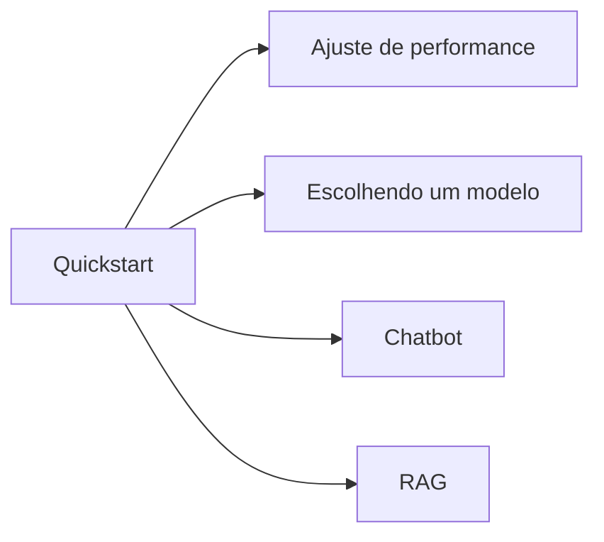

# Receitas

Esta seção coleta receitas ponta a ponta para as tarefas mais
comuns. Cada receita é um programa pequeno e completo com um
resumo de uma linha do que faz, o código-fonte completo, e uma
discussão dos trade-offs.

-   :material-speedometer: __[Ajuste de performance](performance.md)__

    Meça tokens por segundo, encontre o gargalo e ajuste
    `n_threads`, `n_gpu_layers`, tamanho de batch e cadeia de
    sampler para maximizar o throughput no seu hardware.

-   :material-compare: __[Escolhendo um modelo](choosing-a-model.md)__

    Tamanho do quant vs. acurácia vs. velocidade vs. memória. Um
    guia curto para escolher o GGUF certo para o trabalho.

-   :material-robot: __[Construindo um chatbot](chatbot.md)__

    Do REPL de 80 linhas a um agente deployável: máquinas de
    estado, tool calls, corte de histórico e persistência de
    sessão.

-   :material-database-search: __[Construindo um pipeline RAG](rag.md)__

    Embed → store → retrieve → re-rank → answer. O padrão
    ponta a ponta completo.

## Ordem de leitura

As receitas são independentes — escolha a que corresponde à sua
tarefa atual. Se você é novo no `llama-crab`, a página
[Ajuste de performance](performance.md) é um bom ponto de partida
porque te ensina a *medir* antes de otimizar.

