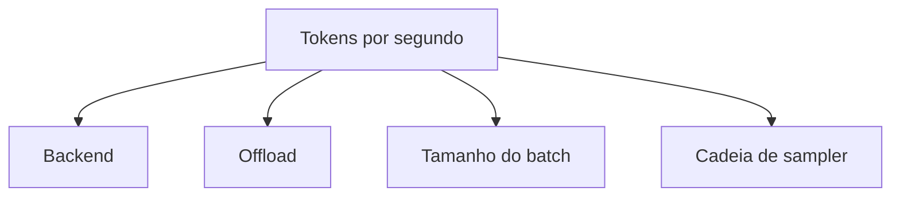

# Ajuste de performance

Esta receita percorre as quatro alavancas que você tem sobre a
performance de inferência: o **backend**, a estratégia de
**offload**, o **tamanho do batch** e a **cadeia de sampler**.
Medimos primeiro, depois otimizamos.

## As quatro alavancas



| Alavanca | Efeito em tokens/s | Quando ajustar |
| --- | --- | --- |
| **Backend** | 5–10× (CPU → GPU). | Quando o modelo está lento demais na CPU. |
| **Offload** | 2–4× por camada cruzada. | Quando o modelo não cabe na VRAM. |
| **Tamanho do batch** | 1.2–2× para servidores em batch. | Quando você serve muitas requisições em paralelo. |
| **Cadeia de sampler** | 1.05–1.5× (greedy é o mais rápido). | Quando você tem um orçamento apertado de latência. |

## Passo 1: meça primeiro

Não otimize antes de medir. A struct `Completion` de alto nível
carrega as temporizações de que você precisa:

```rust
use llama_crab::{Llama, LlamaParams};

let mut llama = Llama::load(LlamaParams::new("modelo.gguf").with_n_ctx(2048))?;
let resp = llama.create_completion("The capital of France is", 200)?;
println!("tokens/sec = {}", 200.0 / resp.timings.total_sec);
```

A struct `CompletionTimings` tem:

| Campo | Significado |
| --- | --- |
| `prompt_n` | Número de tokens do prompt. |
| `prompt_sec` | Tempo de parede para o prefill. |
| `predicted_n` | Número de tokens gerados. |
| `predicted_sec` | Tempo de parede para o loop de decodificação. |
| `total_sec` | Tempo total de parede. |

Para uma comparação justa, rode o mesmo prompt no mesmo
`max_tokens` entre as configurações que você quer testar.

## Passo 2: escolha um backend

| Alvo | Features do Cargo | Tokens/sec típicos (7B Q4_K_M) |
| --- | --- | --- |
| Apenas CPU (Mac série M) | `["openmp"]` | ~10 tok/s. |
| Apple Metal | `["metal", "openmp"]` | ~25 tok/s. |
| NVIDIA RTX 4090 | `["cuda", "openmp"]` | ~80 tok/s. |
| AMD MI300X | `["rocm", "openmp"]` | ~100 tok/s. |
| Vulkan (NVIDIA) | `["vulkan", "openmp"]` | ~70 tok/s. |

Os números dependem do quant, comprimento do contexto,
comprimento do prompt e modelo exato. Use-os como sanity check,
não como garantia.

## Passo 3: ajuste `n_gpu_layers`

`n_gpu_layers` é o maior knob único para cargas de trabalho
híbridas CPU/GPU. A regra de ouro:

| Tamanho do modelo | GPU 8 GB | GPU 16 GB | GPU 24 GB |
| --- | --- | --- | --- |
| 7B Q4_K_M | 99 camadas | 99 camadas | 99 camadas |
| 13B Q4_K_M | 99 camadas | 99 camadas | 99 camadas |
| 70B Q4_K_M | 10–15 camadas | 20–25 camadas | 35–40 camadas |

Para encontrar o valor exato para seu modelo, aumente
`n_gpu_layers` até ver erros de "out of memory", depois volte
5.

## Passo 4: ajuste `n_threads`

Threads de CPU são mais úteis quando (a) o modelo é grande demais
para caber na VRAM e a cauda roda na CPU, ou (b) a fase de
ingestão do prompt é dominada pela tokenização (raro em prompts
pequenos).

Um ponto de partida razoável é o número de cores **físicos** (não
a contagem total de cores). Em Apple Silicon, o número de cores
de *performance* é um alvo melhor.

```rust
use llama_crab::{Llama, LlamaParams};

let mut llama = Llama::load(
    LlamaParams::new("modelo.gguf")
        .with_n_threads(num_cpus::get_physical()),
)?;
```

Algumas regras de ouro:

- Não inscreva demais. Mais threads que cores físicos causa
  sobrecarga de troca de contexto.
- Em laptops, metade dos cores físicos para evitar throttling
  térmico.
- A configuração `n_threads_batch` (contagem separada de threads
  para batches) raramente é necessária; deixe no padrão.

## Passo 5: escolha a cadeia de sampler certa

A cadeia de sampler tem uma pequena sobrecarga por token, mas a
*qualidade* do texto gerado também importa. Algumas cadeias para
começar:

| Caso de uso | Cadeia |
| --- | --- |
| Benchmarks | `temp(0.0)` (greedy). |
| Código | `temp(0.0)` (greedy) ou `temp(0.2) + top_p(0.95)`. |
| Chat geral | `temp(0.7) + top_p(0.9) + min_p(0.05) + penalties(64, 1.1, 0, 0)`. |
| Escrita criativa | `temp(0.9) + top_p(0.95) + min_p(0.05) + penalties(128, 1.1, 0.1, 0.1)`. |
| Saída estruturada | `temp(0.7) + top_p(0.9) + grammar`. |

`greedy` é o sampler mais rápido. `mirostat_v2` é
aproximadamente 1.5× mais lento que `top_p + temp` para a mesma
qualidade.

## Passo 6: decodificação especulativa

Em cargas de trabalho com alta concordância, a decodificação
especulativa pode dar um speedup de 2–3×. A receita:

1. Comece com `PromptLookupDecoding::new(2, 8)` e um modelo
   principal pequeno. Meça a taxa de aceitação.
2. Se a aceitação for > 60%, você está ganhando um speedup de
   graça.
3. Se a aceitação for < 30%, troque para um modelo de rascunho
   pequeno ou pule a decodificação especulativa.

Veja o [guia de decodificação especulativa](../features/speculative.md)
para o menu completo.

## Um exemplo trabalhado

Suponha que um modelo 7B Q4_K_M rode a 10 tok/s em um MacBook
Pro M2. Você tem uma RTX 4090 e quer empurrar para 80 tok/s.

1. Adicione o backend CUDA:
   ```toml
   llama-crab = { version = "0.1", default-features = false, features = ["cuda", "openmp"] }
   ```
2. Descarregue todas as camadas:
   ```rust
   LlamaParams::new("modelo.gguf")
       .with_n_ctx(2048)
       .with_n_gpu_layers(99)
   ```
3. Meça:
   ```
   tokens/sec = 78
   ```
4. Tente aumentar `n_threads` de 4 para 8:
   ```
   tokens/sec = 82
   ```
5. Tente `temp(0.0)` (greedy) em vez da cadeia padrão:
   ```
   tokens/sec = 88
   ```

Os números reais dependem do hardware exato e do modelo; o
*processo* é o mesmo: meça, mude uma variável, meça de novo.

## Armadilhas comuns

| Armadilha | Sintoma | Correção |
| --- | --- | --- |
| Build sem a feature de GPU | `supports_gpu_offload()` é `false`. | Adicione o backend certo às features do Cargo. |
| `n_gpu_layers = 0` | Tudo roda na CPU. | Defina para o número de camadas no modelo. |
| `n_threads` > cores físicos | Sobrecarga de troca de contexto. | Limite aos cores físicos. |
| Sampler greedy em uma tarefa criativa | Saída repetitiva e sem graça. | Adicione temperatura e top-p. |
| Decodificação especulativa em texto criativo | Aceitação < 30%, speedup negativo. | Use um rascunho diferente ou pule a decodificação especulativa. |

## Por onde ir a partir daqui

- [Backends & offload de GPU](../guides/backends.md) — a
  configuração em tempo de execução.
- [Estratégias de amostragem](../guides/sampling.md) — o menu
  completo de samplers.
- [Decodificação especulativa](../features/speculative.md) —
  quando a concordância é alta.
